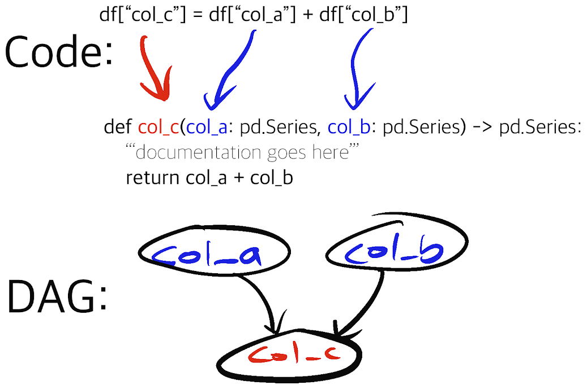

# Hamilton

## Getting Started

If you want to jump in head first, we have a simple tutorial for getting started!  To ask questions, please join our [slack community!](https://join.slack.com/t/hamilton-opensource/shared\_invite/zt-1bjs72asx-wcUTgH7q7QX1igiQ5bbdcg)


[less-than-15-minutes-to-mastery](less-than-15-minutes-to-mastery/)


## What is Hamilton?

It's a general purpose micro-framework for creating [dataflows](https://en.wikipedia.org/wiki/Dataflow) from python functions!

Specifically, Hamilton defines a novel paradigm, that allows you to specify a flow of (delayed) execution, that forms a Directed Acyclic Graph (DAG). It was original built to solve creating wide (1000+) column dataframes at Stitch Fix. Core to the design of Hamilton is a clear mapping of function name to dataflow output. That is, Hamilton forces a certain paradigm with writing functions, and aims for DAG clarity, easy modifications, _with always unit testable and naturally documentable code!_

For the backstory on how Hamilton came about, see the original Stitch Fix [blog post!](https://multithreaded.stitchfix.com/blog/2021/10/14/functions-dags-hamilton/).

Hamilton's method of defining dataflows presents a new paradigm when it comes to creating, um, dataframes (let's use dataframes as an example, otherwise you can create _ANY_ python object). Rather than thinking about manipulating a central dataframe procedurally, and extracting the data you want, as is normal in some data engineering/data science work, you instead think about the column(s) (a.k.a. outputs) you want to create, and what inputs are required. There is no need for you to think about maintaining how to create this dataframe, meaning you do not need to think about any "glue" code; this is all taken care of by the Hamilton framework. Specifically, Hamilton enables you to run your dataflow with the following steps:

1. Define your dataflow (a.k.a. pipeline), as a set of transforms using Hamilton's paradigm for writing python functions.
2. Specify the parameter values your dataflow requires
3. Specify which outputs you want to compute from your dataflow

The rest is delegated to the framework, which handles the computation for you.

Let's illustrate this with some code. If you were asked to write a simple transform (let's use pandas for the sake of argument), you may decide to write something simple like this:

```python
df['col_c'] = df['col_a'] + df['col_b']
```

To represent this in a way Hamilton can understand, you write:

```python
def col_c(col_a: pd.Series, col_b: pd.Series) -> pd.Series:
    """Creating column c from summing column a and column b."""
    return col_a + col_b
```



The Hamilton framework takes the above code, forms it into a computational DAG, and executes it for you!

## Hamilton Open Source Community

If you have questions, have ideas, or need help with Hamilton, join us on [slack](https://join.slack.com/t/hamilton-opensource/shared\_invite/zt-1bjs72asx-wcUTgH7q7QX1igiQ5bbdcg), and we'll try to help!

## Installing Hamilton

Installation should be quick and as simple as:

```
> pip install sf-hamilton
```

For more information please see [installing.md](less-than-15-minutes-to-mastery/installing.md "mention").&#x20;

## License

Hamilton is released under the [BSD 3-Clause Clear License](https://github.com/DAGWorks-Inc/hamilton/blob/main/LICENSE).

## Contributing

We take contributions, large and small. We operate via a Code of Conduct and expect anyone contributing to do the same.

## User Guide

Dive a little deeper and start exploring our API reference to get an idea of everything that's possible with the API:


[api-reference](reference/api-reference/)

