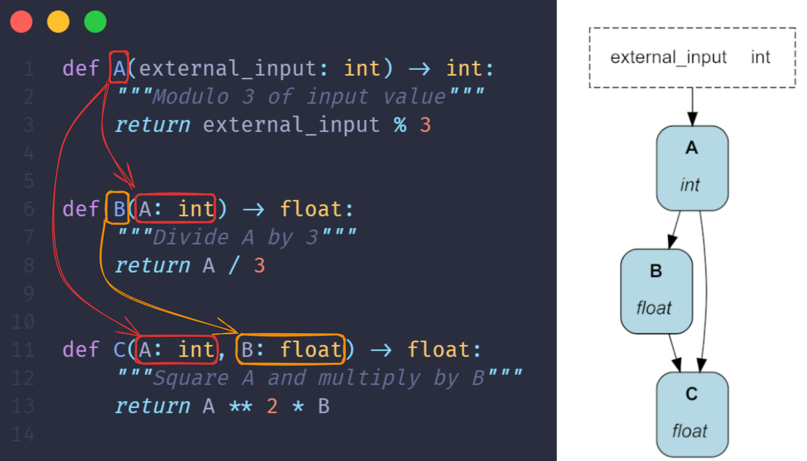
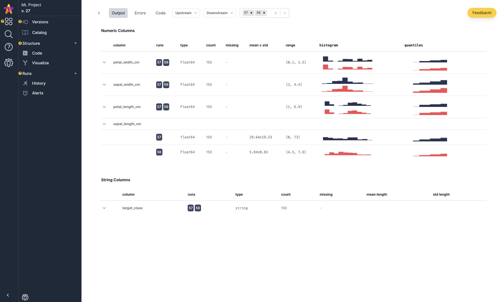
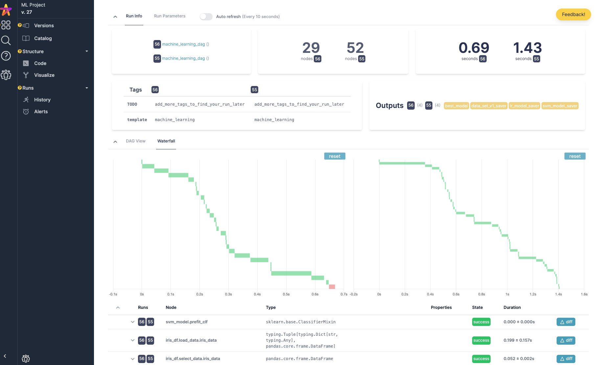
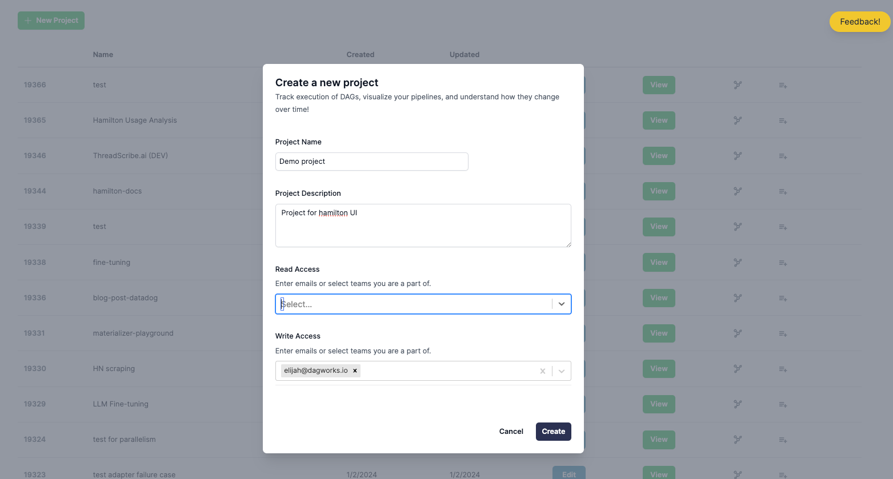

<div align="center">
   <h1> Hamilton — portable & expressive <br> data transformation DAGs</h1>
   <a href='https://hamilton.dagworks.io/en/latest/?badge=latest'>
      
   </a><a href="https://www.python.org/downloads/" target="_blank">
      
   </a>
   <a href="https://pypi.org/project/sf-hamilton/" target="_blank">
      
   </a>
   <a href="https://pepy.tech/project/sf-hamilton" target="_blank">
      
   </a>
   <a href="https://pepy.tech/project/sf-hamilton" target="_blank">
      
   </a>
   <br/>
   <a target="_blank" href="https://linkedin.com/showcase/dagster" style="background:none">
      
   </a>
   <a href="https://join.slack.com/t/hamilton-opensource/shared_invite/zt-2niepkra8-DGKGf_tTYhXuJWBTXtIs4g" target="_blank">
      
   </a>
   <a href="https://twitter.com/hamilton_os" target="_blank">
      
   </a>
   <a href="https://twitter.com/dagworks" target="_blank">
      
   </a>
</div>
<br></br>

Hamilton is a lightweight Python library for directed acyclic graphs (DAGs) of data transformations. Your DAG is **portable**; it runs anywhere Python runs, whether it's a script, notebook, Airflow pipeline, FastAPI server, etc. Your DAG is **expressive**; Hamilton has extensive features to define and modify the execution of a DAG (e.g., data validation, experiment tracking, remote execution).

To create a DAG, write regular Python functions that specify their dependencies with their parameters. As shown below, it results in readable code that can always be visualized. Hamilton loads that definition and automatically builds the DAG for you!

<div align="center">
  
</div>
<div align="center">
   Functions <code>B()</code> and <code>C()</code> refer to function <code>A</code> via their parameters
</div>
<br>

Hamilton brings modularity and structure to any Python application moving data: ETL pipelines, ML workflows, LLM applications, RAG systems, BI dashboards, and the [Hamilton UI](https://hamilton.dagworks.io/en/latest/concepts/ui) allows you to automatically visualize, catalog, and monitor execution.

> Hamilton is great for DAGs, but if you need loops or conditional logic to create an LLM agent or a simulation, take a look at our sister library  [Burr](https://github.com/dagworks-inc/burr) 🤖 .


# Installation

Hamilton supports Python 3.8+. We include the optional `visualization` dependency to display our Hamilton DAG. For visualizations, [Graphviz](https://graphviz.org/download/) needs to be installed on your system separately.

```bash
pip install "sf-hamilton[visualization]"
```

To use the Hamilton UI, install the `ui` and `sdk` dependencies.

```bash
pip install "sf-hamilton[ui,sdk]"
```

To try Hamilton in the browser, visit [www.tryhamilton.dev](https://www.tryhamilton.dev/?utm_source=README)

# Why use Hamilton?

Data teams write code to deliver business value, but few have the resources to standardize practices and provide quality assurance. Moving from proof-of-concept to production and cross-function collaboration (e.g., data science, engineering, ops) remain challenging for teams, big or small. Hamilton is designed to help throughout a project's lifecycle:

- **Separation of concerns**. Hamilton separates the DAG "definition" and "execution" which lets data scientists focus on solving problems and engineers manage production pipelines.

- **Effective collaboration**. The [Hamilton UI provides a shared interface](https://hamilton.dagworks.io/en/latest/hamilton-ui/ui/) for teams to inspect results and debug failures throughout the development cycle.

- **Low-friction dev to prod**. Use `@config.when()` to modify your DAG between execution environments instead of error-prone `if/else` feature flags. The notebook extension prevents the pain of migrating code from a notebook to a Python module.

- **Portable transformations**. Your DAG is [independent of infrastructure or orchestration](https://blog.dagworks.io/publish/posts/detail/145543927?referrer=%2Fpublish%2Fposts), meaning you can develop and debug locally and reuse code across contexts (local, Airflow, FastAPI, etc.).

- **Maintainable DAG definition**. Hamilton [automatically builds the DAG from a single line of code whether it has 10 or 1000 nodes](https://hamilton.dagworks.io/en/latest/concepts/driver/). It can also assemble multiple Python modules into a pipeline, encouraging modularity.

- **Expressive DAGs**. [Function modifiers](https://hamilton.dagworks.io/en/latest/concepts/function-modifiers/) are a unique feature to keep your code [DRY](https://en.wikipedia.org/wiki/Don't_repeat_yourself) and reduce the complexity of maintaining large DAGs. Other frameworks inevitably lead to code redundancy or bloated functions.

- **Built-in coding style**. The Hamilton DAG is [defined using Python functions](https://hamilton.dagworks.io/en/latest/concepts/node/), encouraging  modular, easy-to-read, self-documenting, and unit testable code.

- **Data and schema validation**. Decorate functions with `@check_output` to validate output properties, and raise warnings or exceptions. Add the `SchemaValidator()` adapter to automatically inspect dataframe-like objects (pandas, polars, Ibis, etc.) to track and validate their schema.

- **Built for plugins**. Hamilton is designed to play nice with all tools and provides the right abstractions to create custom integrations with your stack. Our lively community will help you build what you need!


# Hamilton UI

You can track the execution of your Hamilton DAG in the [Hamilton UI](https://hamilton.dagworks.io/en/latest/hamilton-ui/ui/). It automatically populates a data catalog with lineage / tracing and provides execution observability to inspect results and debug errors. You can run it as a [local server](https://hamilton.dagworks.io/en/latest/hamilton-ui/ui/#local-mode) or a [self-hosted application using Docker](https://hamilton.dagworks.io/en/latest/hamilton-ui/ui/#docker-deployed-mode).

<p align="center">
  
  
  
</p>
<p align="center">
  <em>DAG catalog, automatic dataset profiling, and execution tracking</em>
</p>


## Get started with the Hamilton UI

1. To use the Hamilton UI, install the dependencies (see `Installation` section) and start the server with

   ```bash
   hamilton ui
   ```

2. On the first connection, create a `username` and a new project (the `project_id` should be `1`).

<div align="center">
  
</div>
<br>

3. Track your Hamilton DAG by creating a `HamiltonTracker` object with your `username` and `project_id` and adding it to your `Builder`. Now, your DAG will appear in the UI's catalog and all executions will be tracked!

   ```python
   from hamilton import driver
   from hamilton_sdk.adapters import HamiltonTracker
   import my_dag

   # use your `username` and `project_id`
   tracker = HamiltonTracker(
      username="my_username",
      project_id=1,
      dag_name="hello_world",
   )

   # adding the tracker to the `Builder` will add the DAG to the catalog
   dr = (
      driver.Builder()
      .with_modules(my_dag)
      .with_adapters(tracker)  # add your tracker here
      .build()
   )

   # executing the `Driver` will track results
   dr.execute(["C"])
   ```

# Documentation & learning resources

* 📚 See the [official documentation](https://hamilton.dagworks.io/) to learn about the core concepts of Hamilton.

* 👨‍🏫 Consult the [examples on GitHub](https://github.com/DAGWorks-Inc/hamilton/tree/main/examples) to learn about specific features or integrations with other frameworks.

* 📰 The [DAGWorks blog](https://blog.dagworks.io/) includes guides about how to build a data platform and narrative tutorials.

* 📺 Find video tutorials on the [DAGWorks YouTube channel](https://www.youtube.com/@DAGWorks-Inc)

* 📣 Reach out via the [Hamilton Slack community](https://join.slack.com/t/hamilton-opensource/shared_invite/zt-2niepkra8-DGKGf_tTYhXuJWBTXtIs4g) for help and troubleshooting


# How does Hamilton compare to X?

Hamilton is not an orchestrator ([you might not need one](https://blog.dagworks.io/p/lean-data-automation-a-principal)), nor a feature store ([but you can use it to build one!](https://blog.dagworks.io/p/featurization-integrating-hamilton)). Its purpose is to help you structure and manage data transformations. If you know dbt, Hamilton does for Python what dbt does for SQL.

Another way to frame it is to think about the different layers of a data stack. Hamilton is at the **asset layer**. It helps you organize data transformations code (the **expression layer**), manage changes, and validate & test data.

<div align="center" style="width: 100%">
   <table>
      <colgroup>
         <col style="width: 20%">
         <col style="width: 40%">
         <col style="width: 40%">
      </colgroup>
      <thead>
         <tr>
               <th>Layer</th>
               <th>Purpose</th>
               <th>Example Tools</th>
         </tr>
      </thead>
      <tbody>
         <tr>
               <td>Orchestration</td>
               <td>Operational system for the creation of assets</td>
               <td>Airflow, Metaflow, Prefect, Dagster</td>
         </tr>
         <tr>
               <td>Asset</td>
               <td>Organize expressions into meaningful units <br> (e.g., dataset, ML model, table)</td>
               <td><b>Hamilton</b>, dbt, dlt, SQLMesh, <a href="https://github.com/dagworks-inc/burr">Burr</a></td>
         </tr>
         <tr>
               <td>Expression</td>
               <td>Language to write data transformations</td>
               <td>pandas, SQL, polars, Ibis, LangChain</td>
         </tr>
         <tr>
               <td>Execution</td>
               <td>Perform data transformations</td>
               <td>Spark, Snowflake, DuckDB, RAPIDS</td>
         </tr>
         <tr>
               <td>Data</td>
               <td>Physical representation of data, inputs and outputs</td>
               <td>S3, Postgres, file system, Snowflake</td>
         </tr>
      </tbody>
   </table>
</div>

See our page on [Why use Hamilton?](https://hamilton.dagworks.io/en/latest/get-started/why-hamilton/) and framework [code comparisons](https://hamilton.dagworks.io/en/latest/code-comparisons/) for more information.

# 📑 License

Hamilton is released under the BSD 3-Clause Clear License. See [LICENSE](https://github.com/DAGWorks-Inc/hamilton/blob/main/LICENSE.md) for details.


# 🌎 Community
## 👨‍💻 Contributing
We're very supportive of changes by new contributors, big or small! Make sure to discuss potential changes by creating an issue or commenting on an existing one before opening a pull request. Good first contributions include creating an example or an integration with your favorite Python library!

 To contribute, checkout our [contributing guidelines](https://github.com/DAGWorks-Inc/hamilton/blob/main/CONTRIBUTING.md), our [developer setup guide](https://github.com/DAGWorks-Inc/hamilton/blob/main/developer_setup.md), and our [Code of Conduct](https://github.com/DAGWorks-Inc/hamilton/blob/main/CODE_OF_CONDUCT.md).


## 😎 Used by
Hamilton was started at Stitch Fix before the original creators founded DAGWorks Inc! The library is battle-tested and has been supporting production use cases since 2019.

>Read more about the [origin story](https://multithreaded.stitchfix.com/blog/2021/10/14/functions-dags-hamilton/).


* [Stitch Fix](https://www.stitchfix.com/) — Time series forecasting
* [UK Government Digital Services](https://github.com/alphagov/govuk-feedback-analysis) — National feedback pipeline (processing & analysis)
* [IBM](https://www.ibm.com/) — Internal search and ML pipelines
* [Opendoor](https://www.opendoor.com/) — Manage PySpark pipelines
* [Lexis Nexis](https://www.lexisnexis.com/en-us/home.page) — Feature processing and lineage
* [Adobe](https://www.adobe.com/) — Prompt engineering research
* [WrenAI](https://github.com/Canner/WrenAI) — async text-to-SQL workflows
* [British Cycling](https://www.britishcycling.org.uk/) — Telemetry analysis
* [Oak Ridge & PNNL](https://pnnl.gov/) — Naturf project
* [ORNL](https://www.ornl.gov/)
* [Federal Reserve Board](https://www.federalreserve.gov/)
* [Joby Aviation](https://www.jobyaviation.com/) — Flight data processing
* [Two](https://www.two.inc/)
* [Transfix](https://transfix.io/) — Online featurization and prediction
* [Railofy](https://www.railofy.com) — Orchestrate pandas code
* [Habitat Energy](https://www.habitat.energy/) — Time-series feature engineering
* [KI-Insurance](https://www.ki-insurance.com/) — Feature engineering
* [Ascena Retail](https://www.ascena.com/) — Feature engineering
* [NaroHQ](https://www.narohq.com/)
* [EquipmentShare](https://www.equipmentshare.com/)
* [Everstream.ai](https://www.everstream.ai/)
* [Flectere](https://flectere.net/)
* [F33.ai](https://f33.ai/)
* [Kora Money](https://www.koramoney.com)
* [Capitec Bank](https://www.capitecbank.co.za/)

## 🤝 Code Contributors
[](https://github.com/DAGWorks-Inc/hamilton/graphs/contributors)


## 🙌 Special Mentions & 🦟 Bug Hunters

Thanks to our awesome community and their active involvement in the Hamilton library.

[Nils Olsson](https://github.com/nilsso), [Michał Siedlaczek](https://github.com/elshize), [Alaa Abedrabbo](https://github.com/AAbedrabbo), [Shreya Datar](https://github.com/datarshreya), [Baldo Faieta](https://github.com/baldofaieta), [Anwar Brini](https://github.com/AnwarBrini), [Gourav Kumar](https://github.com/gms101), [Amos Aikman](https://github.com/amosaikman), [Ankush Kundaliya](https://github.com/akundaliya), [David Weselowski](https://github.com/j7zAhU), [Peter Robinson](https://github.com/Peter4137), [Seth Stokes](https://github.com/sT0v), [Louis Maddox](https://github.com/lmmx), [Stephen Bias](https://github.com/s-ducks), [Anup Joseph](https://github.com/AnupJoseph), [Jan Hurst](https://github.com/janhurst), [Flavia Santos](https://github.com/flaviassantos), [Nicolas Huray](https://github.com/nhuray), [Manabu Niseki](https://github.com/ninoseki), [Kyle Pounder](https://github.com/kpounder), [Alex Bustos](https://github.com/bustosalex1), [Andy Day](https://github.com/adayNU), [Alexander Cai](https://github.com/adzcai), [Nils Müller-Wendt](https://github.com/ChronoJon), [Paul Larsen](https://github.com/munichpavel), [
Kemal Eren](https://github.com/kemaleren), [Jernej Frank](https://github.com/jernejfrank), [Noah Ridge](https://github.com/noahridge)

# 🎓 Citations
We'd appreciate citing Hamilton by referencing one of the following:

```bibtex
@inproceedings{DBLP:conf/vldb/KrawczykI22,
  title     = {Hamilton: a modular open source declarative paradigm for high level
               modeling of dataflows},
  author    = {Stefan Krawczyk and Elijah ben Izzy},
  editor    = {Satyanarayana R. Valluri and Mohamed Za{\"{\i}}t},
  booktitle = {1st International Workshop on Composable Data Management Systems,
               CDMS@VLDB 2022, Sydney, Australia, September 9, 2022},
  year      = {2022},
  url       = {https://cdmsworkshop.github.io/2022/Proceedings/ShortPapers/Paper6\_StefanKrawczyk.pdf},
  timestamp = {Wed, 19 Oct 2022 16:20:48 +0200},
  biburl    = {https://dblp.org/rec/conf/vldb/KrawczykI22.bib},
  bibsource = {dblp computer science bibliography, https://dblp.org}
}
```
```bibtex
@inproceedings{CEURWS:conf/vldb/KrawczykIQ22,
  title     = {Hamilton: enabling software engineering best practices for data transformations via generalized dataflow graphs},
  author    = {Stefan Krawczyk and Elijah ben Izzy and Danielle Quinn},
  editor    = {Cinzia Cappiello and Sandra Geisler and Maria-Esther Vidal},
  booktitle = {1st International Workshop on Data Ecosystems co-located with 48th International Conference on Very Large Databases (VLDB 2022)},
  pages     = {41--50},
  url       = {https://ceur-ws.org/Vol-3306/paper5.pdf},
  year      = {2022}
}
```

# 📚 Libraries built on / for Hamilton
* [Hypster](https://github.com/gilad-rubin/hypster) - hyperparameter management
* [DSP Decision Engine](https://github.com/capitec/dsp-decision-engine) - decision trees
* [NaturF](https://github.com/IMMM-SFA/naturf/) - library for data transformation for weather forecasting
* [WrenAI](https://github.com/Canner/WrenAI) - RAG
* [FlowerPower](https://github.com/legout/flowerpower/) - Scheduler for Hamilton
