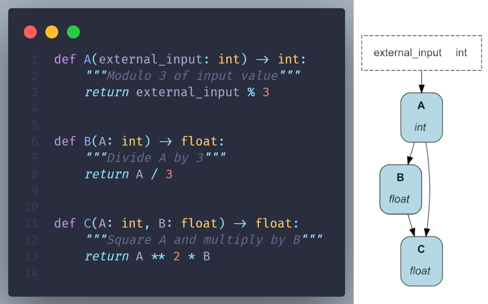

<div align="center">
   <h1> Hamilton — portable & expressive <br> data transformations DAG</h1>
   <a href='https://hamilton.dagworks.io/en/latest/?badge=latest'>
      
   </a><a href="https://www.python.org/downloads/" target="_blank">
      
   </a>
   <a href="https://pypi.org/project/sf-hamilton/" target="_blank">
      
   </a>
   <a href="https://pepy.tech/project/sf-hamilton" target="_blank">
      
   </a>

   <a target="_blank" href="https://linkedin.com/showcase/dagster" style="background:none">
      
   </a>
   <a href="https://join.slack.com/t/hamilton-opensource/shared_invite/zt-1bjs72asx-wcUTgH7q7QX1igiQ5bbdcg" target="_blank">
      
   </a>
   <a href="https://twitter.com/hamilton_os" target="_blank">
      </src>
   </a>
</div>
<br></br>

Hamilton is a general purpose Python library to author data transformations as a directed acyclic graph (DAG). It enables users to write ETL pipelines, ML workflows, LLM applications, RAG systems, business analytics dashboards, webscrapers, and more! The [Hamilton UI](https://hamilton.dagworks.io/en/latest/concepts/ui) allows to automatically visualize, catalog, and monitor execution.

Hamilton uses regular Python functions to define DAGs; you don't even need to `import hamilton` ! It uses the function name and parameters to resolve the graph. As shown below, functions specify their dependencies creating readable code that can always be visualized.

<div align="center">
  
</div>
<br>


> 🤖 Hamilton is great for DAGs. If you needs loops or conditional logic to create an LLM agent or a simulation take a look at our sister library  [Burr](https://github.com/dagworks-inc/burr).


# Installation

Hamilton supports Python 3.8+. We include the optional `visualization` dependency to display our Hamilton DAG.

```bash
pip install "sf-hamilton[visualization]"
```

To use the Hamilton UI, install the `ui` and `sdk` dependencies.

```bash
pip install "sf-hamilton[ui,sdk]"
```

To try Hamilton in the browser, visit [www.tryhamilton.dev](https://www.tryhamilton.dev/?utm_source=README)

# Key Features

Data teams write code to deliver business value, but few have the resources to standardize practices and provide quality assurance. Moving from proof-of-concept to production, and cross-function collaboration (e.g., data science, engineering, ops) remain challenging for teams big or small.

Hamilton bakes-in solutions to support you throughout a project's lifecycle:

- **Built-in coding style**. Hamilton is built around Python functions encouraging  modular, easy to read, self-documenting, and unit testable code.

- **Maintainable DAG definitions**.

- **Portable transformations**. Your DAG is independent of instrastructure or orchestration, meaning you can develop and debug locally and reuse code across contexts (local, Airflow, FastAPI, etc.).

- **Separation of concerns**. Hamilton separates the DAG "definition" and "execution" which lets data scientists focus on solving problems and engineers manage production pipelines.

- **Low-friction dev to prod**. Use `@config.when()` to modify your DAG between execution environments instead of error-prone `if/else` feature flags. The notebook extension prevents the pain of migrating code from notebook to module.

- **Effective collaboration**. The Hamilton UI provides a shared interface that teams can use to inspect results and debug failures throughout the development cycle.

- **Built for plugins**. Hamilton is designed to play nice with all tools and provides the right abstractions to build custom integrations with your stack. Our community is active and very supportive.

- **Data and schema validation**. Decorate functions with `@check_output` to validate output properties, and raise warnings or exceptions. Add the `SchemaValidator()` adapter to automatically inspect dataframe-like objects (pandas, polars, Ibis, etc.) to track and validate their schema.


# Hamilton UI

You can track the execution of your Hamilton DAG in the Hamilton UI. It automatically populates a data catalog with lineage and provides execution observability to inspect results and debug errors. You can run it as a [local server](https://hamilton.dagworks.io/en/latest/hamilton-ui/ui/#local-mode) or a [self-hosted application using Docker](https://hamilton.dagworks.io/en/latest/hamilton-ui/ui/#docker-deployed-mode).

<p align="center">
  
  
  
</p>
<p align="center">
  <em>DAG catalog, automatic dataset profiling, and execution tracking</em>
</p>


## Get started with the Hamilton UI

1. To use the Hamilton UI, install the dependencies (see `Installation` section) and start the server with

   ```bash
   hamilton ui
   ```

2. On the first connection, you will have to create a `username`. Then, create a new project and note the `project_id` (it should be `1`).

<div align="center">
  
</div>
<br>

3. Track your Hamilton DAG by create a `HamiltonTracker` object with your `username` and `project_id`. Now, all executions will be tracked and available from the UI!

   ```python
   from hamilton import driver
   from hamilton_sdk.adapters import HamiltonTracker
   import my_dag

   # use your `username` and `project_id`
   tracker = HamiltonTracker(
      username="my_username",
      project_id=1,
      dag_name="hello_world",
   )

   # building the `Driver` will add the DAG to the catalog
   dr = (
      driver.Builder()
      .with_modules(my_dag)
      .with_adapters(tracker)  # add your tracker here
      .build()
   )

   # executing the `Driver` will track results
   dr.execute(["C"])
   ```

# Documentation & learning resources

* 📚 See the [official documentation](https://hamilton.dagworks.io/) to learn about the core concepts of Hamilton.

* 👨‍🏫 Consult the [examples on GitHub](https://github.com/DAGWorks-Inc/hamilton/tree/main/examples) to learn about specific features or integrations with other frameworks.

* 📰 The [DAGWorks blog](https://blog.dagworks.io/) includes narrative tutorials and broader guides about how to build a data platform.

* 📺 Find video tutorials on the [DAGWorks YouTube channel](https://www.youtube.com/@DAGWorks-Inc)

* 📣 Reach out via the [Hamilton Slack community](https://join.slack.com/t/hamilton-opensource/shared_invite/zt-1bjs72asx-wcUTgH7q7QX1igiQ5bbdcg) for help and troubleshooting


# How does Hamilton compare to X?

Hamilton is not an orchestrator ([you might not need one](https://blog.dagworks.io/p/lean-data-automation-a-principal)) nor a feature store ([but you can use it to build one!](https://blog.dagworks.io/p/featurization-integrating-hamilton)). It's closest to dbt; it helps you structure and manage data transformations. While dbt is focus on SQL and data tables, Hamilton supports the full Python ecosystem and is great for machine learning pipelines, working with documents & LLMs, web requests, and more.

Another way to frame it is to think about the different layers of a data stack. Hamilton is at the **asset layer**. It helps you organize data transformations (the **expression layer**), manage changes, and validate & test data.

<table>
    <colgroup>
        <col style="width: 20%">
        <col style="width: 40%">
        <col style="width: 40%">
    </colgroup>
    <thead>
        <tr>
            <th>Layer</th>
            <th>Function</th>
            <th>Example Tools</th>
        </tr>
    </thead>
    <tbody>
        <tr>
            <td>Orchestration</td>
            <td>Operational system for the creation of assets</td>
            <td>Airflow, Metaflow, Prefect, Kedro</td>
        </tr>
        <tr>
            <td>Asset</td>
            <td>Organize expressions into meaningful units <br> (e.g., a dataset, a model)</td>
            <td><b>Hamilton</b>, dbt, dlt, SQLMesh, LangGraph</td>
        </tr>
        <tr>
            <td>Expression</td>
            <td>Language to write data transformations</td>
            <td>pandas, SQL, polars, Ibis, LangChain</td>
        </tr>
        <tr>
            <td>Execution</td>
            <td>Perform data transformations</td>
            <td>Spark, Snowflake, DuckDB, RAPIDS</td>
        </tr>
        <tr>
            <td>Data</td>
            <td>Physical representation of data, inputs and outputs</td>
            <td>S3, Postgres, file system, Snowflake</td>
        </tr>
    </tbody>
</table>

>See our page on [Why use Hamilton?](https://hamilton.dagworks.io/en/latest/get-started/why-hamilton/) and framework [code comparisons](https://hamilton.dagworks.io/en/latest/code-comparisons/) for more information.

# 📑 License

Hamilton is released under the BSD 3-Clause Clear License. See [LICENSE](https://github.com/DAGWorks-Inc/hamilton/blob/main/LICENSE.md) for details.


# 🌎 Community
## 👨‍💻 Contributing
We take contributions, large and small. We operate via a [Code of Conduct](https://github.com/DAGWorks-Inc/hamilton/blob/main/CODE_OF_CONDUCT.md) and expect anyone
contributing to do the same.

To see how you can contribute, please read our [contributing guidelines](https://github.com/DAGWorks-Inc/hamilton/blob/main/CONTRIBUTING.md) and then our [developer
setup guide](https://github.com/DAGWorks-Inc/hamilton/blob/main/developer_setup.md).

## 😎 Used by
Hamilton was started at Stitch Fix before the original creators founded DAGWorks Inc! It's a battle-tested framework that has been supporting production use cases since 2019.
Read more about it's [origin story](https://multithreaded.stitchfix.com/blog/2021/10/14/functions-dags-hamilton/).


* [Stitch Fix](https://www.stitchfix.com/) — Time series forecasting
* [UK Government Digital Services](https://github.com/alphagov/govuk-feedback-analysis) — National feedback pipeline (processing & analysis)
* [IBM](https://www.ibm.com/) — Internal search and ML pipelines
* [Opendoor](https://www.opendoor.com/) — Manage PySpark pipelines
* [Lexis Nexis]() — Feature processing and lineage
* [Adobe]() — Prompt engineering research
* [British Cycling](https://www.britishcycling.org.uk/) — Telemetry analysis
* [Oak Ridge & PNNL](https://pnnl.gov/) — Naturf project
* [ORNL](https://www.ornl.gov/)
* [Federal Reserve Board](https://www.federalreserve.gov/)
* [Joby Aviation](https://www.jobyaviation.com/) — Flight data processing
* [Two](https://www.two.inc/)
* [Transfix](https://transfix.io/) — Online featurization and prediction
* [Railofy](https://www.railofy.com) — Orchestrate pandas code
* [Habitat Energy](https://www.habitat.energy/) — Time-series feature engineering
* [KI-Insurance](https://www.ki-insurance.com/) — Feature engineering
* [Ascena Retail](https://www.ascena.com/) — Feature engineering
* [NaroHQ](https://www.narohq.com/)
* [EquipmentShare](https://www.equipmentshare.com/)
* [Everstream.ai](https://www.everstream.ai/)
* [Flectere](https://flectere.net/)
* [F33.ai](https://f33.ai/)

## 🤝 Code Contributors
[](https://contrib.rocks/image?repo=dagworks-inc/hamilton)


## 🙌 Special Mentions & 🦟 Bug Hunters

Thanks for our awesome community and their active involvement in the Hamilton library.

Nils Olsson (@nilsso), Michał Siedlaczek (@elshize), Alaa Abedrabbo (@AAbedrabbo),  Shreya Datar (@datarshreya), Baldo Faieta (@baldofaieta), Anwar Brini (@AnwarBrini), Gourav Kumar (@gms101), Amos Aikman (@amosaikman), Ankush Kundaliya (@akundaliya), David Weselowski (@j7zAhU), Peter Robinson (@Peter4137), Seth Stokes (@sT0v), Louis Maddox (@lmmx), Stephen Bias (@s-ducks), Anup Joseph (@AnupJoseph), Jan Hurst (@janhurst), Flavia Santos (@flaviassantos), Nicolas Huray (@nhuray), Manabu Niseki (@ninoseki), Kyle Pounder (@kpounder), Alex Bustos (@bustosalex1), Andy Day (@adayNU)

# 🎓 Citations
We'd appreciate citing Hamilton by referencing one of the following:

```bibtex
@inproceedings{DBLP:conf/vldb/KrawczykI22,
  title     = {Hamilton: a modular open source declarative paradigm for high level
               modeling of dataflows},
  author    = {Stefan Krawczyk and Elijah ben Izzy},
  editor    = {Satyanarayana R. Valluri and Mohamed Za{\"{\i}}t},
  booktitle = {1st International Workshop on Composable Data Management Systems,
               CDMS@VLDB 2022, Sydney, Australia, September 9, 2022},
  year      = {2022},
  url       = {https://cdmsworkshop.github.io/2022/Proceedings/ShortPapers/Paper6\_StefanKrawczyk.pdf},
  timestamp = {Wed, 19 Oct 2022 16:20:48 +0200},
  biburl    = {https://dblp.org/rec/conf/vldb/KrawczykI22.bib},
  bibsource = {dblp computer science bibliography, https://dblp.org}
}
```
```bibtex
@inproceedings{CEURWS:conf/vldb/KrawczykIQ22,
  title     = {Hamilton: enabling software engineering best practices for data transformations via generalized dataflow graphs},
  author    = {Stefan Krawczyk and Elijah ben Izzy and Danielle Quinn},
  editor    = {Cinzia Cappiello and Sandra Geisler and Maria-Esther Vidal},
  booktitle = {1st International Workshop on Data Ecosystems co-located with 48th International Conference on Very Large Databases (VLDB 2022)},
  pages     = {41--50},
  url       = {https://ceur-ws.org/Vol-3306/paper5.pdf},
  year      = {2022}
}
```
