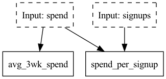

<div align="center">
    
    <h1>Welcome to the official Hamilton Github Repository</h1>
    <a href="https://circleci.com/gh/DAGWorks-Inc/hamilton/tree/main" target="_blank">
      
    </a>
    <a href='https://hamilton.dagworks.io/en/latest/?badge=latest'>
        
    </a>
    <a href="https://join.slack.com/t/hamilton-opensource/shared_invite/zt-1bjs72asx-wcUTgH7q7QX1igiQ5bbdcg" target="_blank"></a>
        <a href="https://twitter.com/hamilton_os" target="_blank"></a>
        <br/>
    <a href="https://www.python.org/downloads/" target="_blank"></a>
    <a href="https://pypi.org/project/sf-hamilton/" target="_blank"></a>
    <a href="https://pepy.tech/project/sf-hamilton" target="_blank"></a>
    <br/>
    <a href="https://anaconda.org/hamilton-opensource/sf-hamilton">  </a>
    <a href="https://anaconda.org/hamilton-opensource/sf-hamilton">  </a>
</div>

# Hamilton

The general purpose micro-orchestration framework for creating [dataflows](https://en.wikipedia.org/wiki/Dataflow) from python functions! That is, your single tool to express things like data, ML, LLM pipelines/workflows, and even web request logic!

Hamilton is a novel paradigm for specifying a flow of delayed execution in python. It works on python objects of any type and dataflows of any complexity. Core to the design of Hamilton is a clear mapping of function name to artifact, allowing you to quickly grok the relationship between the code you write and the data you produce.

This paradigm makes modifications easy to build and track, ensures code is self-documenting, and makes it natural to unit test your data transformations. When connected together, these functions form a [Directed Acyclic Graph](https://en.wikipedia.org/wiki/Directed_acyclic_graph) (DAG), which the Hamilton framework can execute, optimize, and report on.

## Problems Hamilton Solves
✅ Model a dataflow -- If you can model your problem as a DAG in python, Hamilton is the cleanest way to build it.<br/>
✅ Unmaintainable spaghetti code -- Hamilton dataflows are unit testable, self-documenting, and provide lineage.<br/>
✅ Long iteration/experimentation cycles -- Hamilton provides a clear, quick, and methodical path to debugging/modifying/extending your code.<br/>
✅ Reusing code across contexts -- Hamilton encourages code that is independent of infrastructure and can run regardless of execution setting.

## Problems Hamilton Does not Solve
❌ Provisioning infrastructure -- you want a macro-orchestration system (see airflow, kubeflow, sagemaker, etc...).<br/>
❌ Doing your ML for you -- we organize your code, BYOL (bring your own libraries).<br/>
❌ Tracking execution + associated artifacts -- Hamilton is lightweight, but if this is important to you see the [DAGWorks product](www.dagworks.io).

See the table below for more specifics/how it compares to other common tooling.

## Full Feature Comparison
Here are common things that Hamilton is compared to, and how Hamilton compares to them.

| Feature                                   | Hamilton | Macro orchestration systems (e.g. Airflow) | Feast | dbt | Dask |
|-------------------------------------------|:---:|:---------------------------------------------:|:-----:|:---:|:----:|
| Python 3.8+                               | ✅  |                   ✅                          |   ✅  | ✅  |  ✅   |
| Helps you structure your code base        | ✅  |                   ❌                          |   ❌  | ✅  |  ❌   |
| Code is always unit testable              | ✅  |                   ❌                          |   ❌  | ❌  |  ❌   |
| Documentation friendly                    | ✅  |                   ❌                          |   ❌  | ❌  |  ❌   |
| Can visualize lineage easily              | ✅  |                   ❌                          |   ❌  | ✅  |  ✅   |
| Is just a library                         | ✅  |                   ❌                          |   ❌  | ❌  |  ✅   |
| Runs anywhere python runs                 | ✅  |                   ❌                          |   ❌  | ❌  |  ✅   |
| Built for managing python transformations | ✅  |                   ❌                          |   ❌  | ❌  |  ❌   |
| Can model GenerativeAI/LLM based workflows | ✅  |                   ❌                          |   ❌  | ❌  |  ❌   |
| Replaces macro orchestration systems      | ❌  |                   ✅                          |   ❌  | ❌  |  ❌   |
| Is a feature store                        | ❌  |                   ❌                          |   ✅  | ❌  |  ❌   |
| Can model transforms at row/column/object/dataset level | ✅  |                   ❌            |   ❌  | ❌  |  ❌   |

# Getting Started
If you don't want to install anything to try Hamilton, we recommend trying [www.tryhamilton.dev](https://www.tryhamilton.dev/?utm_source=README).
Otherwise, here's a quick getting started guide to get you up and running in less than 15 minutes.
If you need help join our [slack](https://join.slack.com/t/hamilton-opensource/shared_invite/zt-1bjs72asx-wcUTgH7q7QX1igiQ5bbdcg) community to chat/ask Qs/etc.
For the latest updates, follow us on [twitter](https://twitter.com/hamilton_os)!

## Installation
Requirements:

* Python 3.8+

To get started, first you need to install hamilton. It is published to pypi under `sf-hamilton`:
> pip install sf-hamilton

Note: to use the DAG visualization functionality, you should instead do:
> pip install "sf-hamilton[visualization]"

While it is installing we encourage you to start on the next section.

Note: the content (i.e. names, function bodies) of our example code snippets are for illustrative purposes only, and don't reflect what we actually do internally.

## Hamilton in <15 minutes
Hamilton is a new paradigm when it comes to creating, um, dataframes (let's use dataframes as an example, otherwise you can create _ANY_ python object).
Rather than thinking about manipulating a central dataframe, as is normal in some data engineering/data science work,
you instead think about the column(s) you want to create, and what inputs are required. There
is no need for you to think about maintaining this dataframe, meaning you do not need to think about any "glue" code;
this is all taken care of by the Hamilton framework.

For example rather than writing the following to manipulate a central dataframe object `df`:
```python
df['col_c'] = df['col_a'] + df['col_b']
```

you write
```python
def col_c(col_a: pd.Series, col_b: pd.Series) -> pd.Series:
    """Creating column c from summing column a and column b."""
    return col_a + col_b
```
In diagram form:

The Hamilton framework will then be able to build a DAG from this function definition.

So let's create a "Hello World" and start using Hamilton!

### Your first hello world.
By now, you should have installed Hamilton, so let's write some code.

1. Create a file `my_functions.py` and add the following functions:
```python
import pandas as pd

def avg_3wk_spend(spend: pd.Series) -> pd.Series:
    """Rolling 3 week average spend."""
    return spend.rolling(3).mean()

def spend_per_signup(spend: pd.Series, signups: pd.Series) -> pd.Series:
    """The cost per signup in relation to spend."""
    return spend / signups
```
The astute observer will notice we have not defined `spend` or `signups` as functions. That is okay,
this just means these need to be provided as input when we come to actually wanting to create a dataframe.

Note: functions can take or create scalar values, in addition to any python object type.

2. Create a `my_script.py` which is where code will live to tell Hamilton what to do:
```python
import sys
import logging
import importlib

import pandas as pd
from hamilton import driver

logging.basicConfig(stream=sys.stdout)
initial_columns = {  # load from actuals or wherever -- this is our initial data we use as input.
    # Note: these do not have to be all series, they could be scalar inputs.
    'signups': pd.Series([1, 10, 50, 100, 200, 400]),
    'spend': pd.Series([10, 10, 20, 40, 40, 50]),
}
# we need to tell hamilton where to load function definitions from
module_name = 'my_functions'
module = importlib.import_module(module_name) # or we could just do `import my_functions`
dr = driver.Driver(initial_columns, module)  # can pass in multiple modules
# we need to specify what we want in the final dataframe.
output_columns = [
    'spend',  # or module.spend
    'signups',  # or module.signups
    'avg_3wk_spend',  # or module.avg_3wk_spend
    'spend_per_signup',  # or module.spend_per_signup
]
# let's create the dataframe!
# if you only did `pip install sf-hamilton` earlier:
df = dr.execute(output_columns)
# else if you did `pip install "sf-hamilton[visualization]"` earlier:
# dr.visualize_execution(output_columns, './my-dag.dot', {})
print(df)
```
3. Run my_script.py
> python my_script.py

You should see the following output:

       spend  signups  avg_3wk_spend  spend_per_signup
    0     10        1            NaN            10.000
    1     10       10            NaN             1.000
    2     20       50      13.333333             0.400
    3     40      100      23.333333             0.400
    4     40      200      33.333333             0.200
    5     50      400      43.333333             0.125

You should see the following image if you ran `dr.visualize_execution(output_columns, './my-dag.dot', {"format": "png"}, orient="TB")`:


Note: we treat displaying `Inputs` in a special manner for readability in our visualizations. So you'll likely see input
nodes repeated.

Congratulations - you just created your Hamilton dataflow that created a dataframe!

## Example Hamilton Dataflows
We have a growing list of examples showcasing how one might use Hamilton. You currently have two places to find them:

1. The [Hamilton Dataflow Hub](https://hub.dagworks.io/) -- which makes it easy to pull and then modify code.
2. The [`examples/`](https://github.com/dagworks-inc/hamilton/tree/main/examples) folder in this repository.

For the Hub, this will contain user contributed dataflows, e.g. text_summarization, forecasting, data processing, that will be continually added to.

For the [`examples/`](https://github.com/dagworks-inc/hamilton/tree/main/examples) directory, you'll have to copy/fork the repository to run them.
E.g.
* [Hello world](https://github.com/dagworks-inc/hamilton/tree/main/examples/hello_world)
* Scaling on to [Ray](https://github.com/dagworks-inc/hamilton/tree/main/examples/ray), [Dask](https://github.com/dagworks-inc/hamilton/tree/main/examples/dask), or [Pandas on Spark](https://github.com/dagworks-inc/hamilton/tree/main/examples/spark)
* Training [a model with scikit-learn](https://github.com/dagworks-inc/hamilton/tree/main/examples/model_examples)
* Doing [air quality analysis solely in numpy](https://github.com/dagworks-inc/hamilton/tree/main/examples/numpy/air-quality-analysis)

We also have a docker container that contains some of these examples so you can pull that and run them locally. See the [examples folder README](https://github.com/DAGWorks-Inc/hamilton/blob/main/examples/README.md#running-examples-through-a-docker-image) for details.

# We forked and lost some stars
This repository is maintained by the original creators of Hamilton, who have since founded [DAGWorks inc.](https://dagworks.io/), a company largely dedicated to building and maintaining the Hamilton library. We decided to fork the original because Stitch Fix did not want to transfer ownership to us; we had grown the star count in the original repository to 893: 
before forking.

For the backstory on how Hamilton came about, see the original Stitch Fix [blog post!](https://multithreaded.stitchfix.com/blog/2021/10/14/functions-dags-hamilton/).

# Slack Community
We have a small but active community on [slack](https://join.slack.com/t/hamilton-opensource/shared_invite/zt-1bjs72asx-wcUTgH7q7QX1igiQ5bbdcg). Come join us!

# License
Hamilton is released under the [BSD 3-Clause Clear License](https://github.com/DAGWorks-Inc/hamilton/blob/main/LICENSE.md).

# Used internally by:
* [Stitch Fix](https://www.stitchfix.com/)
* [UK Government Digital Services](https://github.com/alphagov/govuk-feedback-analysis)
* [IBM](https://www.ibm.com/)
* [British Cycling](https://www.britishcycling.org.uk/)
* [PNNL](https://pnnl.gov/)
* [ORNL](https://www.ornl.gov/)
* [Federal Reserve Board](https://www.federalreserve.gov/)
* [Joby Aviation](https://www.jobyaviation.com/)
* [Two](https://www.two.inc/)
* [Transfix](https://transfix.io/)
* [Railofy](https://www.railofy.com)
* [Habitat Energy](https://www.habitat.energy/)
* [KI-Insurance](https://www.ki-insurance.com/)
* [Ascena Retail](https://www.ascena.com/)
* [Opendoor](https://www.opendoor.com/)

To add your company, make a pull request to add it here.

# Contributing
We take contributions, large and small. We operate via a [Code of Conduct](https://github.com/DAGWorks-Inc/hamilton/blob/main/CODE_OF_CONDUCT.md) and expect anyone
contributing to do the same.

To see how you can contribute, please read our [contributing guidelines](https://github.com/DAGWorks-Inc/hamilton/blob/main/CONTRIBUTING.md) and then our [developer
setup guide](https://github.com/DAGWorks-Inc/hamilton/blob/main/developer_setup.md).

# Blog Posts
* [Lineage + Hamilton in 10 minutes](https://towardsdatascience.com/lineage-hamilton-in-10-minutes-c2b8a944e2e6)
* [(Organic Content) The perks of creating dataflows with Hamilton by Thierry Jean](https://medium.com/@thijean/the-perks-of-creating-dataflows-with-hamilton-36e8c56dd2a)
* [Developing Scalable Feature Engineering DAGs with Metaflow & Hamilton](https://outerbounds.com/blog/developing-scalable-feature-engineering-dags)
* [Tidy Production Pandas with Hamilton](https://towardsdatascience.com/tidy-production-pandas-with-hamilton-3b759a2bf562)
* [Towards Data Science post on backstory & introduction](https://towardsdatascience.com/functions-dags-introducing-hamilton-a-microframework-for-dataframe-generation-more-8e34b84efc1d).
* [How to use Hamilton with Pandas in 5 minutes](https://medium.com/@stefan.krawczyk/how-to-use-hamilton-with-pandas-in-5-minutes-89f63e5af8f5).
* [How to iterate with Hamilton in a Notebook](https://towardsdatascience.com/how-to-iterate-with-hamilton-in-a-notebook-8ec0f85851ed).
* [Original Stitch Fix Post](https://multithreaded.stitchfix.com/blog/2021/10/14/functions-dags-hamilton/).
* [Extension Stitch Fix Post](https://multithreaded.stitchfix.com/blog/2021/10/14/functions-dags-hamilton/).

# Videos of talks
* [Hamilton: a python micro-framework for data/feature engineering at Stitch Fix - 40 mins](https://www.youtube.com/watch?v=PDGIt37dov8&ab_channel=AICamp):
[](https://youtu.be/PDGIt37dov8)
* [Hamilton: a python micro-framework for tidy scalable pandas - ~20 mins](https://www.youtube.com/watch?v=m_rjCzxQj4c&ab_channel=Ponder):

[](https://www.youtube.com/watch?v=m_rjCzxQj4c&ab_channel=Ponder)

# Citing Hamilton
We'd appreciate citing Hamilton by referencing one of the following:

```
@inproceedings{DBLP:conf/vldb/KrawczykI22,
  author    = {Stefan Krawczyk and Elijah ben Izzy},
  editor    = {Satyanarayana R. Valluri and Mohamed Za{\"{\i}}t},
  title     = {Hamilton: a modular open source declarative paradigm for high level
               modeling of dataflows},
  booktitle = {1st International Workshop on Composable Data Management Systems,
               CDMS@VLDB 2022, Sydney, Australia, September 9, 2022},
  year      = {2022},
  url       = {https://cdmsworkshop.github.io/2022/Proceedings/ShortPapers/Paper6\_StefanKrawczyk.pdf},
  timestamp = {Wed, 19 Oct 2022 16:20:48 +0200},
  biburl    = {https://dblp.org/rec/conf/vldb/KrawczykI22.bib},
  bibsource = {dblp computer science bibliography, https://dblp.org}
}

@inproceedings{CEURWS:conf/vldb/KrawczykIQ22,
  author    = {Stefan Krawczyk and Elijah ben Izzy and Danielle Quinn},
  editor    = {Cinzia Cappiello and Sandra Geisler and Maria-Esther Vidal},
  title     = {Hamilton: enabling software engineering best practices for data transformations via generalized dataflow graphs},
  booktitle = {1st International Workshop on Data Ecosystems co-located with 48th International Conference on Very Large Databases (VLDB 2022)},
  pages     = {41--50},
  url       = {https://ceur-ws.org/Vol-3306/paper5.pdf},
  year      = {2022}
}
```
# 🛣🗺 Roadmap / Things you can do with Hamilton
Hamilton is an ambitious project to provide a unified way to describe any dataflow, independent of where it runs.
You can find currently support integrations and high-level roadmap below. Please reach out via [slack](https://join.slack.com/t/hamilton-opensource/shared_invite/zt-1bjs72asx-wcUTgH7q7QX1igiQ5bbdcg)
or email (stefan / elijah at dagworks.io) to contribute or share feedback!

## Object types:
* [x] Any python object type! E.g. Pandas, Spark dataframes, Dask dataframes, Ray datasets, Polars, dicts, lists, primitives,
your custom objects, etc.

## Workflows:
* [x] data processing
* [x] feature engineering
* [x] model training
* [x] LLM application workflows
* [x] all of them together

## Data Quality
See the [data quality](https://hamilton.dagworks.io/en/latest/how-tos/run-data-quality-checks.html) docs.
* [x] Ability to define data quality check on an object.
* [x] Pandera schema integration.
* [x] Custom object type validators.
* [ ] Integration with other data quality libraries (e.g. Great Expectations, Deequ, whylogs, etc.)

## Online Monitoring
* [ ] Open telemetry/tracing plugin.

## Caching:
* [ ] Checkpoint caching (e.g. save a function's result to disk, independent of input) - [WIP](https://github.com/DAGWorks-Inc/hamilton/pull/195).
* [ ] Finergrained caching (e.g. save a function's result to disk, dependent on input).

## Execution:
* [x] Runs anywhere python runs. E.g. airflow, prefect, dagster, kubeflow, sagemaker, jupyter, fastAPI, snowpark, etc.

## Backend integrations:
Specific integrations with other systems where we help you write code that runs on those systems.
### Ray
* [x] Delegate function execution to Ray.
* [ ] Function grouping (e.g. fuse multiple functions into a single Ray task)

### Dask
* [x] Delegate function execution to Dask.
* [ ] Function grouping (e.g. fuse multiple functions into a single Dask task)

### Spark
* [x] Pandas on spark integration (via GraphAdapter)
* [x] PySpark native UDF map function integration (via GraphAdapter)
* [ ] PySpark native aggregation function integration
* [ ] PySpark join, filter, groupby, etc. integration

### Snowpark
* [ ] Packaging functions for Snowpark

### LLVMs & related
* [ ] Numba integration

### Custom Backends
* [ ] Generate code to execute on a custom topology, e.g. microservices, etc.

## Integrations with other systems/tools:
* [ ] Generating Airflow | Prefect | Metaflow | Dagster | Kubeflow Pipelines | Sagemaker Pipelines | etc from Hamilton.
* [ ] Plugins for common MLOps/DataOps tools: MLFlow, DBT, etc.

## Dataflow/DAG Walking:
* [x] Depth first search traversal
* [x] Async function support via AsyncDriver
* [x] Parallel walk over a generator
* [x] Python multiprocessing execution (still in beta)
* [x] Python threading support
* [x] Grouping of nodes into tasks for efficient parallel computation
* [ ] Breadth first search traversal
* [ ] Sequential walk over a generator

## DAG/Dataflow resolution:
* [x] At Driver instantiation time, using configuration/modules and [`@config.when`](https://hamilton.dagworks.io/en/latest/reference/api-reference/decorators.html#config).
* [x] With [`@resolve`](https://hamilton.dagworks.io/en/latest/reference/api-reference/decorators.html#resolve) during Driver instantiation time.


# Prescribed Development Workflow
In general we prescribe the following:

1. Ensure you understand [Hamilton Basics](https://github.com/DAGWorks-Inc/hamilton/blob/main/basics.md).
2. Familiarize yourself with some of the [Hamilton decorators](https://github.com/DAGWorks-Inc/hamilton/blob/main/decorators.md). They will help keep your code DRY.
3. Start creating Hamilton Functions that represent your work. We suggest grouping them in modules where it makes sense.
4. Write a simple script so that you can easily run things end to end.
5. Join our [Slack](https://join.slack.com/t/hamilton-opensource/shared_invite/zt-1bjs72asx-wcUTgH7q7QX1igiQ5bbdcg) community to chat/ask Qs/etc.

For the backstory on Hamilton we invite you to watch a roughly-9 minute lightning talk on it that we gave at the apply conference:
[video](https://www.youtube.com/watch?v=B5Zp_30Knoo), [slides](https://www.slideshare.net/StefanKrawczyk/hamilton-a-micro-framework-for-creating-dataframes).

## PyCharm Tips
If you're using Hamilton, it's likely that you'll need to migrate some code. Here are some useful tricks we found
to speed up that process.

### Live templates
Live templates are a cool feature and allow you to type in a name which expands into some code.

E.g. For example, we wrote one to make it quick to stub out Hamilton functions: typing `graphfunc` would turn into ->

```python
def _(_: pd.Series) -> pd.Series:
   """"""
   return _
```

Where the blanks are where you can tab with the cursor and fill things in. See your pycharm preferences for setting this up.

### Multiple Cursors
If you are doing a lot of repetitive work, one might consider multiple cursors. Multiple cursors allow you to do things on multiple lines at once.

To use it hit `option + mouse click` to create multiple cursors. `Esc` to revert back to a normal mode.

# Usage analytics & data privacy
By default, when using Hamilton, it collects anonymous usage data to help improve Hamilton and know where to apply development
efforts.

We capture three types of events: one when the `Driver` object is instantiated, one when the `execute()` call on the `Driver` object completes, and one for most `Driver` object function invocations.
No user data or potentially sensitive information is or ever will be collected. The captured data is limited to:

* Operating System and Python version
* A persistent UUID to indentify the session, stored in ~/.hamilton.conf.
* Error stack trace limited to Hamilton code, if one occurs.
* Information on what features you're using from Hamilton: decorators, adapters, result builders.
* How Hamilton is being used: number of final nodes in DAG, number of modules, size of objects passed to `execute()`, the name of the Driver function being invoked.

If you're worried, see telemetry.py for details.

If you do not wish to participate, one can opt-out with one of the following methods:
1. Set it to false programmatically in your code before creating a Hamilton driver:
   ```python
   from hamilton import telemetry
   telemetry.disable_telemetry()
   ```
2. Set the key `telemetry_enabled` to `false` in ~/.hamilton.conf under the `DEFAULT` section:
   ```
   [DEFAULT]
   telemetry_enabled = False
   ```
3. Set HAMILTON_TELEMETRY_ENABLED=false as an environment variable. Either setting it for your shell session:
   ```bash
   export HAMILTON_TELEMETRY_ENABLED=false
   ```
   or passing it as part of the run command:
   ```bash
   HAMILTON_TELEMETRY_ENABLED=false python NAME_OF_MY_DRIVER.py
   ```

# Contributors

## Code Contributors
- Stefan Krawczyk (@skrawcz)
- Elijah ben Izzy (@elijahbenizzy)
- Danielle Quinn (@danfisher-sf)
- Rachel Insoft (@rinsoft-sf)
- Shelly Jang (@shellyjang)
- Vincent Chu (@vslchusf)
- Christopher Prohm (@chmp)
- James Lamb (@jameslamb)
- Avnish Pal (@bovem)
- Sarah Haskins (@frenchfrywpepper)
- Thierry Jean (@zilto)
- Michał Siedlaczek (@elshize)
- Benjamin Hack (@benhhack)
- Bryan Galindo (@bryangalindo)
- Jordan Smith (@JoJo10Smith)
- Roel Bertens (@roelbertens)

## Bug Hunters/Special Mentions
- Nils Olsson (@nilsso)
- Michał Siedlaczek (@elshize)
- Alaa Abedrabbo (@AAbedrabbo)
- Shreya Datar (@datarshreya)
- Baldo Faieta (@baldofaieta)
- Anwar Brini (@AnwarBrini)
- Gourav Kumar (@gms101)
- Amos Aikman (@amosaikman)
- Ankush Kundaliya (@akundaliya)
- David Weselowski (@j7zAhU)
- Peter Robinson (@Peter4137)
- Seth Stokes (@sT0v
- Louis Maddox (@lmmx)
- Stephen Bias (@s-ducks)
- Anup Joseph (@AnupJoseph)
- Jan Hurst (@janhurst)
- Flavia Santos (@flaviassantos)
