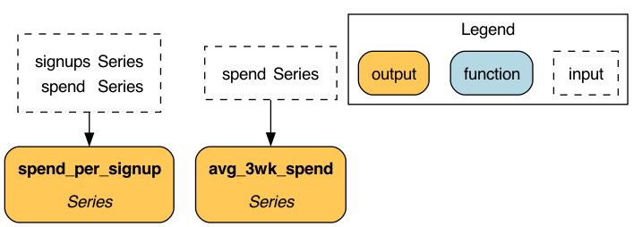

# Hamilton

The micro-framework to create dataframes from functions.

Specifically, Hamilton is a framework that allows for delayed executions of functions in a Directed Acyclic Graph (DAG).
This is meant to solve the problem of creating complex data pipelines. Core to the design of Hamilton is a clear mapping of
function name to implementation. That is, Hamilton forces a certain paradigm with writing functions, and aims for DAG clarity,
easy modifications, unit testing, and documentation.

# Getting Started
Here's a quick getting started guide to get you up and running in less than 15 minutes.

## Installation
Requirements:

* Python 3.6 or 3.7

To get started, first you need to install hamilton. It is published to pypi under `sf-hamilton`:
> pip install sf-hamilton

While it is installing we encourage you to start on the next section.

Note: the content (i.e. names, function bodies) of our example code snippets are for illustrative purposes only, and don't reflect what we actually do internally.

## Hamilton in 15 minutes
Hamilton is a new paradigm when it comes to creating dataframes. Rather than thinking about manipulating
a central dataframe, you instead think about the column(s) you want to create, and what inputs are required. There
is no need for you to think about maintaining this dataframe, meaning you do not need to think about any "glue" code;
this is all taken care of by the Hamilton framework.

For example rather than writing the following to manipulate a central dataframe object `df`:
```python
df['col_c'] = df['col_a'] + df['col_b']
```

you write
```python
def col_c(col_a: pd.Series, col_b: pd.Series) -> pd.Series:
    """Creating column c from summing column a and column b."""
    return col_a + col_b
```
In diagram form:

The Hamilton framework will then be able to build a DAG from this function definition.

So let's create a "Hello World" and start using Hamilton!

### Your first hello world.
By now, you should have installed Hamilton, so let's write some code.

1. Create a file `my_functions.py` and add the following functions:
```python
import pandas as pd

def avg_3wk_spend(spend: pd.Series) -> pd.Series:
    """Rolling 3 week average spend."""
    return spend.rolling(3).mean()

def spend_per_signup(spend: pd.Series, signups: pd.Series) -> pd.Series:
    """The cost per signup in relation to spend."""
    return spend / signups
```
The astute observer will notice we have not defined `spend` or `signups` as functions. That is okay,
this just means these need to be provided as input when we come to actually wanting to create a dataframe.

2. Create a `my_script.py` which is where code will live to tell Hamilton what to do:
```python
import importlib
import logging
import sys

import pandas as pd
from hamilton import driver

logger = logging.getLogger(__name__)
logging.basicConfig(stream=sys.stdout)
initial_columns = {  # load from actuals or wherever -- this is our initial data we use as input.
    'signups': pd.Series([1, 10, 50, 100, 200, 400]),
    'spend': pd.Series([10, 10, 20, 40, 40, 50]),
}
# we need to tell hamilton where to load function definitions from
module_name = 'my_functions'
module = importlib.import_module(module_name)
dr = driver.Driver(initial_columns, module)  # can pass in multiple modules
# we need to specify what we want in the final dataframe.
output_columns = [
    'spend',
    'signups',
    'avg_3wk_spend',
    'spend_per_signup',
]
# let's create the dataframe!
df = dr.execute(output_columns, display_graph=True)
print(df)
```
3. Run my_script.py
> python my_script.py

You should see the following output:


       spend  signups  avg_3wk_spend  spend_per_signup
    0     10        1            NaN            10.000
    1     10       10            NaN             1.000
    2     20       50      13.333333             0.400
    3     40      100      23.333333             0.400
    4     40      200      33.333333             0.200
    5     50      400      43.333333             0.125

Congratulations - you just created your first dataframe with Hamilton!

# License
Hamilton is released under the [BSD 3-Clause Clear License](LICENSE). If you need to get in touch about something,
contact us at algorithms-opensource (at) stitchfix.com.

# Contributing
We take contributions, large and small. We operate via a [Code of Conduct](CODE_OF_CONDUCT.md) and expect anyone
contributing to do the same.

To see how you can contribute, please read our [contributing guidelines](CONTRIBUTING.md) and then our [developer
setup guide](developer_setup.md).


# Prescribed Development Workflow
In general we prescribe the following:

1. Ensure you understand [Hamilton Basics](basics.md).
2. Familiarize yourself with some of the [Hamilton decorators](decorators.md). They will help keep your code DRY.
3. Start creating Hamilton Functions that represent your work. We suggest grouping them in modules where it makes sense.
4. Write a simple script so that you can easily run things end to end.
5. Join our [discord](https://discord.gg/wCqxqBqn73) community to chat/ask Qs/etc.

For the backstory on Hamilton we invite you to watch ~9 minute lightning talk on it that we gave at the apply conference:
[video](https://www.youtube.com/watch?v=B5Zp_30Knoo), [slides](https://www.slideshare.net/StefanKrawczyk/hamilton-a-micro-framework-for-creating-dataframes).

## PyCharm Tips
If you're using Hamilton, it's likely that you'll need to migrate some code. Here are some useful tricks we found
to speed up that process.

### Live templates
Live templates are a cool feature and allow you to type in a name which expands into some code.

E.g. For example, we wrote one to make it quick to stub out Hamilton functions: typing `graphfunc` would turn into ->

```python
def _(_: pd.Series) -> pd.Series:
   """""""
   return _
```

Where the blanks are where you can tab with the cursor and fill things in. See your pycharm preferences for setting this up.

### Multiple Cursors
If you are doing a lot of repetitive work, one might consider multiple cursors. Multiple cursors allow you to do things on multiple lines at once.

To use it hit `option + mouse click` to create multiple cursors. `Esc` to revert back to a normal mode.

# Contributors

- Stefan Krawczyk (@skrawcz)
- Elijah ben Izzy (@elijahbenizzy)
- Danielle Quinn (@danfisher-sf)
- Rachel Insoft (@rinsoft-sf)
- Shelly Jang (@shellyjang)
- Vincent Chu (@vslchusf)
