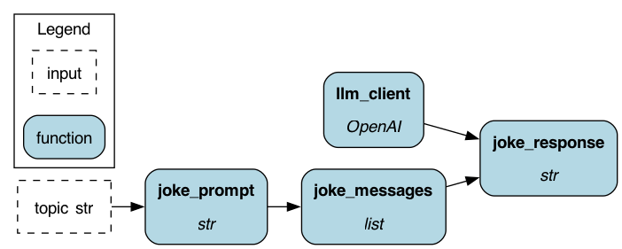
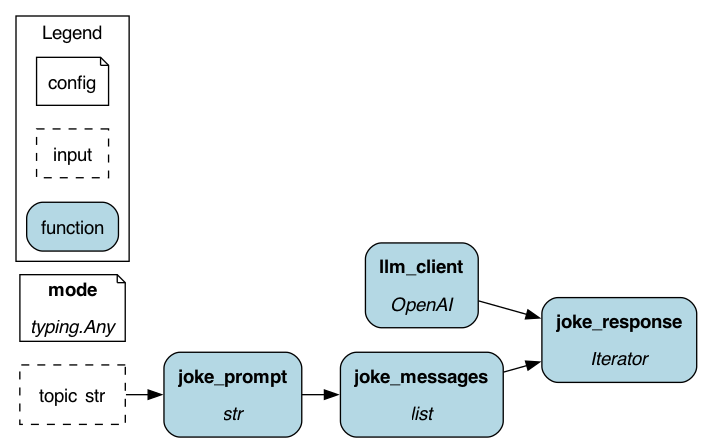
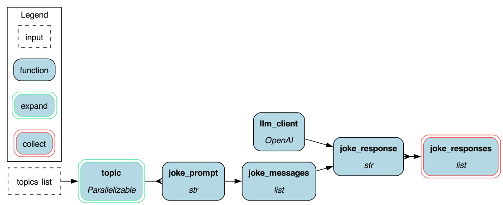
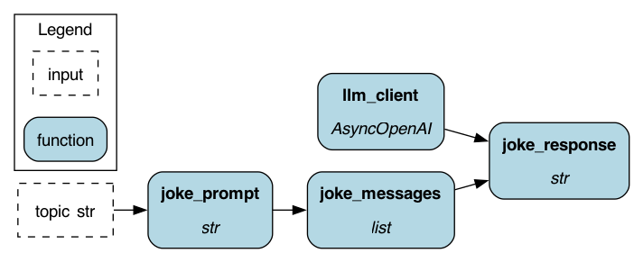
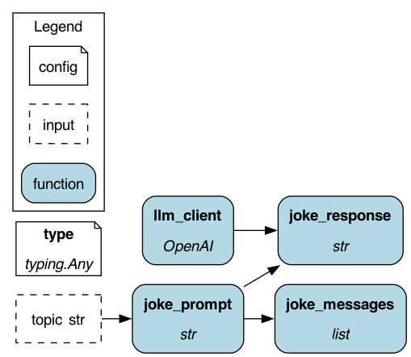
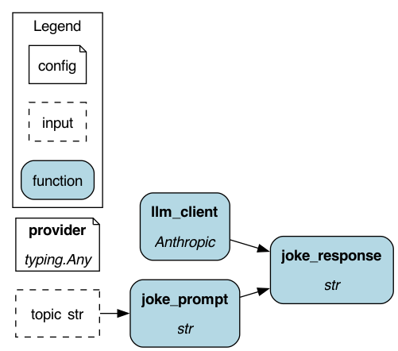

======================
LangChain
======================

Here we have some code snippets that help compare a vanilla code implementation
with LangChain and Hamilton.

LangChain's focus is on hiding details and making code terse.

Hamilton's focus instead is on making code more readable, maintainable, and importantly customizeable.

So don't be surprised that Hamilton's code is "longer" - that's by design. There is
also little abstraction between you, and the underlying libraries with Hamilton.
With LangChain they're abstracted away, so you can't really see easily what's going on
underneath.

*Rhetorical question*: which code would you rather maintain, change, and update?

----------------------
A simple joke example
----------------------

.. table:: Simple Invocation
   :align: left

   +-----------------------------------------------------------+----------------------------------------------------------+-------------------------------------------------------------+
   | Hamilton                                                  | Vanilla                                                  | LangChain                                                   |
   +===========================================================+==========================================================+=============================================================+
   | .. literalinclude:: langchain_snippets/hamilton_invoke.py | .. literalinclude:: langchain_snippets/vanilla_invoke.py | .. literalinclude:: langchain_snippets/lcel_invoke.py       |
   |                                                           |                                                          |                                                             |
   +-----------------------------------------------------------+----------------------------------------------------------+-------------------------------------------------------------+

   The Hamilton DAG visualized.

-----------------------
A streamed joke example
-----------------------
With Hamilton we can just swap the call function to return a streamed response.
Note: you could use @config.when to include both streamed and non-streamed versions in the same DAG.

.. table:: Streamed Version
   :align: left

   +-------------------------------------------------------------+------------------------------------------------------------+---------------------------------------------------------------+
   | Hamilton                                                    | Vanilla                                                    | LangChain                                                     |
   +=============================================================+============================================================+===============================================================+
   | .. literalinclude:: langchain_snippets/hamilton_streamed.py | .. literalinclude:: langchain_snippets/vanilla_streamed.py | .. literalinclude:: langchain_snippets/lcel_streamed.py       |
   |                                                             |                                                            |                                                               |
   +-------------------------------------------------------------+------------------------------------------------------------+---------------------------------------------------------------+

   The Hamilton DAG visualized.

-------------------------------
A "batch" parallel joke example
-------------------------------
In this batch example, the joke requests are parallelized.
Note: with Hamilton you can delegate to many different backends for parallelization,
e.g. Ray, Dask, etc. We use multi-threading here.

.. table:: Batch Parallel Version
   :align: left

   +-------------------------------------------------------------+------------------------------------------------------------+---------------------------------------------------------------+
   | Hamilton                                                    | Vanilla                                                    | LangChain                                                     |
   +=============================================================+============================================================+===============================================================+
   | .. literalinclude:: langchain_snippets/hamilton_batch.py    | .. literalinclude:: langchain_snippets/vanilla_batch.py    | .. literalinclude:: langchain_snippets/lcel_batch.py          |
   |                                                             |                                                            |                                                               |
   +-------------------------------------------------------------+------------------------------------------------------------+---------------------------------------------------------------+

   The Hamilton DAG visualized.

----------------------
A "async" joke example
----------------------
Here we show how to make the joke using async constructs. With Hamilton
you can mix and match async and regular functions, the only change
is that you need to use the async Hamilton Driver.

.. table:: Async Version
   :align: left

   +-------------------------------------------------------------+------------------------------------------------------------+---------------------------------------------------------------+
   | Hamilton                                                    | Vanilla                                                    | LangChain                                                     |
   +=============================================================+============================================================+===============================================================+
   | .. literalinclude:: langchain_snippets/hamilton_async.py    | .. literalinclude:: langchain_snippets/vanilla_async.py    | .. literalinclude:: langchain_snippets/lcel_async.py          |
   |                                                             |                                                            |                                                               |
   +-------------------------------------------------------------+------------------------------------------------------------+---------------------------------------------------------------+

   The Hamilton DAG visualized.

---------------------------------
Switch LLM to completion for joke
---------------------------------
Here we show how to make the joke switching to a different openAI model that is for completion.
Note: we use the @config.when construct to augment the original DAG and add a new function
that uses the different OpenAI model.

.. table:: Completion Version
   :align: left

   +------------------------------------------------------------------+-----------------------------------------------------------------+---------------------------------------------------------------+
   | Hamilton                                                         | Vanilla                                                         | LangChain                                                     |
   +==================================================================+=================================================================+===============================================================+
   | .. literalinclude:: langchain_snippets/hamilton_completion.py    | .. literalinclude:: langchain_snippets/vanilla_completion.py    | .. literalinclude:: langchain_snippets/lcel_completion.py     |
   |                                                                  |                                                                 |                                                               |
   +------------------------------------------------------------------+-----------------------------------------------------------------+---------------------------------------------------------------+

   The Hamilton DAG visualized with configuration provided for the completion path. Note the dangling node - that's normal, it's not used in the completion path.

---------------------------------
Switch to using Anthropic
---------------------------------
Here we show how to make the joke switching to use a different model provider, in this case
it's Anthropic.
Note: we use the @config.when construct to augment the original DAG and add a new functions
to use Anthropic.

.. table:: Anthropic Version
   :align: left

   +------------------------------------------------------------------+-----------------------------------------------------------------+---------------------------------------------------------------+
   | Hamilton                                                         | Vanilla                                                         | LangChain                                                     |
   +==================================================================+=================================================================+===============================================================+
   | .. literalinclude:: langchain_snippets/hamilton_anthropic.py     | .. literalinclude:: langchain_snippets/vanilla_anthropic.py     | .. literalinclude:: langchain_snippets/lcel_anthropic.py      |
   |                                                                  |                                                                 |                                                               |
   +------------------------------------------------------------------+-----------------------------------------------------------------+---------------------------------------------------------------+

   The Hamilton DAG visualized with configuration provided to use Anthropic.

---------------------------------
Logging
---------------------------------
Here we show how to log more information about the joke request. Hamilton has
lots of customization options, and one out of the box is to log more information via
printing.

.. table:: Logging
   :align: left

   +------------------------------------------------------------------+-----------------------------------------------------------------+---------------------------------------------------------------+
   | Hamilton                                                         | Vanilla                                                         | LangChain                                                     |
   +==================================================================+=================================================================+===============================================================+
   | .. literalinclude:: langchain_snippets/hamilton_logging.py       | .. literalinclude:: langchain_snippets/vanilla_logging.py       | .. literalinclude:: langchain_snippets/lcel_logging.py        |
   |                                                                  |                                                                 |                                                               |
   +------------------------------------------------------------------+-----------------------------------------------------------------+---------------------------------------------------------------+

---------------------------------
Fallbacks
---------------------------------
Fallbacks are pretty situation and context dependent. It's not that
hard to wrap a function in a try/except block. The key is to make sure
you know what's going on, and that a fallback was triggered. So in our
opinion it's better to be explicit about it.

.. table:: Logging
   :align: left

   +------------------------------------------------------------------+-----------------------------------------------------------------+---------------------------------------------------------------+
   | Hamilton                                                         | Vanilla                                                         | LangChain                                                     |
   +==================================================================+=================================================================+===============================================================+
   | .. literalinclude:: langchain_snippets/hamilton_fallbacks.py     | .. literalinclude:: langchain_snippets/vanilla_fallbacks.py     | .. literalinclude:: langchain_snippets/lcel_fallbacks.py      |
   |                                                                  |                                                                 |                                                               |
   +------------------------------------------------------------------+-----------------------------------------------------------------+---------------------------------------------------------------+
