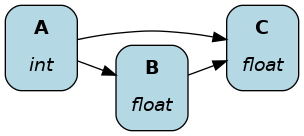

#######
Builder
#######

The :doc:`driver` page covered the basics to build the Driver, visualize the dataflow, and execute the dataflow. We learned how to create the dataflow by passing a Python module to ``Builder().with_modules()``.

On this page, you'll learn how the ``driver.Builder()`` enables you to configure your Driver. Advanced concepts are mentioned briefly, but know that each has its own page with further explanations.

.. note::

    As your Builder code grows complex, definining it over multiple lines can improve readability. This is possible by using parentheses after the assignment ``=``

    .. code-block:: python

        dr = (
            driver.Builder()
            .with_modules(my_dataflow)
            .build()
        )

.. note::

    The order of Builder statements doesn't matter as long as ``.build()`` is last. 

with_modules()
--------------

This passes dataflow modules to the Driver. It can accept multiple modules at once after they'll be assembled into a single dataflow.

.. code-block:: python

    # my_dataflow.py
    def A() -> int:
        """Constant value 35"""
        return 35

    def B(A: int) -> float:
        """Divide A by 3"""
        return A / 3

.. code-block:: python

    # my_other_dataflow.py
    def C(A: int, B: float) -> float:
        """Square A and multiply by B"""
        return A**2 * B

.. code-block:: python

    # run.py
    from hamilton import driver
    import my_dataflow
    import my_other_dataflow

    dr = driver.Builder().with_modules(my_dataflow, my_other_dataflow).build()

It encourages organizing code into logical modules (e.g., feature processing, model training, model evaluation). ``features.py`` might depend on PySpark and ``model_training.py`` on XGBoost. By organizing modules by dependencies, it's easier to reuse the XGBoost model training module in a project that doesn't use PySpark and avoid version conflicts.

.. code-block:: python

    # run.py
    from hamilton import driver
    import features
    import model_training
    import model_evaluation

    dr = (
        driver.Builder()
        .with_modules(features, model_training, model_evaluation)
        .build()
    )

with_config()
-------------

This is directly related to the ``@config`` function decorator (see **#TODO add link**) and doesn't have any effect in its absence. By passing a dictionary to ``with_config()``, you configure which functions will be used to create the dataflow. You can't change the config after the Driver is created. Instead, you need to rebuild the Driver with the new config values.

.. code-block:: python

    # my_dataflow.py
    from hamilton.function_modifiers import config

    def A() -> int:
        """Constant value 35"""
        return 35

    @config.when_not(version="remote")
    def B__default(A: int) -> float:
        """Divide A by 3"""
        return A / 3

    @config.when(version="remote")
    def B__remote(A: int) -> float:
        """Divide A by 2"""
        return A / 2

.. code-block:: python

    # run.py
    from hamilton import driver
    import my_dataflow

    dr = (
        driver.Builder()
        .with_modules(my_dataflow)
        .with_config(dict(version="remote"))
        .build()
    )

with_adapters()
---------------

This allows to add multiple Lifecycle hooks (**#TODO add link**) to the Driver. This is a very flexible abstraction to develop custom plugins to do logging, telemetry, alerts, and more. The following adds a hook to launch debugger when reaching the node ``"B"``:

.. code-block:: python

    # run.py
    from hamilton import driver, lifecycle
    import my_dataflow

    debug_hook = lifecycle.default.PDBDebugger(node_filter="B", during=True)
    dr = (
        driver.Builder()
        .with_modules(my_dataflow)
        .with_adapters(debug_hook)
        .build()
    )

Other hooks are available to output a progress bar in terminal, do experiment tracking for your Hamilton runs, cache results to disk, send logs to DataDog, and more!

enable_dynamic_execution()
--------------------------

This directly relates to the Builder ``with_local_executor()`` and ``with_remote_executor()`` and the ``Parallelizable/Collect`` functions (see **#TODO link**). For the Driver to be able to parse them, you need to set ``allow_experimental_mode=True`` like the following:

.. code-block:: python

    # run.py
    from hamilton import driver
    import my_dataflow  # <- this contains Parallelizable/Collect nodes

    dr = (
        driver.Builder()
        .enable_dynamic_execution(allow_experimental_mode=True)  # set True
        .with_modules(my_dataflow)
        .build()
    )

By enabling dynamic execution, reasonable defaults are used for local and remote executors. You also specify them explicitly as such:

.. code-block:: python

    # run.py
    from hamilton import driver
    from hamilton.execution import executors
    import my_dataflow

    dr = (
        driver.Builder()
        .with_modules(my_dataflow)
        .enable_dynamic_execution(allow_experimental_mode=True)
        .with_local_executor(executors.SynchronousLocalTaskExecutor())
        .with_remote_executor(executors.MultiProcessingExecutor(max_tasks=5))
        .build()
    )
