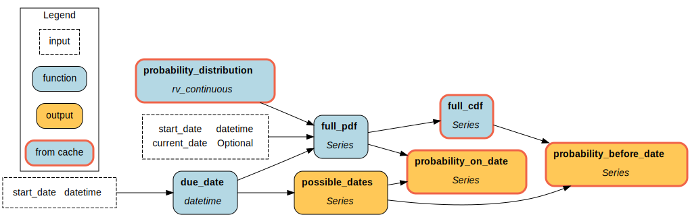

========
Caching
========

Caching enables storing execution results to be reused in later executions, effectively skipping redundant computations. This speeds up execution and saves resources (computation, API credits, GPU time, etc.), and has applications both for development and production.

To enable caching, add ``.with_cache()`` to your ``Builder()``.

.. code-block:: python

    from hamilton import driver
    import my_dataflow

    dr = (
        driver.Builder()
        .with_module(my_dataflow)
        .with_cache()
        .build()
    )

    dr.execute([...])
    dr.execute([...])

The first execution will store **metadata** and **results** next to the current directory under ``./.hamilton_cache``. The next execution will retrieve results from cache when possible to skip execution.

.. note::

    We highly suggest viewing the :doc:`../how-tos/caching-tutorial` tutorial for a practical introduction to caching.

How does it work?
-----------------

Caching relies on multiple components:

- **Cache adapter**: decide to retrieve a result or execute the node
- **Metadata store**: store information about past node executions
- **Result store**: store results on disk, it is unaware of other cache components.

At a high-level, the cache adapter does the following for each node:

1. Before execution: determine the ``cache_key``

2. At execution:
    a. if the ``cache_key`` finds a match in the metadata store (cache **hit**), retrieve the ``data_version`` of the ``result``.
    b. If there's no match (cache **miss**), execute the node and store the ``data_version`` of the ``result`` in the metadata store.

3. After execution: if we had to execute the node, store the ``result`` in the result store.

The caching mechanism is highly performant because it can pass ``data_version`` (small strings) through the dataflow instead of the actual data until a node needs to be executed.

The result store is a mapping of ``{data_version: result}``. While a ``cache_key`` is unique to determine retrieval or execution, multiple cache keys can point to the same ``data_version``, which avoid storing duplicate results.

Cache key
~~~~~~~~~

Understanding the ``cache_key`` is important to understand why a node is recomputed or not. It is composed of:

- ``node_name``: name of the node
- ``code_version``: version of the node's code
- ``dependencies_data_versions``: ``data_version`` of each dependency of the node

.. code-block:: json

    {
        "node_name": "processed_data",
        "code_version": "c2ccafa54280fbc969870b6baa445211277d7e8cfa98a0821836c175603ffda2",
        "dependencies_data_versions": {
            "raw_data": "WgV5-4SfdKTfUY66x-msj_xXsKNPNTP2guRhfw==",
            "date": "ZWNhd-XNlIF0YV9-2ZXJzaW9u_YGAgKA==",
        }
    }

By traversing the cache keys' ``dependencies_data_versions``, we can actually reconstruct the dataflow structure!

.. warning::

    Cache keys could be unstable across Python and Hamilton versions (because of new features, bug fixes, etc.). Upgrading Python or Hamilton could require starting with a new empty cache for reliable behavior.

Observing the cache
-------------------

Caching is best understood throung interacting with it. Hamilton offers many utilities to observe and introspect the cache manually.

Logging
~~~~~~~

To see how the cache works step-by-step, start your code (script, notebook, etc.) by getting the logger and setting the level to ``DEBUG``. Using ``INFO`` will be less noisy and only log ``GET_RESULT`` and ``EXECUTE_NODE`` events.

.. code-block:: python

    import logging

    logger = logging.getLogger("hamilton.caching")
    logger.setLevel(logging.INFO)
    logger.addHandler(logging.StreamHandler())  # this handler will print to the console

The logs follow the structure ``{node_name}::{task_id}::{actor}::{event_type}::{message}``, omitting empty sections.

.. code-block:: console

    # example INFO logs for nodes foo, bar, and baz
    foo::result_store::get_result::hit
    bar::adapter::execute_node
    baz::adapter::execute_node

Visualization
~~~~~~~~~~~~~~

After ``Driver`` execution, calling ``dr.cache.view_run()`` will create a visualization of the dataflow with results retrieved from the cache highlighted.

By default, it shows the latest run, but it's possible to view previous runs by passing a ``run_id``. Specify a ``output_file_path`` to save the visualization.

.. code-block:: python

    # ... define and execute a `Driver`

    # select the 3rd unique run_id
    run_id_3 = dr.cache.run_ids[2]
    dr.cache.view_run(run_id=run_id_3, output_file_path="cached_run_3.png")

    Visualization produced by ``dr.cache.view_run()``. Retrieved results are outlined.

.. note::

    The method ``.view_run()`` doens't currently support task-based execution or ``Parallelizable/Collect``.

.. _caching-structured-logs:

Structured logs
~~~~~~~~~~~~~~~

Structured logs are stored on the ``Driver.cache`` and can be inspected programmatically. By setting ``.with_cache(log_to_file=True)``, structured logs will also be appended to a ``.jsonl`` file as they happen; this is ideal for production usage.

To access log, use ``Driver.cache.logs()``. You can ``.logs(level=...)`` to ``"info"`` or ``"debug"`` to view only ``GET_RESULT`` and ``EXECUTE_NODE`` or all events. Specifying ``.logs(run_id=...)`` will return logs from a given run, and leaving it empty will returns logs for all executions of this ``Driver``.

.. code-block:: python

    dr.execute(...)
    dr.cache.logs(level="info")

The shape of the returned object is slightly diffrent if specifying a ``run_id`` or not. Specifying a ``run_id`` will give ``{node_name: List[CachingEvent]}``

Requesting ``Driver.cache.logs()`` will return a dictionary with ``run_id`` as key and list of ``CachingEvent`` as values ``{run_id: List[CachingEvent]}``. This is useful for comparing run and verify nodes were properly executed or retrieved.

.. code-block:: python

    dr.cache.logs(level="debug", run_id=dr.cache.last_run_id)
    # {
    #     'raw_data': [CachingEvent(...), ...],
    #     'processed_data': [CachingEvent(...), ...],
    #     'amount_per_country': [CachingEvent(...), ...]
    # }

    dr.cache.logs(level="debug")
    # {
    #     'run_id_1': [CachingEvent(...), ...],
    #     'run_id_2': [CachingEvent(...), ...]
    # }

.. note::

    When using ``Parallelizable/Collect``, nodes part of the "parallel branches" will have a ``task_id`` key too ``{node_name: {task_id: List[CachingEvent]}}`` while nodes outside branches will remain ``{node_name: List[CachingEvent]}``

.. _cache-result-format:

Cached result format
---------------------

By default, caching uses the ``pickle`` format because it can accomodate almost all Python objects. Although, it has `caveats <https://grantjenks.com/docs/diskcache/tutorial.html#caveats>`_. The ``cache`` decorator allows you to use a different format for a given node (``JSON``, ``CSV``, ``Parquet``, etc.).

The next snippet caches ``clean_dataset`` as ``parquet``, and ``statistics`` as ``json``. These formats maybe more reliable, efficient, and easier to work with.

.. code-block:: python

    # my_dataflow.py
    import pandas as pd
    from hamilton.function_modifiers import cache

    def raw_data(path: str) -> pd.DataFrame:
        return pd.read_csv(path)

    @cache(format="parquet")
    def clean_dataset(raw_data: pd.DataFrame) -> pd.DataFrame:
        raw_data = raw_data.fillna(0)
        return raw_data

    @cache(format="json")
    def statistics(clean_dataset: pd.DataFrame) -> dict:
        return ...

.. code-block:: python

    import driver
    import my_dataflow

    dr = (
        driver.Builder()
        .with_modules(my_dataflow)
        .with_cache()
        .buid()
    )

    # first execution will product a ``parquet`` file for  ``clean_dataset``
    # and a ``json`` file for ``statistics``
    dr.execute(["statistics"])
    # second execution will use these parquet and json files when loading results
    dr.execute(["statistics"])

.. note::

    Internally, this uses :doc:`Materializers </concepts/materialization>`

Caching behavior
-----------------

The **caching behavior** refers to the caching logic used to:
- version data
- load and store metadata
- load and store results
- execute or not a node

The ``DEFAULT`` behavior aims to be easy to use and facilitate iterative development. However, other behavior may be desirble in particular scenarios or when going to production. The behavior can be set node-by-node.

1. ``DEFAULT``: Try to retrieve results from cache instead of executing the node. Node result and metadata are stored.

2. ``RECOMPUTE``: Always execute the node / never retrieve from cache. Result and metadata are stored. This can be useful to ensure external data is alawys reloaded.

3. ``DISABLE``: Act as if caching isn't enabled for this node. Nodes depending on a disabled node will miss metadata for cache retrieval, forcing their re-execution. Useful for disabling caching in parts of the dataflow.

4. ``IGNORE``: Similar to **Disable**, but downstream nodes will ignore the missing metadata and can successfully retrieve results. Useful to ignore "irrelevant" nodes that shouldn't impact the results (e.g., credentials, API clients, database connections).

.. seealso::

    Learn more in the :doc:`/reference/caching/caching-logic` reference section.

.. note::

    There are other caching behaviors theoretically possible, but these four should cover most cases. Let us know if you have a use case that is not covered.

Setting caching behavior
~~~~~~~~~~~~~~~~~~~~~~~~~~~

The caching behavior can be specified at the node-level via the ``@cache`` function modifier or at the builder-level via ``.with_cache(...)`` arguments. Note that the behavior specified by the ``Builder`` will override the behavior from ``@cache`` since it's closer to execution.

via ``@cache``
~~~~~~~~~~~~~~~

Below, we set ``raw_data`` to ``RECOMPUTE`` because the file it loads data from may change between executions. After executing and versioning the result of ``raw_data``, if the data didn't change from previous execution, we'll be able to retrieve ``clean_dataset`` and ``statistics`` from cache.

.. code-block:: python

    # my_dataflow.py
    import pandas as pd
    from hamilton.function_modifiers import cache

    @cache(behavior="recompute")
    def raw_data(path: str) -> pd.DataFrame:
        return pd.read_csv(path)

    def clean_dataset(raw_data: pd.DataFrame) -> pd.DataFrame:
        raw_data = raw_data.fillna(0)
        return raw_data

    def statistics(clean_dataset: pd.DataFrame) -> dict:
        return ...

via ``Builder().with_cache()``
~~~~~~~~~~~~~~~~~~~~~~~~~~~~~~~

Equivalently, we could set this behavior via the ``Builder``. You can pass a list of node names to the keyword arguments ``recompute``, ``ignore``, and ``disable``. Using ``True`` to enable that behavior for all nodes. For example, using ``recompute=True`` will force execution of all nodes and store their results in cache. Having ``disable=True`` is equivalent to not having the ``.with_cache()`` clause.

.. code-block:: python

    from hamilton import driver
    import my_dataflow

    dr = (
        driver.Builder()
        .with_modules(my_dataflow)
        .with_cache(recompute=["raw_data"])
        .build()
    )

Set a default behavior
~~~~~~~~~~~~~~~~~~~~~~

By default, caching is "opt-out" meaning all nodes are cached unless specified otherwise. To make it "opt-in", where only the specified nodes are cached, set ``default_behavior="disable"``. You can also try different default behaviors.

.. code-block:: python

    from hamilton import driver
    import my_dataflow

    dr = (
        driver.Builder()
        .with_modules(my_dataflow)
        .with_cache(
            default=["raw_data", "statistics"],  # set behavior DEFAULT
            default_behavior="disable"  # all other nodes are DISABLE
        )
        .build()
    )

Code version
------------

The ``code_version`` of a node is determined by hashing its source code, ignoring docstring and comments.

Importantly, Hamilton will not version nested function calls. If you edit utility functions or upgrade Python libraries, the cache might incorrectly assume the code to be the same.

For example, take the following function ``foo``:

.. code-block:: python

    def _increment(x):
        return x + 1

    def foo():
        return _increment(13)

    # foo's code version: 129064d4496facc003686e0070967051ceb82c354508a58440910eb82af300db

Despite editing the nested ``_increment()``, we get the same ``code_version`` because the content of ``foo()`` hasn't changed.

.. code-block:: python

    def _increment(x):
        return x + 2

    def foo():
        return _increment(13)

    # foo's code version: 129064d4496facc003686e0070967051ceb82c354508a58440910eb82af300db

In that case, ``foo()`` should return ``13 + 2`` instead of ``13 + 1``. Unaware of the change in ``_increment()``, the cache will find a ``cache_key`` match and return ``13 + 1``.

A solution is to set the caching behavior to ``RECOMPUTE`` to force execute ``foo()``. Another is to delete stored metadata or results to force re-execution.

Data version
------------

Caching requires the ability to uniquely identify data (e.g., create a hash). By default, all Python primitive types (``int``, ``str``, ``dict``, etc.) are supported and more types can be added via extensions (e.g., ``pandas``). For types not explicitly supported, caching can still function by versioning the object's internal ``__dict__`` instead. However, this could be expensive to compute or less reliable than alternatives.

Recursion depth
~~~~~~~~~~~~~~~

To version complex objects, we recursively hash its values. For example, versioning an object ``List[Dict[str, float]]`` involves hashing all keys and values of all dictionaries. Versioning complex objects with large ``__dict__`` state can become expensive.

In practice, we need to need a maximum recursion depth because there's a trade-off between the computational cost of hashing data and how accurately it uniquely identifies data (reduce hashing collisions).

Here's how to set the max depth:

.. code-block:: python

    from hamilton.io import fingerprinting
    fingerprinting.set_max_depth(depth=3)

Support additional types
~~~~~~~~~~~~~~~~~~~~~~~~~

Additional types can be supported by registering a hashing function via the module ``hamilton.io.fingerprinting``. It uses `@functools.singledispatch <https://docs.python.org/3/library/functools.html#functools.singledispatch>`_ to register the hashing function per Python type. The function must return a ``str``. The code snippets shows how to support polars ``DataFrame``:

.. code-block:: python

    import polars as pl
    from hamilton.io import fingerprinting

    # specify the type via the decorator
    @fingerprinting.hash_value.register(pl.DataFrame)
    def hash_polars_dataframe(obj, *args, **kwargs) -> str:
        """Convert a polars dataframe to a list of row hashes, then hash the list.
        We consider that row order matters.
        """
        # obj is of type `pl.DataFrame`
        hash_per_row = obj.hash_rows(seed=0)
        # fingerprinting.hash_value(...) will automatically hash primitive Python types
        return fingerprinting.hash_value(hash_per_row)

Alternatively, you can register functions without using decorators.

.. code-block:: python

    from hamilton.io import fingerprinting

    def hash_polars_dataframe(obj, *args, **kwargs) -> str: ...

    fingerprinting.hash_value.register(pl.DataFrame, hash_polars_dataframe)

If you want to override the base case, the one defined by the function ``hash_value()``, you can do so by registering a function for the type ``object``.

.. code-block:: python

    @fingerprinting.hash_value.register(object)
    def hash_object(obj, *args, **kwargs) -> str: ...

Storage
-------

The caching feature is powered by two data storages:

- **Metadata store**: It contains information about past ``Driver`` executions (**code version**, **data version**, run id, etc.). From this metadata, Hamilton determines if a node needs to be executed or not. This metadata is generally lightweight.

- **Result store**: It's a key-value store that maps a **data version** to a **result**. It's completely unaware of nodes, executions, etc. and simply holds the **results**. The result store can significantly grow in size depending on your usage. By default, all results are pickled, but :ref:`other formats are possible <cache-result-format>`.

Setting the cache path
~~~~~~~~~~~~~~~~~~~~~~

By default, the **metadata** and **results** are stored under a new subdirectory ``./.hamilton_cache/``, next to the current directory. Alternatively, you can set a path via ``.with_cache(path=...)`` that will be applied to both stores.

By project
^^^^^^^^^^
Centralizing your cache by project is useful when you have nodes that are reused across multiple dataflows (e.g., training and inference ML pipelines, feature engineering).

.. code-block:: python

    # training_script.py
    from hamilton import driver
    import training

    cache_path = "/path/to/project/hamilton_cache"
    train_dr = driver.Builder().with_modules(training).with_cache(path=cache_path).build()

    # inference_script.py
    from hamilton import driver
    import inference

    cache_path = "/path/to/project/hamilton_cache"
    predict_dr = driver.Builder().with_modules(inference).with_cache(path=cache_path).build()

Globally
^^^^^^^^^^

Using a global cache is easier storage management. Since the metadata and the results for *all* your Hamilton dataflows are in one place, it can be easier to cleanup disk space.

.. code-block:: python

    import pathlib
    from hamilton import driver
    import my_dataflow

    # set the cache under the user's global directory for any operating system
    # The `Path` is converted to a string.
    cache_path = str(pathlib.expanduser().joinpath("/.hamilton_cache"))
    dr = driver.Builder().with_module(my_dataflow).with_cache(path=cache_path).build()

.. hint::

    It can be a good idea to store the cache path in an environment variable.

Separate locations
^^^^^^^^^^^^^^^^^^

If you want the metadata and result stores to be at different location, you can instantiate and pass them to ``.with_cache()``. In that case, ``.with_cache()``'s ``path`` parameter will be ignored.

.. code-block:: python

    from hamilton import driver
    from hamitlon.io.store import SQLiteMetadataStore, ShelveResultStore

    metadata_store = SQLiteMetadataStore(path="~/.hamilton_cache")
    result_store = ShelveResultStore(path="/path/to/my/project")

    dr = (
        driver.Builder()
        .with_modules(dataflow)
        .with_cache(
            metadata_store=metadata_store,
            result_store=result_store,
        )
        .build()
    )

Inspect storage
~~~~~~~~~~~~~~~

It is possible to directly interact with the metadata and result stores either by creating them or via ``Driver.cache``.

.. code-block:: python

    from hamilton.caching.stores.sqlite import SQLiteMetadataStore
    from hamilton.caching.stores.file import FileResultStore

    metadata_store = SQLiteMetadataStore(path="~/.hamilton_cache")
    result_store = FileResultStore(path="/path/to/my/project")

    metadata_store.get(context_key=...)
    result_store.get(data_version=...)

.. code-block:: python

    from hamilton import driver
    import my_dataflow

    dr = (
        driver.Builder()
        .with_modules(dataflow)
        .with_cache()
        .build()
    )

    dr.cache.metadata_store.get(context_key=...)
    dr.cache.result_store.get(data_version=...)

A useful pattern is using the ``Driver.cache`` state or `structured logs <caching-structured-logs>` to retrieve a **data version** and query the **result store**.

.. code-block:: python

    from hamilton import driver
    from hamilton.caching.adapter import CachingEventType
    import my_dataflow

    dr = (
        driver.Builder()
        .with_modules(dataflow)
        .with_cache()
        .build()
    )

    dr.execute(["amount_per_country"])

    # via `cache.data_versions`; this points to the latest run
    data_version = dr.cache.data_versions["amount_per_country"]
    stored_result = dr.cache.result_store.get(data_version)

    # via structured logs; this allows to query any run
    run_id = ...
    for event in dr.cache.logs(level="debug")[run_id]:
        if (
            event.event_type == CachingEventType.SET_RESULT
            and event.node_name == "amount_per_country"
        ):
            data_version = event.value
            break

    stored_result = dr.cache.result_store(data_version)

In-memory
~~~~~~~~~

You can enable in-memory caching by using the ``InMemoryMetadataStore`` and ``InMemoryResultStore``. Caching behaves the same, but metadata and results are never persisted to disk. This is useful in notebooks and interactive sessions where results are only temporary relevant (e.g., experimentating with new features).

.. warning::

    In-memory caching can quickly fill memory. We suggest selectively caching results to limit this issue.

.. code-block:: python

    from hamilton import driver
    from hamilton.caching.stores.memory import InMemoryMetadataStore, InMemoryResultStore
    import dataflow

    dr = (
        driver.Builder()
        .with_modules(dataflow)
        .with_cache(
            metadata_store=InMemoryMetadataStore(),
            result_store=InMemoryResultStore(),
        )
        .build()
    )

In-memory stores also allow you to persist your entire in-memory session to disk or start your in-memory session by loading an existing cache. This is compatible with most implementations.

Persist cache
^^^^^^^^^^^^^

This snippet shows how to persist an in-memory cache to an sqlite-backed metadata store and a file-based result store. Note that you should persist both the metadata and results stores for this to be useful. The ``.persist_to()`` method will repeatedly call ``.set()`` on the destination store. Persisting multiple times will add to the already cached data.

.. code-block:: python

    from hamilton import driver
    from hamilton.caching.stores.sqlite import SQLiteMetadataStore
    from hamilton.caching.stores.file import FileResultStore
    from hamilton.caching.stores.memory import InMemoryMetadataStore, InMemoryResultStore
    import my_dataflow

    dr = (
        driver.Builder()
        .with_modules(my_dataflow)
        .with_cache(
            metadata_store=InMemoryMetadataStore(),
            result_store=InMemoryResultStore(),
        )
        .build()
    )

    # execute the Driver several time. This will populate the in-memory stores
    dr.execute(...)

    # persist to disk
    dr.cache.metadata_store.persist_to(SQLiteMetadataStore(path="./.hamilton_cache"))
    dr.cache.result_store.persist_to(FileResultStore(path="./.hamilton_cache"))

Load cache
^^^^^^^^^^

This snippet loads in-memory data from persisted metadata and result stores. The ``.load_from()`` is a classmethod and returns an instance of the in-memory store. The method ``InMemoryResultStore.load_from(...)`` must receive as argument a result store, but also a metadata store or a list of ``data_version`` to load. This is because ``ResultStore`` implementations don't have a registry of stored results.

.. code-block:: python

    from hamilton import driver
    from hamilton.caching.stores.sqlite import SQLiteMetadataStore
    from hamilton.caching.stores.file import FileResultStore
    from hamilton.caching.stores.memory import InMemoryMetadataStore, InMemoryResultStore
    import my_dataflow

    # create persisted stores
    metadata_store = SQLiteMetadataStore(path="./.hamilton_cache")
    result_store = FileResultStore(path="./.hamilton_cache")

    dr = (
        driver.Builder()
        .with_modules(my_dataflow)
        .with_cache(
            # create in-memory stores by loading from persisted store
            metadata_store=InMemoryMetadataStore.load_from(metadata_store),
            result_store=InMemoryResultStore.load_from(
                result_store=result_store,
                metadata_store=metadata_store,
            ),
        )
        .build()
    )

Roadmap
-------

Caching is a significant Hamilton feature and there are plans to expand it. Here are some ideas and areas for development. Feel free comment on them or make other suggestions via `Slack <https://join.slack.com/t/hamilton-opensource/shared_invite/zt-2niepkra8-DGKGf_tTYhXuJWBTXtIs4g>`_ or GitHub!

- **Hamilton UI integration**: caching introduces the concept of ``data_version``. This metadata could be captured by the Hamilton UI to show how different values are used across dataflow executions. This would be particularly useful for experiment tracking and lineage.
- **Distributed caching support**: the initial release supports multithreading and multiprocessing on a single machine. For distributed execution, we will need ``ResultStore`` and ``MetadataStore`` that can be remote and are safe for concurrent access.
- **Integrate with remote execution** (Ray, Skypilot, Modal, Runhouse): facilitate a pattern where the dataflow is executed locally, but some nodes can selectively be executed remotely and have their results cached locally.
- **async support**: Support caching with ``AsyncDriver``. This requires a significant amount of code, but the core logic shouldn't change much.
- **cache eviction**: Allow to set up a max storage (in size or number of items) or time-based policy to delete data from the metadata and result stores. This would help with managing the cache size.
- **more store backends**: The initial release includes backend supported by the Python standard library (SQLite metadata and file-based results). Could support more backends via `fsspec <https://filesystem-spec.readthedocs.io/en/latest/?badge=latest>`_ (AWS, Azure, GCP, Databricks, etc.)
- **support more types**: Include specialized hashing functions for complex objects from popular libraries. This can be done through Hamilton extensions.
