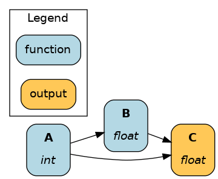
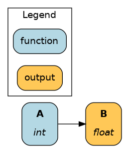

======
Driver
======

Once you defined your dataflow in a Python module, you will need to create Hamilton Driver to execute it. This page details the Driver basics, which include:

1. Defining the Driver
2. Visualizing the dataflow
3. Executing the dataflow

For this page, let's pretend we defined the following module ``my_dataflow.py``:

.. code-block:: python

    # my_dataflow.py
    def A() -> int:
        """Constant value 35"""
        return 35

    def B(A: int) -> float:
        """Divide A by 3"""
        return A / 3

    def C(A: int, B: float) -> float:
        """Square A and multiply by B"""
        return A**2 * B

Define the Driver
-----------------

First, you need to create a ``driver.Driver`` object. This is possible through the ``driver.Builder()`` object to which you give Python modules and other configurations, and call ``.build()`` to create the Driver. 

The most basic Driver looks like this:

.. code-block:: python

    # run.py
    from hamilton import driver
    import my_dataflow  # <- module containing functions to define dataflow

    # variable `dr` is of type `driver.Driver`
    # it is created by a `driver.Builder` object
    dr = driver.Builder().with_modules(my_dataflow).build()

The ``.build()`` method will fail if the definition found in ``my_dataflow`` is invalid (e.g., type mismatch, missing annotations) allowing to fix issues and iterate quickly.

The ``Driver`` is defined in the context you intend to run, separetely from your dataflow module. It can be in a script, notebook, server, web app, or anywhere else Python can run. As a convention, most Hamilton example code example use a script named ``run.py``.

Visualize the dataflow
----------------------

Once you successfully created your Driver, you can visualize the entire dataflow with the following:

.. code-block:: python

    # run.py
    from hamilton import driver
    import my_dataflow

    dr = driver.Builder().with_modules(my_dataflow).build()
    dr.display_all_functions("dag.png")  # outputs a file dag.png
    dr.display_all_functions()  # to view directly in a notebook

The dataflow visualization is useful for documenting your project and quickly make sense of what it does. There are several several other visualization features, such a highlighting the path between two nodes, that we'll discuss later.

Execute the dataflow
--------------------

With the Driver, you can request the value of specific nodes by calling ``dr.execute()`` with a list node names. These requested nodes are specified via ``final_vars``.  By default, results are returned in a dictionary with ``{node_name: result}``.

The following requests the node ``C`` and visualizes the execution path:

.. code-block:: python

    # run.py
    from hamilton import driver
    import my_dataflow 

    dr = driver.Builder().with_modules(my_dataflow).build()
    dr.visualize_execution(["C"], "execute_c.png")
    results = dr.execute(["C"])

    print(results["C"])  # access results dictionary

The Driver automatically determines and computes the minimum required path to requested nodes. See the respective outputs for ``dr.visualize_execution(["C"])`` and ``dr.visualize_execution(["B"])``:

Development tips
----------------

With Hamilton, most of your development time is spent on writing functions for your dataflow in a Python module. Rebuilding the Driver and visualizing your dataflow as you make changes helps iterative development. So here's helpful workflows:

With a Python module
~~~~~~~~~~~~~~~~~~~~

One approach is to define the dataflow and the Driver in the same file (e.g., ``my_dataflow.py``). Then, you can execute it as a script with ``python my_dataflow.py`` to rebuild the Driver and visualize your dataflow. This ensures your dataflow definition remains valid as you make changes.

For example: 

.. code-block:: python

    # my_dataflow.py
    def A() -> int:
        """Constant value 35"""
        return 35

    # ... more functions

    # is True when calling `python my_dataflow.py`
    if __name__ == "__main__":
        from hamilton import driver
        # __main__ refers to the file itself
        # and yes, a file can import itself as a module!
        import __main__
        
        dr = driver.Builder().with_modules(__main__).build()
        dr.display_all_functions("dag.png")
        dr.execute(["C"])

With a Jupyter notebook
~~~~~~~~~~~~~~~~~~~~~~~

Another approach is to define the dataflow in a module (e.g., ``my_dataflow.py``) and reload the Driver in a Jupyter notebook. This allows for a more interactive experience when you want to inspect results of functions as you're developing.

By default, Python only imports a module once and subsequent ``import`` statements don't reload the module. We use ``importlib.reload`` to reload ``my_dataflow`` before rebuilding the Driver. 

.. code-block:: python

    # notebook.ipynb
    # %%cell 1
    import importlib
    from hamilton import driver
    import my_dataflow

    # %%cell 2
    # this will reload an already imported module
    importlib.reload(my_dataflow)
    
    # rebuild the `Driver` with the reloaded module and execute again
    dr = driver.Builder().with_modules(my_dataflow).build()
    dr.display_all_functions("dag.png")
    results = dr.execute(["C"])

    # %%cell 3
    # do something with results
    print(results["C"])

Learn other Jupyter development tips on the page :doc:`../how-tos/use-in-jupyter-notebook`.

Recap
-----
- The Driver automatically assembles dataflows from Python modules
- The Driver can build a visualization of the dataflow from your code
- Functions are executed by requesting nodes to driver ``.execute()``

Next step
---------
Now, you know the basics of authoring and executing Hamilton dataflows! We encourage you to:

- Write some code with our `interactive tutorials <https://www.tryhamilton.dev/intro>`_
- Kickstart your project with `community dataflows <https://hub.dagworks.io/docs/>`_

The next Concepts page cover notions to write more expressive and powerful code. If you feel stuck or constrained with the basics, it's probably a good time to visit them. They include:

- Driver ()
- Materialization: integrate Hamilton in your data infrastructure
- Function decorators: write expressive dataflows without repeating code
- Lifecycle hooks: customize Driver execution
