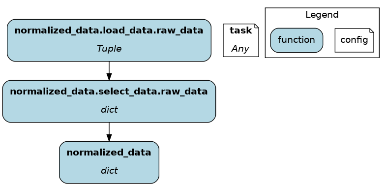

==================
Function modifiers
==================

In :doc:`node`, we discussed how to write Python functions to define Hamilton nodes and dataflow. In the basic case, each function defines one node.

Yet, it's common to need nodes with similar purposes but different dependencies, such as preprocessing training and evaluation datasets. In that case, using a **function modifier** can help create both nodes from a single Hamilton function!

On this page, you'll learn:

- Python decorators basics
- Add metadata to node
- Validate node output
- Split node output into *n* nodes
- Define one function, create *n* nodes
- Select nodes to load from module

This page covers important conceptual notions but is not exhaustive. To find details about all function modifiers see API references :doc:`../../reference/decorators/index`.

Decorators
----------

Python decorators are statements that begin with ``@`` located above function definitions. Hamilton uses decorators to implement function modifiers and reduce the amount of code you have to write to make expressive dataflows.

Multiple decorators can be stacked on a single function and are applied from bottom to top. Hamilton decorators should be insensitive to ordering, but be careful with non-Hamilton decorators (e.g., @retries, @time). See this `decorator primer <https://realpython.com/primer-on-python-decorators/>`_ to learn more.

Function modifiers were designed to have clear semantics, so you should be able to figure out what they do from their name. For instance, the following code adds metadata using ``@tag`` and conducts some checks over the return value with ``check_output``.

.. code-block:: python

    @tag(owner='Data-Science', pii='False')
    @check_output(data_type=np.float64, range=(-5.0, 5.0), allow_nans=False)
    def height_zero_mean_unit_variance(
        height_zero_mean: pd.Series, height_std_dev: pd.Series
    ) -> pd.Series:
    """Zero mean unit variance value of height"""
    return height_zero_mean / height_std_dev

Reminder: Anatomy of a node
---------------------------

This section from the page :doc:`node` details how a Python function maps to a Hamilton node. We'll reuse these terms to explain the function modifiers.

.. image:: ../_static/function_anatomy.png
    :scale: 13%
    :align: center

.. list-table::
   :header-rows: 1

   * - id
     - Function components
     - Node components
   * - 1
     - Function name and return type annotation
     - Node name and type
   * - 2
     - Parameter names and type annotations
     - Node dependencies
   * - 3
     - Docstring
     - Description of the node return value
   * - 4
     - Function body
     - Implementation of the node

.. _tag-decorators:

Add metadata to a node
----------------------

@tag
~~~~~~~~
The ``@tag`` decorator **doesn't modify the function/node**. It attaches metadata to the node that can be used by Hamilton and you. It can help tag nodes by ownership, data source, version, infrastructure, and anything else.

For example, this tags the associated data product and the sensitivity of the data.

.. code-block:: python

    from hamilton.function_modifiers import tag

    @tag(data_product='final', pii='true')
    def final_column(
        intermediate_column: pd.Series
    ) -> pd.Series: ...

Query node by tag
~~~~~~~~~~~~~~~~~

Once you built your Driver, you can get all nodes with ``Driver.list_available_variables()`` and then filter them by tag. The following gets all the nodes for which ``data_product="final"`` and passes them to ``driver.execute()``

.. code-block:: python

    dr = driver.Builder().with_modules(my_module).build()
    tagged_nodes = [node.name for node in dr.list_available_variables()
                    if 'final' == node.tags.get('data_product')]

    results = dr.execute(tagged_nodes)

Customize visualization by tag
~~~~~~~~~~~~~~~~~~~~~~~~~~~~~~

Tags are also accessible to the visualization styling feature, allowing you to highlight important nodes for your documentation. See :ref:`custom-visualization-style` for details.

.. image:: ./_function-modifiers/custom_viz.png
    :height: 250px

@schema
~~~~~~~

The ``@schema`` function modifiers provides a lightweight way to add type metadata to dataframes. It works by specifying tuples of ``(field_name, field_type)`` with types as strings.

.. code-block:: python

    from hamilton.function_modifiers import schema

    @schema.output(
        ("a", "int"),
        ("b", "float"),
        ("c", "str")
    )
    def clean_df(raw_df: pd.DataFrame) -> pd.DataFrame:
        return pd.DataFrame.from_records(
            {"a": [1], "b": [2.0], "c": ["3"]}
        )

.. image:: ./_function-modifiers/schema.png

Validate node output
--------------------

The ``@check_output`` function modifiers are applied on the **node output / function return** and therefore don't directly affect node behavior. Decorators separate data validation from the function body where the core logic is. It improves function readability, and it helps reusing and maintaining standardized checks across multiple functions.

.. note::

    In the future, validatation capabailities may be added to ``@schema``. For now, it's only added metadata.

@check_output*
~~~~~~~~~~~~~~

The ``@check_output`` implements many data checks for Python objects and DataFrame/Series including data type, min/max/between, count, fraction of null/nan values, and allow null/nan. Failed checks are either logged (``importance="warn"``) or make the dataflow fail (``importance="fail"``).

The next snippet checks if the returned Series is of type ``np.int32``, which is non-nullable, and if its within the range 0-100, and logs failed checks. This allows us to manually review instances where data validation failed.

.. code-block:: python

    from hamilton.function_modifiers import check_output

    @check_output(data_type=np.int32, range=(0,100), importance="warn")
    def quiz_grade(quiz_df: pd.DataFrame) -> pd.Series:
        return ...

.. image:: ./_function-modifiers/check_output.png

- To see all available validators, go to the file ``hamilton/data_quality/default_validators.py`` and view the variable ``AVAILABLE_DEFAULT_VALIDATORS``.
- The function modifier ``@check_output_custom`` allows you to define your own validator. Validators inherit the ``base.BaseDefaultValidator`` class and are essentially standardized Hamilton node definitions (instead of functions). See ``hamilton/data_quality/default_validators.py`` or reach out on `Slack <https://join.slack.com/t/hamilton-opensource/shared_invite/zt-2niepkra8-DGKGf_tTYhXuJWBTXtIs4g>`_ for help!
- Note: ``@check_output_custom`` decorators cannot be stacked, but they instead can take multiple validators.

.. note::

    As you see, validation steps effectively add nodes to the dataflow and the visualization. This helps trace which specific check failed for instance, but it can make visualizations harder to read.

    You can hide these nodes using the custom visualization style feature (see :ref:`custom-visualization-style`) by applying the style ``{"style": "invis"}`` to nodes with the tag ``hamilton.data_quality.source_node``. This will only keep the original nodes and their ``_raw`` variant.

pandera support
~~~~~~~~~~~~~~~

Hamilton has a pandera plugin for data validation that you can install with ``pip install sf-hamilton[pandera]``. Then, you can pass a pandera schema (for DataFrame or Series) to ``@check_output(schema=...)``.

pydantic support
~~~~~~~~~~~~~~~~

Hamilton also supports data validation of pydantic models, which can be enabled with ``pip install sf-hamilton[pydantic]``. With pydantic installed, you can pass any subclass of the pydantic base model to ``@check_output(model=...)``. Pydantic validation is performed in strict mode, meaning that raw values will not be coerced to the model's types. For more information on strict mode see the `pydantic docs <https://docs.pydantic.dev/latest/concepts/strict_mode/>`_.

Split node output into *n* nodes
--------------------------------

Sometimes, your node outputs multiple values that you would like to name and make available to other nodes. These function modifiers act on the **node output / function return**.

.. note::

    To add metadata to extracted nodes, use ``@tag_output``, which works just like ``@tag``.

@unpack_fields
~~~~~~~~~~~~~~

A good example is splitting a dataset into training, validation, and test splits. We use ``@unpack_fields``, which requires specifying the names of the fields to extract. The function must return a tuple with at least as many elements as there are specified fields. Note that selecting a subset of the tuple or using an indeterminate tuple size is also possible.

.. code-block:: python

    from typing import Tuple
    from hamilton.function_modifiers import unpack_fields

    @unpack_fields("X_train" "X_validation", "X_test")
    def dataset_splits(X: np.ndarray) -> Tuple[np.ndarray, np.ndarray, np.ndarray]:
        """Randomly split data into train, validation, test"""
        X_train, X_validation, X_test = random_split(X)
        return X_train, X_validation, X_test

Now, ``X_train``, ``X_validation``, and ``X_test`` are available to other nodes and can be queried with ``.execute()``. However, since ``dataset_splits`` is itself a node, you can query it to obtain all splits in a single tuple!

@extract_fields
~~~~~~~~~~~~~~~

Additionally, we can extract fields from an output dictionary using ``@extract_fields``. In this case, you must specify the dictionary keys and their types. The function must return a dictionary that contains, at a minimum, those keys specified in the decorator.

.. code-block:: python

    from typing import Dict
    from hamilton.function_modifiers import extract_fields

    @extract_fields(dict(  # don't forget the dictionary
        X_train=np.ndarray,
        X_validation=np.ndarray,
        X_test=np.ndarray,
    ))
    def dataset_splits(X: np.ndarray) -> Dict:
        """Randomly split data into train, validation, test"""
        X_train, X_validation, X_test = random_split(X)
        return dict(
            X_train=X_train,  # keys match those from @extract_fields
            X_validation=X_validation,
            X_test=X_test,
        )

Again, ``X_train``, ``X_validation``, and ``X_test`` are now available to other nodes, or you can query the ``dataset_splits`` node to retrieve all splits in a dictionary.

@extract_columns
~~~~~~~~~~~~~~~~

``@extract_columns`` is a specialized version of ``@extract_fields`` to get individual columns of a dataframe (pandas, polars, Spark, etc.). It enables column-level lineage which improves visibility over data transformations and facilitates reusing feature transformations. Also, it can reduce memory usage by avoiding moving large dataframe through nodes.

Since it knows how to extract series from a dataframe, you just have to specify the column names.

.. code-block:: python

    from hamilton.function_modifiers import extract_columns

    # assuming `user_id` and `weekday` are existing columns
    # note that strings are passed directly, without a list
    @extract_columns("user_id", "weekday")
    def clean_df(raw_df: pd.DataFrame) -> pd.DataFrame:
        """Clean my data"""
        clean_df = clean_my_data(raw_df)
        return clean_df

.. image:: ./_function-modifiers/extract_columns.png
    :height: 250px

Define one function, create *n* nodes
-------------------------------------

The family of ``@parameterize`` function modifiers allows the creation of multiple nodes with the same **node implementation / function body** (and therefore output type), but different **node inputs**.

This has many applications, such as producing the same performance plot for multiple models or computing groupby aggregates along different dimensions.

@parameterize
~~~~~~~~~~~~~

You need to specify the generated **node name**, a dictionary of dependencies, and optionally a docstring. For the dependencies, you can pass constants with ``value()`` or get them from the dataflow by passing a node name to ``source()``. These notions are tricky at first, but let's look at an example:

We create 3 nodes: ``revenue_by_age``, ``revenue_by_country``, ``revenue_by_occupation``. For each, we get the dataframe ``df`` from the dataflow using ``source()`` and specify a different ``groupby_col`` with ``value()``. Also, the docstring uses ``{groupby_col}`` to have the value inserted.

.. code-block:: python

    from hamilton.function_modifiers import parameterize
    from hamilton.function_modifiers import source, value

    @parameterize(
        revenue_by_age=dict(df=source("df"), groupby_col=value("age")),
        revenue_by_country=dict(df=source("df"), groupby_col=value("country")),
        revenue_by_occupation=dict(df=source("df"), groupby_col=value("occupation")),
    )
    def population_metrics(df: pd.DataFrame, groupby_col: str) -> dict:
        """Compute df metrics aggregates over dimension {groupby_col}"""
        return df.groupby(groupby_col)["revenue"] \
                 .agg(["mean", "min", "max"]) \
                 .to_dict()

- The above example mixes constant ``value()`` and dataflow ``source()`` dependencies. The syntax is indeed verbose. Simplified syntaxes are available through ``@parameterize_values`` and ``@parameterize_sources`` if you only need one type of dependency.
- If you need to extract columns from the output of a generated node, use ``@parameterize_extract_columns``

.. _config-decorators:

Select functions to include
---------------------------

The family of ``@config`` decorators doesn't modify the function. Rather, it tells the Driver which functions from the module (and therefore nodes) to include in the dataflow. This helps projects that need to run in different contexts (e.g., locally vs orchestrator) or need to swap different implementations of a node (e.g., ML experiments, code migration, A/B testing).

.. note::

    At first, there can be confusion between ``@config`` and the ``inputs`` and ``overrides`` of the Driver's ``.execute()`` and ``.materialize()`` methods. In common language, people might refer to the ``.execute(inputs=..., overrides=...)`` as a configuration. However, these two affect the values passing through the dataflow **once the Driver is built** while ``@config`` determines **how the Driver is built**.

@config
~~~~~~~

For the decorator, you must specify one or more ``key=value`` pairs. Then, you need to add to the Builder ``.with_config()`` and give it a dictionary of ``key=value`` pairs. This will determine which functions to load.

This example uses ``@config.when()`` to select between a binary classifier and a regressor model. Notice a few elements:

- both functions have the same name ``base_model`` with a suffix ``__binary`` or ``__regression``. This is required because Python enforces unique function names. After the config determines which function to load, Hamilton will remove the suffix from the node name.
- the two functions have different return types, so ``train_model`` needs to annotate ``base_model`` as a ``Union[]`` type.

.. code-block:: python

    # model_training.py
    from hamilton.function_modifiers import config

    @config.when(task="binary_classification")
    def base_model__binary() -> XGBClassifier:
        return XGBClassifier(...)

    @config.when(task="continuous_regression")
    def base_model__regression() -> XGBRegressor:
        return XGBRegressor(...)

    def train_model(
        base_model: Union[XGBClassifier, XGBRegressor],
        X: np.ndarray,
        y: np.ndarray,
    ) -> Union[XGBClassifier, XGBRegressor]:
        return ...

    # run.py
    dr = (
        driver.Builder()
        .with_modules(model_training)
        .with_config(dict(task="continuous_regression"))
        .build()
    )

.. image:: ./_function-modifiers/config_1.png
    :height: 168px
.. image:: ./_function-modifiers/config_2.png
    :height: 168px

In the above example, if the Driver receives no value for the key ``task`` or the value isn't ``"binary_classification"`` or ``"continuous_regression"``, there would be no ``base_model`` node loaded and ``train_model`` would fail.

Using ``@config.when_not()`` can help set up a default case and ensure a ``base_model`` node is always loaded.

.. code-block:: python

    @config.when(library="xgboost")
    def base_model__xgboost() -> XGBClassifier:
        return XGBClassifier(...)

    @config.when_not(library="xgboost")
    def base_model__default() -> sklearn.ensemble.RandomForestRegressor:
        return sklearn.ensemble.RandomForestRegressor(...)

There exists also ``@config.when_in()`` and ``@config.when_not_in()`` that accept a list of values to check. Expanding on the previous example:

.. code-block:: python

    @config.when(library="xgboost")
    def base_model__xgboost() -> XGBClassifier:
        return XGBClassifier(...)

    @config.when(library="lightgbm")
    def base_model__lightgbm() -> LGBMClassifier:
        return LGBMClassifier(...)

    @config.when_not_in(library=["xgboost", "lightgbm"])
    def base_model__default() -> sklearn.ensemble.RandomForestRegressor:
        return sklearn.ensemble.RandomForestRegressor(...)

.. _loader-saver-decorators:

Load and save external data
---------------------------

Most dataflows require reading or writing data to external sources in some capacity. It's a good idea to conduct this step in a node separated from transformations to trace failures more easily.

Nevertheless, adding one function per read/write becomes tedious and hard to maintain. Hamilton provides well-tested implementations for common formats (JSON, CSV, Parquet, etc.) available through ``@load_from`` and ``@save_to`` decorators and materializers (see :doc:`materialization`).

More formats are available through Hamilton plugins, and you should be able to add your own custom loader/saver (reach out on `Slack <https://join.slack.com/t/hamilton-opensource/shared_invite/zt-2niepkra8-DGKGf_tTYhXuJWBTXtIs4g>`_ for help!)

@load_from
~~~~~~~~~~

You can think of ``@load_from`` as adding an upstream node. The next example specifies the ``path`` of the file, which will be loaded in the variable ``raw_data``. Note that the variable type should be compatible with the loaded file (``dict`` for JSON here).

.. code-block:: python

    @load_from.json(path="/path/to/file.json")
    def normalized_data(raw_data: dict) -> dict:
        return ...

It is possible to use ``source()`` (like in ``@parameterize``) to specify the file path from the driver code. See:

.. code-block:: python

    # functions.py
    @load_from.json(path=source("raw_data_path"))
    def normalized_data(raw_data: dict) -> dict:
        return ...

    # run.py
    dr = driver.Builder().with_modules(functions).build()
    dr.execute(["normalized_data"], inputs=dict(raw_data_path="./this/file.json"))

You will need to use the ``inject_`` keyword when you load multiple files into a node or your function has multiple parameters.

.. code-block:: python

    @load_from.json(path="/path/to/logs.json", inject_="logs1")
    @load_from.json(path="/path/to/other/logs.json", inject_="logs2")
    def merged_logs(logs1: dict, logs2: dict) -> dict:
        return ...

@save_to
~~~~~~~~

The ``@save_to`` decorator works very similarly to ``@load_from``. In this case, ``path=...`` specifies where the data will be saved, and an ``output_name_`` is required to be able to request the node from ``Driver.execute()``. Here again, ``source()`` can be used.

.. code-block:: python

    # functions.py
    @save_to.json(path=source("metrics_path"), output_name_="metrics_to_json")
    def eval_metric(x: np.ndarray, y: np.ndarray) -> dict:
        return dict(...)

    # run.py
    dr = driver.Builder().with_modules(functions).build()
    dr.execute(["metrics_to_json"], inputs=dict(metrics_path="./out/metrics.json"))

.. image:: ./_function-modifiers/save_to.png
    :height: 168px
