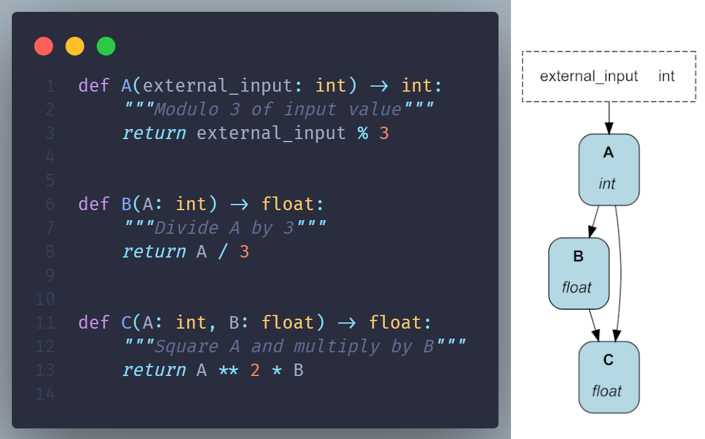
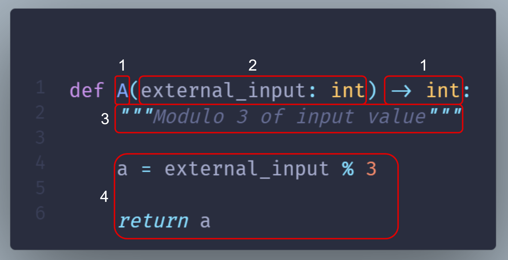

====
Node
====

The Node is the basic unit of Hamilton. Each node contains code to execute, and they can be assembled to form a dataflow.

Nodes are simply Python functions
---------------------------------
Nodes are defined using the native Python function definition API. The figure below shows how the functions ``A()``, ``B()``, and ``C()`` are automatically assembled into a dataflow. Notice that function definitions don't have any special "Hamilton code". Also, the function name and return type ``A() -> int`` match the parameter ``A: int`` found in functions ``B()`` and ``C()``.

Anatomy of a node
-----------------
The following figure and table detail how a Python function maps to a Hamilton node.

.. list-table::
   :header-rows: 1

   * - id
     - Function components
     - Node components
   * - 1
     - Function name and return type annotation
     - Node name and type
   * - 2
     - Parameter(s) name and type annotation
     - Node dependencies
   * - 3
     - Docstring
     - Description of the node return value
   * - 4
     - Function body
     - Implementation of the node

.. note::
  A `node` is an object Hamilton creates and uses as part of a `dataflow`. A `function` is a piece of Python code wrote by someone. A `function` almost always map to a single `node` so the two terms are often used interchangeably.

  However, Hamilton allows to create multiple nodes with a single function to keep your code `DRY <https://en.wikipedia.org/wiki/Don't_repeat_yourself>`_. We'll discuss these features later in this guide.

Function naming
---------------
Hamilton strongly agrees with the `Zen of Python <https://peps.python.org/pep-0020/>`_ #2: "Explicit is better than implicit". Meaningful function names help document what functions do, so don't shy away from longer names. If you were to come across a function named ``life_time_value`` versus ``ltv`` versus ``l_t_v``, which one is most obvious? Remember your code usually lives a lot longer that you ever think it will.

Unlike the common practice of including meaningful verbs in function names (e.g., ``get_credentials()``, ``statistical_test()``), with Hamilton, the function name should more closely align with nouns. That's because the function name determines the node name and how data will be queried. Therefore, names that describe the node result rather than its action may be more readable (e.g., ``credentials()``, ``statistical_results()``).

Node definitions -> Dataflow definition
---------------------------------------
Defining an Hamilton node requires specifying it's dependencies as function parameters. By walking through dependencies, Hamilton can automatically build a dataflow from a collection of node definitions. In practice, Hamilton loads all functions of a Python modules, so you don't have to import them one by one.

This contrasts with other orchestration frameworks (Airflow, Kedro, Prefect, VertexAI, SageMaker, etc.) where you first define nodes/steps/components/tasks in one place. Then, explicitly assemble them into a dataflow in separate locations.

Benefits of Hamilton
--------------------
For most orchestration frameworks, the code for ``component A`` doesn't tell you how it relates ``component B`` or the broader dataflow. By tying node definitions and the dataflow definition in a single place, Hamilton helps with readability. The ratio of reading to writing code can be as high as `10:1 <https://www.goodreads.com/quotes/835238-indeed-the-ratio-of-time-spent-reading-versus-writing-is>`_, especially for complex dataflows, so optimizing for readability is very high-value.

When editing a dataflow (new feature, debugging, etc.), changes to node definitions most often involve altering the dataflow structure. By keeping the two together, Hamilton improves maintainability by facilitating code changes. For other frameworks, code changes to ``component A`` require you to manually ensure consistent edits to the definition of dataflows where it's used.

In enterprise, it can become incredibly complex to discover and track all the places ``component A`` is used (potentially 10s or 100s of pipelines) and make manual changes to the dataflow structure to prevent failures. Hamilton avoids this problem because changes to the node definitions, and thus the dataflow, will propagate to all places this code is used.

Helper Functions
----------------

Hamilton constructs dataflows by using all functions in a module. To prevent a function from being included, prefix its name with an underscore (``_``). In the following example, only ``A()`` and ``B()`` are part of the dataflow.

.. code-block:: python

    def _round_three_decimals(value: float) -> float:
        """Round value by 3 decimals"""
        return round(value, 3)

    def A(external_input: int) -> int:
        """Modulo 3 of input value"""
        return external_input % 3

    def B(A: int) -> float:
        """Divide A by 3"""
        b = A / 3
        return _round_three_decimals(b)

Recap
--------
- Nodes are defined via Python functions
- The dataflow is defined by its nodes
- Define a helper function by adding an underscore prefix (e.g., ``_helper()``)
