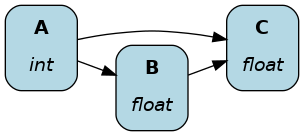

===========================
Functions, nodes & dataflow
===========================

On this page, you'll learn how Hamilton converts your Python functions into nodes and then creates a dataflow.

Functions
---------

Hamilton requires you to write your code using functions. To get started, you simply need to:

- `Annotate the type <https://docs.python.org/3/library/typing.html>`_ of the function parameters and return value.
- Specify the function dependencies with the parameter names.
- Store your code in Python modules (``.py`` files).

Since your code doesn't depend on special "Hamilton code", you can reuse it however you want!

Specifying dependencies
~~~~~~~~~~~~~~~~~~~~~~~
In Hamilton, you define dependencies by matching parameter names with the names of other functions. Below, the function name and return type ``A() -> int`` match the parameter ``A: int`` found in functions ``B()`` and ``C()``.

.. code-block:: python

  def A() -> int:
    """Constant value 35"""
    return 35

  def B(A: int) -> float:
      """Divide A by 3"""
      return A / 3

  def C(A: int, B: float) -> float:
      """Square A and multiply by B"""
      return A**2 * B

The figure shows how Hamilton automatically assembled the functions ``A()``, ``B()``, and ``C()``.

Helper function
~~~~~~~~~~~~~~~~

You can prefix a function name with an underscore (``_``) to prevent it from being included in a dataflow. Below, ``A()`` and ``B()`` are part of the dataflow, but ``_round_three_decimals()`` isn't.

.. code-block:: python

    def _round_three_decimals(value: float) -> float:
        """Round value by 3 decimals"""
        return round(value, 3)

    def A(external_input: int) -> int:
        """Modulo 3 of input value"""
        return external_input % 3

    def B(A: int) -> float:
        """Divide A by 3"""
        b = A / 3
        return _round_three_decimals(b)

Function naming tips
~~~~~~~~~~~~~~~~~~~~
Hamilton strongly agrees with the `Zen of Python <https://peps.python.org/pep-0020/>`_ #2: "Explicit is better than implicit". Meaningful function names help document what functions do, so don't shy away from longer names. If you were to come across a function named ``life_time_value`` versus ``ltv`` versus ``l_t_v``, which one is most obvious? Remember your code usually lives a lot longer than you ever think it will.

Unlike the common practice of including meaningful verbs in function names (e.g., ``get_credentials()``, ``statistical_test()``), with Hamilton, the function name should more closely align with nouns. That's because the function name determines the node name and how data will be queried. Therefore, names that describe the node result rather than its action may be more readable (e.g., ``credentials()``, ``statistical_results()``).

Nodes
-----

A node is a single "operation" or "step" in a dataflow. Hamilton users write Python `functions` that Hamilton converts into `nodes`. User never directly create nodes.

Anatomy of a node
~~~~~~~~~~~~~~~~~
The following figure and table detail how a Python function maps to a Hamilton node.

.. image:: ../_static/function_anatomy.png
    :scale: 13%
    :align: center

.. list-table::
   :header-rows: 1

   * - id
     - Function components
     - Node components
   * - 1
     - Function name and return type annotation
     - Node name and type
   * - 2
     - Parameter names and type annotations
     - Node dependencies
   * - 3
     - Docstring
     - Description of the node return value
   * - 4
     - Function body
     - Implementation of the node

Since functions almost always map to nodes 1-to-1, the two terms are often used interchangeably. However, there are exceptions that we'll discuss later in this guide.

Dataflow
--------

From a collection of nodes, Hamilton automatically assembles the dataflow. For each node, it creates edges between itself and its dependencies, resulting in a `dataflow <https://en.wikipedia.org/wiki/Dataflow_programming>`_ (or a `graph <https://en.wikipedia.org/wiki/Graph_(discrete_mathematics)>`_ in more mathematical terms).

From the user perspective, you give Hamilton a Python module containing your functions and it will generate your dataflow! This is a key difference with popular orchestration / pipeline / workflow frameworks (Airflow, Kedro, Prefect, VertexAI, SageMaker, etc.)

How other frameworks build graphs
~~~~~~~~~~~~~~~~~~~~~~~~~~~~~~~~~
In most frameworks, you first define nodes / steps / tasks / components. Then, you need to create your dataflow by explicitly specifying the relationship between each node.

Readability
^^^^^^^^^^^
In that case, the code for ``step A`` doesn't tell you how it relates ``step B`` or the broader dataflow. Hamilton solves this problem by tying functions, nodes, and dataflow definitions in a single place. The ratio of reading to writing code can be as high as `10:1 <https://www.goodreads.com/quotes/835238-indeed-the-ratio-of-time-spent-reading-versus-writing-is>`_, especially for complex dataflows, so optimizing for readability is high-value.

Maintainability
^^^^^^^^^^^^^^^
Typically, editing a dataflow (new feature, debugging, etc.) alters both what a **node** does and how the **dataflow** is structured. Consequently, changes to ``step A`` require you to manually ensure consistent edits to the definition of dataflows, which is likely in another file. In enterprise settings, it can become difficult to discover and track every location where ``step A`` is used (potentially 10s or 100s of pipelines), increasing the likelihood of breaking changes. Hamilton avoids this problem entirely because changes to the node definitions, and thus the dataflow, will propagate to all places the code is used. This greatly improves maintainability and development speed by facilitating code changes.

Recap
--------
- Users write Python functions into modules with proper naming and typing
- Helper functions use an underscore prefix (e.g., ``_helper()``)
- Hamilton converts functions into nodes
- Hamilton automatically assembles nodes into a dataflow

Next step
---------
So far, we learned how to write Hamilton code for our dataflow. Next, we'll explore how we can effectively

1. Convert a Python module into dataflow
2. Visualize a dataflow
3. Execute a dataflow
4. Gather and store results of a dataflow
