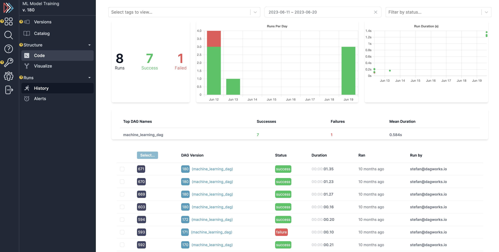

===========
Hamilton UI
===========

Hamilton comes with a fully open-source UI that can be run both for local deployment and on a remote server.
The UI consists of the following features:

1. Telemetry for hamilton executions -- both on the history of executions and the data itself
2. A feature/artifact catalog for browsing/connecting executions of nodes -> results
3. A DAG visualizer for exploring the DAG, looking at the code, and determining lineage

--------
Overview
--------

Getting Started
---------------

The Hamilton UI is contained within a set of docker images. You launch with `docker-compose <https://docs.docker.com/compose/>`_, and it will start up the UI, the backend server,
and a postgres database.

Prerequisites
-------------

To run this, you'll need:

1. Docker installed -- you can follow instructions  `here <https://docs.docker.com/engine/install/>`_.
2. A Hamilton workflow -- if you don't have this there's an init command that will create a basic one for you.
3. The `hamilton` repository cloned locally.

----

Starting the UI
---------------

Start by ensuring that the hamilton repository is cloned locally. Then, navigate to the `ui` directory:

.. code-block:: bash

    git clone https://github.com/dagworks-inc/hamilton

Then, navigate to the ``ui`` directory:

.. code-block:: bash

    cd hamilton/ui

And run the server command:

.. code-block:: bash

    ./deployment/run.sh

This will do the following:

1. Pull all docker images from the docker hub
2. Start a local postgres database
3. Start the backend server
4. Start the frontend server

This takes a bit of time! So be patient. The server will be running on port 8242. Then navigate to ``http://localhost:8242`` in your browser, and enter your email (this will be the username used within the app).

Building the Docker Images locally
__________________________________
If building the Docker containers from scratch, increase your Docker memory to 10gb or more -- you can do this in the Docker Desktop settings.

To build the images locally, you can run the following command:

.. code-block:: bash

    # from the hamilton/ui directory
    ./deployment/dev.sh --build

This will build the containers from scratch. If you just want to mount the local code, you can run just

.. code-block:: bash

    ./deployment/dev.sh

----

Running your first dataflows
----------------------------

Now that you have your server running, you can run a simple dataflow and watch it in the UI!
You can follow instructions in the UI when you create a new project, or follow the instructions here.

First, install the SDK:

.. code-block:: bash

    pip install "sf-hamilton[sdk]"

Then, navigate to the project page (dashboard/projects), in the running UI, and click the green ``+ New DAG`` button.

.. image:: ../_static/new_project.png

Remember the project ID -- you'll use it for the next steps.

Add the following adapter to your code:

.. code-block:: python

    from hamilton_sdk import adapters

    tracker = adapters.HamiltonTracker(
       project_id=PROJECT_ID_FROM_ABOVE,
       username="EMAIL_YOU_PUT_IN_THE_UI",
       dag_name="my_version_of_the_dag",
       tags={"environment": "DEV", "team": "MY_TEAM", "version": "X"}
    )

    dr = (
      driver.Builder()
        .with_config(your_config)
        .with_modules(*your_modules)
        .with_adapters(tracker)
        .build()
    )

Then run your DAG, and follow the links in the logs!

Exploring in the UI
-------------------

Once you get to the UI, you will be navigated to the projects page. After you create one + log,
you can navigate to `runs/history` for a history of runs. You can select by tags, date, etc...

----

-----------
Features
-----------

The UI has the following features:

DAG version tracking
--------------------

Select DAG versions to compare + visualize.

.. image:: ../_static/version_tracking.png
    :alt: DAG Version Tracking

Feature/asset Catalog
---------------------

View functions, nodes, and assets across a history of runs.

.. image:: ../_static/catalog.png
    :alt: Catalog

Browser
-------

View DAG shapes + code:

.. image:: ../_static/code_browser.png
    :alt: Browser

.. image:: ../_static/dag_view.png
    :alt: Browser

Run tracking + telemetry
------------------------

View a history of runs, telemetry on runs/comparison, and data for specific runs:

.. image:: ../_static/run_telemetry.png
    :alt: Run Telemetry

.. image:: ../_static/run_data.png
    :alt: Run Data

----

------------
Self-Hosting
------------

Please reach out to us if you want to deploy on your own infrastructure. Self-hosting documentation will be up soon.
