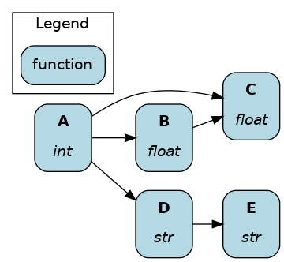
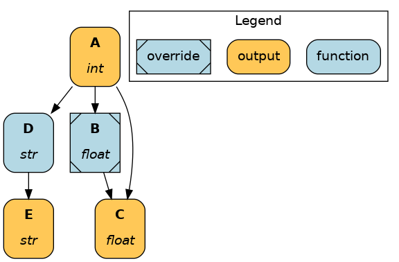
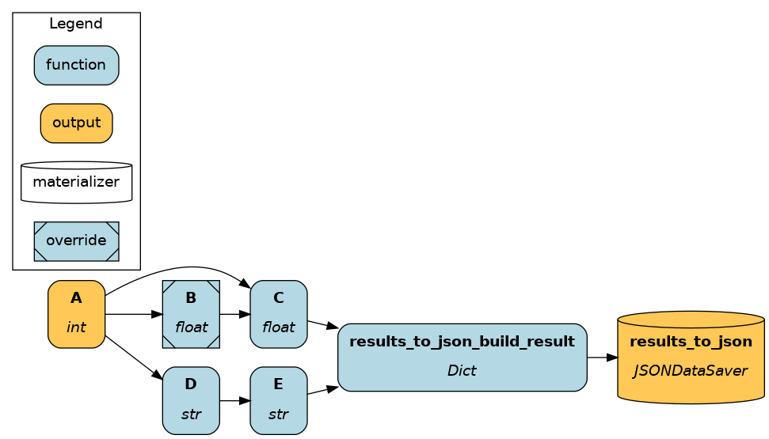
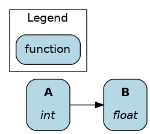
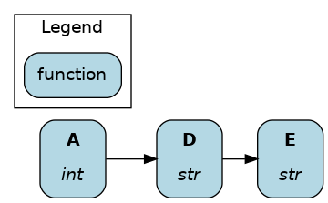
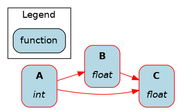
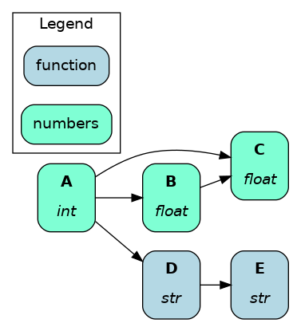

=============
Visualization
=============

After assembling the dataflow, the Driver can display it in several ways. Hamilton dataflow visualizations are great for documentation because they are directly derived from the code.

On this page, you'll learn:

- the available visualization functions
- how to answer lineage questions
- how to apply a custom style

For this page, we'll assume to have the following dataflow and Driver:

.. code-block:: python

    # my_dataflow.py
    def A() -> int:
        """Constant value 35"""
        return 35

    def B(A: int) -> float:
        """Divide A by 3"""
        return A / 3

    def C(A: int, B: float) -> float:
        """Square A and multiply by B"""
        return A**2 * B

    def D(A: int) -> str:
        """Say `hello` A times"""
        return "hello "

    def E(D: str) -> str:
        """Say hello*A world"""
        return D + "world"

    # run.py
    from hamilton import driver
    import my_dataflow

    dr = driver.Builder().with_modules(my_dataflow).build()

Available visualizations
------------------------

View full dataflow
~~~~~~~~~~~~~~~~~~

During development and for documentation, it's most useful to view the full dataflow and all nodes.

.. code-block:: python

    dr.display_all_functions(...)

View executed dataflow
~~~~~~~~~~~~~~~~~~~~~~

Visualizing exactly which nodes were executed is more helpful than viewing the full dataflow when logging driver execution (e.g., ML experiments).

You should produce the visualization before executing the dataflow. Otherwise, the figure won't be generated if the execution fails first.

.. code-block:: python

    # pull variables to ensure .execute() and
    # .visualize_execution() receive the same
    # arguments
    final_vars = ["A", "C", "E"]
    inputs = dict()
    overrides = dict(B=36.1)

    dr.visualize_execution(
        final_vars=final_vars,
        inputs=inputs,
        overrides=overrides,
    )
    dr.execute(
        final_vars=final_vars,
        inputs=inputs,
        overrides=overrides,
    )

An equivalent method is available if you're using materialization.

.. code-block:: python

    materializer =  to.json(
        path="./out.json",
        dependencies=["C", "E"],
        combine=base.DictResult(),
        id="results_to_json",
    )
    additional_vars = ["A"]
    inputs = dict()
    overrides = dict(B=36.1)

    dr.visualize_materialization(
        materializer,
        additional_vars=additional_vars,
        inputs=inputs,
        overrides=dict(B=36.1),
        output_file_path="dag.png"
    )
    dr.materialize(
        materializer,
        additional_vars=additional_vars,
        inputs=inputs,
        overrides=dict(B=36.1),
    )

Learn more about :doc:`materialization`.

View node dependencies
----------------------

Representing data pipelines, ML experiments, or LLM applications as a dataflow helps reason about the dependencies between operations. The Hamilton Driver has the following utilities to select and return a list of nodes:

- ``.what_is_upstream_of(*node_names: str)``
- ``.what_is_downstream_of(*node_names: str)``
- ``.what_is_the_path_between(upstream_node_name: str, down_stream_node_name: str)``

See our user guide on :doc:`../how-tos/use-hamilton-for-lineage` to learn more.

These functions are wrapped into their visualization counterparts:

Display ancestors of ``B``:

.. code-block:: python

    dr.display_upstream(["B"])

Display descendants of ``D`` and its immediate parents, which is only ``A``.

.. code-block:: python

    dr.display_downstream(["D"])

Filter nodes to the necessary path:

.. code-block:: python

    dr.visualize_path-between("A", "C")
    # dr.visualize_path-between("C", "D") would return
    # ValueError: No path found between C and D.

Configure your visualization
----------------------------

All of the above visualization functions share parameters to customize the visualization (e.g., hide legend, hide inputs). The API reference for `Driver.display_all_functions() <https://hamilton.dagworks.io/en/latest/reference/drivers/Driver/#hamilton.driver.Driver.display_all_functions>`_ should apply to all other visualizations.

We won't provide visual examples here, but you try them yourself in your browser on tryhamilton.dev (#TODO add tutorial)

.. _custom-visualization-style:

Apply custom style
~~~~~~~~~~~~~~~~~~

By default, each node is labeled with name and type, and stylized (shape, color, outline, etc.). By passing a function to the parameter ``custom_style_function``, you can customize the node style based on its attributes. This pairs nicely with the ``@tag`` function modifier (learn more :ref:`tag-decorators`)

To define your own style:

1. The function must use only keyword arguments, taking in ``node`` and ``node_class``.
2. It needs to return a tuple ``(style, node_class, legend_name)`` where:
    - ``style``: dictionary of valid graphviz node style attributes.
    - ``node_class``: class used to style the default visualization - we recommend returning the input ``node_class``
    - ``legend_name``: text to display in the legend. Return ``None`` for no legend entry.
3. For the execution-focused visualizations, your custom styles are applied before the modifiers for outputs and overrides are applied.

If you need more customization, we suggest getting the graphviz object back and then modifying it yourself.

This `online graphviz editor <https://edotor.net/>`_ can help you get started!

.. code-block:: python

    def custom_style(
        *, node: graph_types.HamiltonNode, node_class: str
    ) -> Tuple[dict, Optional[str], Optional[str]]:
        """Custom style function for the visualization.

        :param node: node that Hamilton is styling.
        :param node_class: class used to style the default visualization
        :return: a triple of (style, node_class, legend_name)
        """
        if node.type in [float, int]:
            style = ({"fillcolor": "aquamarine"}, node_class, "numbers")

        else:
            style = ({}, node_class, None)

        return style

    dr.display_all_functions(custom_style_function=custom_style)

See the `full code example <https://github.com/DAGWorks-Inc/hamilton/tree/main/examples/styling_visualization>`_ for more details.
