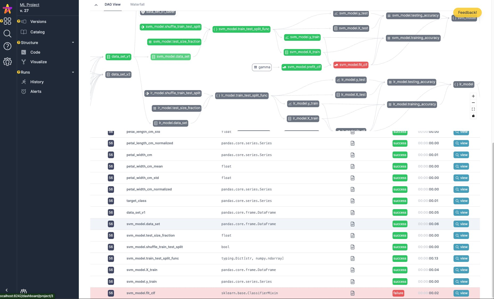
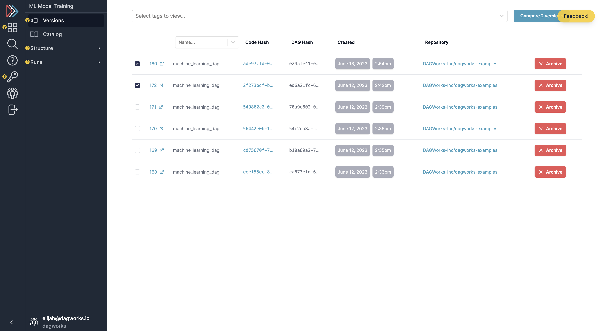
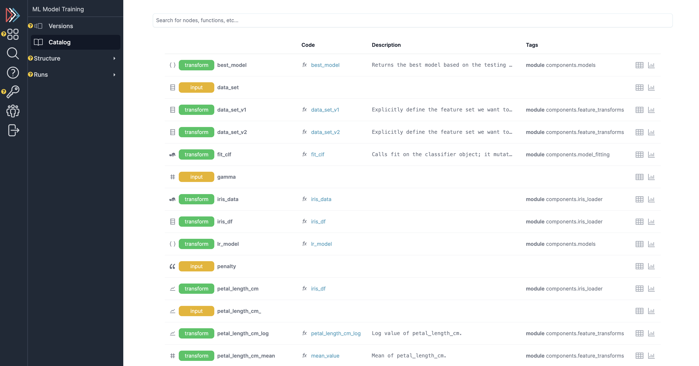
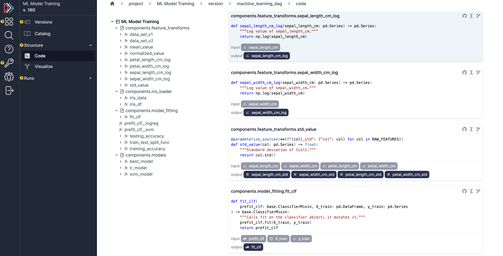
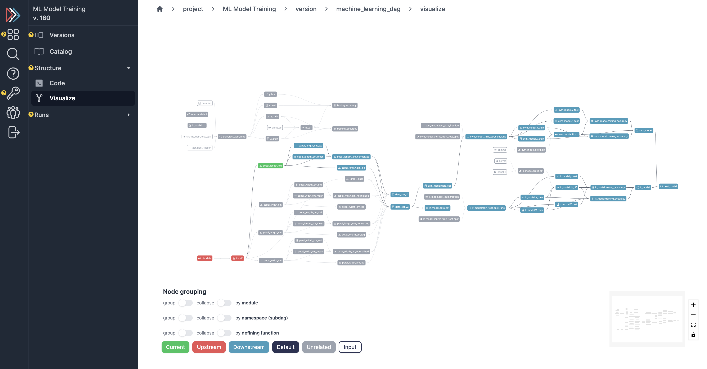
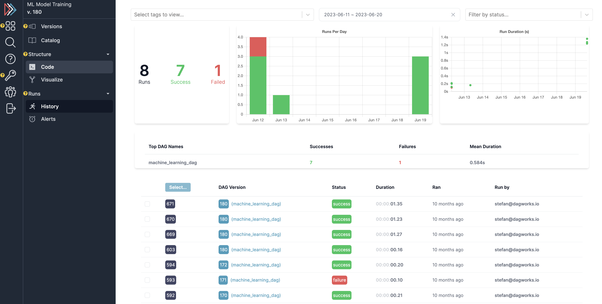
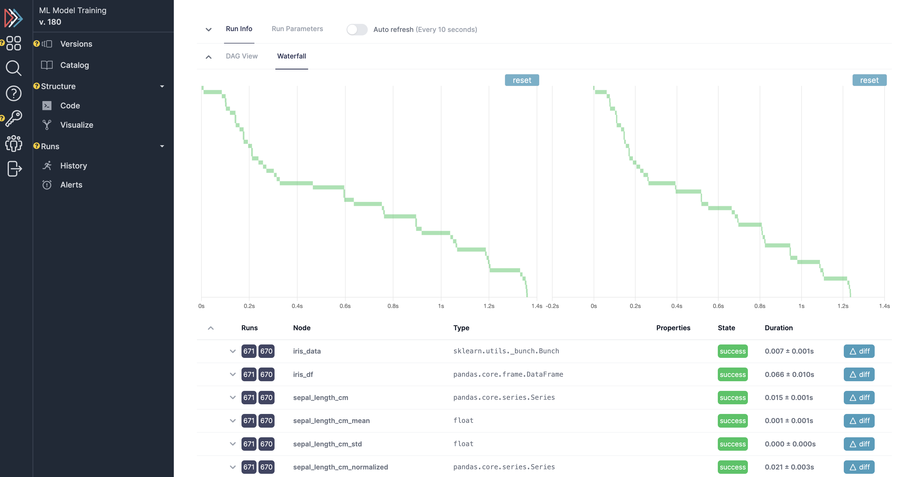
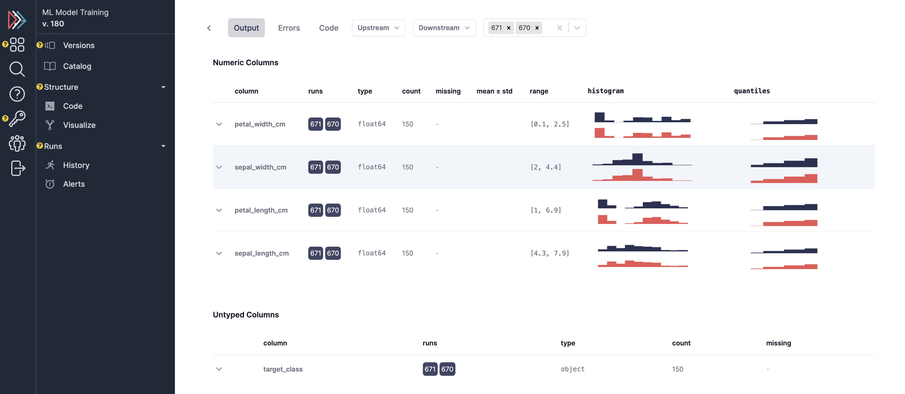

--------------------
UI Overview
--------------------

Hamilton comes with a fully open-source UI that can be run both for local deployment and on a remote server.
The UI consists of the following features:

1. Telemetry for hamilton executions -- both on the history of executions and the data itself.
2. A feature/artifact catalog for browsing/connecting executions of nodes -> results.
3. A dataflow (i.e. DAG) visualizer for exploring and looking at your code, and determining lineage.
4. A project explorer for viewing curating projects and viewing versions of your Hamilton dataflows.

In short, the Hamilton UI aims to combine a large swath of MLOps/data observability systems in one simple application.

---

The Hamilton UI has two modes:
1. Run locally using sqlite3
2. Run on docker images with postgres (meant for deployment)

----------
Local Mode
----------

To run the hamilton UI in local mode, you can do the following:

.. code-block:: bash

    pip install "sf-hamilton[ui,sdk]"
    hamilton ui
    # python -m hamilton.cli.__main__ ui # on windows

This will launch a browser window in localhost:8241. You can then navigate to the UI and start using it!
While this can potentially handle a small production workflow, you may want to run on postgres with a separate frontend/backend/db
for full scalability and a multi-read/write db.

--------------------
Docker/Deployed Mode
--------------------

The Hamilton UI can be contained within a set of Docker images. You launch with `docker-compose <https://docs.docker.com/compose/>`_, and it will start up the UI, the backend server,
and a Postgres database. If you'd like a quick overview of some of the features, you can watch the following:

.. raw:: html

    <iframe width="560" height="315" src="https://www.youtube.com/embed/0VIVSeN7Ij8?si=i3vTsfTNorzh5y2C" title="YouTube video player" frameborder="0" allow="accelerometer; autoplay; clipboard-write; encrypted-media; gyroscope; picture-in-picture; web-share" referrerpolicy="strict-origin-when-cross-origin" allowfullscreen></iframe>

Note: if you run into the "Invalid HTTP_HOST" error, then please set the environment variable `HAMILTON_ALLOWED_HOSTS="*"` (or comma separated list of domains of choice) for the backend docker container. You can inject
this via `-e` or in the `docker-compose[-prod].yml` file itself.

Install
-------

If you'd like a video walkthrough on getting set up, you can watch the following:

.. raw:: html

    <iframe width="560" height="315" src="https://www.youtube.com/embed/DPfxlTwaNsM?si=gks5oOAWsNPSJbe_" title="YouTube video player" frameborder="0" allow="accelerometer; autoplay; clipboard-write; encrypted-media; gyroscope; picture-in-picture; web-share" referrerpolicy="strict-origin-when-cross-origin" allowfullscreen></iframe>

As prerequisites, you will need to have Docker installed -- you can follow instructions  `here <https://docs.docker.com/engine/install/>`_.

1. Clone the Hamilton repository locally

.. code-block:: bash

    git clone https://github.com/dagworks-inc/hamilton

2. Navigate to the ``hamilton/ui`` directory

.. code-block:: bash

    cd hamilton/ui

3. Execute the installation script with the following command

.. code-block:: bash

    ./run.sh

This will:

- Pull all Docker images from the Docker Hub
- Start a local Postgres database
- Start the backend server
- Start the frontend server

This takes a bit of time! So be patient. The server will be running on port 8242.

4. Then navigate to ``http://localhost:8242`` in your browser, and enter your email (this will be the username used within the app).

Building the Docker Images locally
-----------------------------------
If building the Docker containers from scratch, increase your Docker memory to 10gb or more -- you can do this in the Docker Desktop settings.

To build the images locally, you can run the following command:

.. code-block:: bash

    # from the hamilton/ui directory
    ./dev.sh --build

This will build the containers from scratch. If you just want to mount the local code, you can run just

.. code-block:: bash

    ./dev.sh

Self-Hosting
-------------

If you know docker, you should be good to go. The one environment variable to know is `HAMILTON_ALLOWED_HOSTS`, which you can set to `*` to allow all hosts, or
a comma separated list of hosts you want to allow.

Please reach out to us if you want to deploy on your own infrastructure and need help - `join slack <https://join.slack.com/t/hamilton-opensource/shared_invite/zt-2niepkra8-DGKGf_tTYhXuJWBTXtIs4g>`_.
More extensive self-hosting documentation is in the works, e.g. Snowflake, Databricks, AWS, GCP, Azure, etc.; we'd love a helm
chart contribution!

Running on Snowflake
---------------------
You can run the Hamilton UI on Snowflake Container Services. For a detailed guide, see the blog post
`Observability of Python code and application logic with Hamilton UI on Snowflake Container Services <https://medium.com/@pkantyka/observability-of-python-code-and-application-logic-with-hamilton-ui-on-snowflake-container-services-a26693b46635>`_ by
`Greg Kantyka <https://medium.com/@pkantyka>`_ and the `Hamilton Snowflake Example <https://github.com/DAGWorks-Inc/hamilton/tree/main/examples/snowflake/hamilton_ui>`_.

-----------
Get started
-----------

Now that you have your server running, you can run a simple dataflow and watch it in the UI!
You can follow instructions in the UI when you create a new project, or follow the instructions here.

First, install the SDK:

.. code-block:: bash

    pip install "sf-hamilton[sdk]"

Then, navigate to the project page (dashboard/projects), in the running UI, and click the green ``+ New DAG`` button.

.. image:: ../_static/new_project.png

Remember the project ID -- you'll use it for the next steps.

Existing Hamilton Code
----------------------
Add the following adapter to your code if you have existing Hamilton code:

.. code-block:: python

    from hamilton_sdk import adapters

    tracker = adapters.HamiltonTracker(
       project_id=PROJECT_ID_FROM_ABOVE,
       username="USERNAME/EMAIL_YOU_PUT_IN_THE_UI",
       dag_name="my_version_of_the_dag",
       tags={"environment": "DEV", "team": "MY_TEAM", "version": "X"}
    )

    dr = (
      driver.Builder()
        .with_config(your_config)
        .with_modules(*your_modules)
        .with_adapters(tracker)
        .build()
    )

Then run your DAG, and follow the links in the logs! Note that the link is correct if you're using
the local mode -- if you're on postgres it links to 8241 (but you'll want to follow it to 8241).

I need some Hamilton code to run
--------------------------------
If you don't have Hamilton code to run this with, you can run Hamilton UI example under `examples/hamilton_ui <https://github.com/dagworks-inc/hamilton/tree/main/examples/hamilton_ui>`_:

.. code-block:: bash

    # we assume you're in the Hamilton repository root
    cd examples/hamilton_ui
    # make sure you have the right python packages installed
    pip install -r requirements.txt
    # run the pipeline providing the email and project_id you created in the UI
    python run.py --email <email> --project_id <project_id>

You should see links in the `logs to the UI <http://localhost:8242/dashboard/projects>`_, where you can see the DAG run + the data summaries captured.

----------
Features
----------

Once you get to the UI, you can navigate to the projects page (left hand nav-bar). Assuming you have created a project
and logged to it, you can then navigate to view it and then more details about it. E.g. versions, code, lineage, catalog, execution runs.
See below for a few screenshots of the UI.

Dataflow versioning
--------------------

Select a dataflow versions to compare and visualize.

Assets/features catalog
-----------------------

View functions, nodes, and assets across a history of runs.

Browser
--------

View dataflow structure and code.

Run tracking + telemetry
-------------------------

View a history of runs, telemetry on runs/comparison, and data for specific runs:

------------------
SDK Configuration
------------------
This section documents HamiltonTracker configuration options.

Changing where data is sent
----------------------------
You can change where telemetry is logged by passing in `hamilton_api_url` and/or `hamilton_ui_url` to the
HamiltonTracker constructor. By default, these are set to `localhost:8241/8242`.

.. code-block:: python

    from hamilton_sdk import adapters

    tracker = adapters.HamiltonTracker(
       project_id=PROJECT_ID_FROM_ABOVE,
       username="USERNAME/EMAIL_YOU_PUT_IN_THE_UI",
       dag_name="my_version_of_the_dag",
       tags={"environment": "DEV", "team": "MY_TEAM", "version": "X"},
       hamilton_api_url="http://YOUR_DOMAIN_HERE:8241",
       hamilton_ui_url="http://YOUR_DOMAIN_HERE:8242" # if using docker the UI is on 8242.
    )

    dr = (
      driver.Builder()
        .with_config(your_config)
        .with_modules(*your_modules)
        .with_adapters(tracker)
        .build()
    )

Changing behavior of what is captured
-------------------------------------
By default, a lot is captured and sent to the Hamilton UI.

Here are a few options that can change that - these can be found
in `hamilton_sdk.tracking.constants`. You can either change the defaults by
directly changing the constants, by specifying them in a config file, or via environment variables.

Here we first explain the options:

.. table:: Simple Invocation
   :align: left

   +-----------------------------+-----------------------------+----------------------------------------------------------+
   | Option                      | Default                     | Explanation                                              |
   +=============================+=============================+==========================================================+
   | CAPTURE_DATA_STATISTICS     | True                        | Whether to capture any data insights/statistics          |
   +-----------------------------+-----------------------------+----------------------------------------------------------+
   | MAX_LIST_LENGTH_CAPTURE     | 50                          | Max length for list capture                              |
   +-----------------------------+-----------------------------+----------------------------------------------------------+
   | MAX_DICT_LENGTH_CAPTURE     | 100                         | Max length for dict capture                              |
   +-----------------------------+-----------------------------+----------------------------------------------------------+
   | DEFAULT_CONFIG_URI          | ~/.hamilton.conf            | Default config file URI.                                 |
   +-----------------------------+-----------------------------+----------------------------------------------------------+

To change the defaults via a config file, you can do the following:

.. code-block:: ini

    [SDK_CONSTANTS]
    MAX_LIST_LENGTH_CAPTURE=100
    MAX_DICT_LENGTH_CAPTURE=200

    # save this to ~/.hamilton.conf

To change the defaults via environment variables, you can do the following, prefixing them with `HAMILTON_`:

.. code-block:: bash

    export HAMILTON_MAX_LIST_LENGTH_CAPTURE=100
    export HAMILTON_MAX_DICT_LENGTH_CAPTURE=200
    python run_my_hamilton_code.py

To change the defaults directly, you can do the following:

.. code-block:: python

    from hamilton_sdk.tracking import constants

    constants.MAX_LIST_LENGTH_CAPTURE = 100
    constants.MAX_DICT_LENGTH_CAPTURE = 200

    tracker = adapters.HamiltonTracker(
       project_id=PROJECT_ID_FROM_ABOVE,
       username="USERNAME/EMAIL_YOU_PUT_IN_THE_UI",
       dag_name="my_version_of_the_dag",
       tags={"environment": "DEV", "team": "MY_TEAM", "version": "X"}
    )

    dr = (
      driver.Builder()
        .with_config(your_config)
        .with_modules(*your_modules)
        .with_adapters(tracker)
        .build()
    )
    dr.execute(...)

In terms of precedence, the order is:

1. Module default.
2. Config file values.
3. Environment variables.
4. Directly set values.
