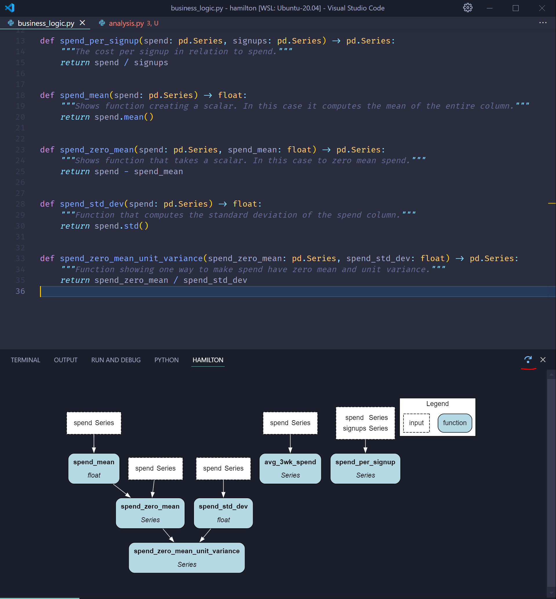
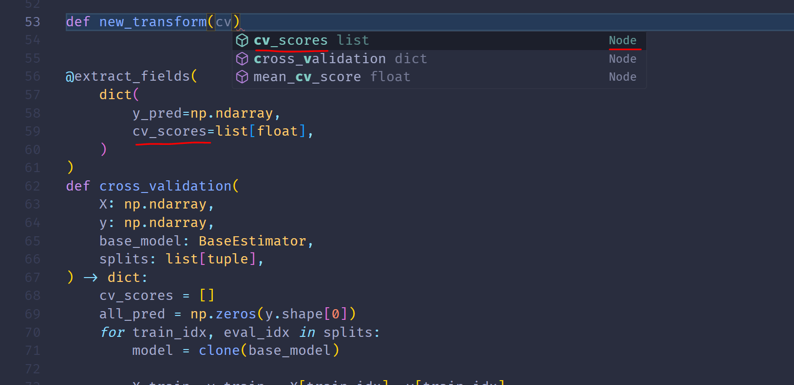
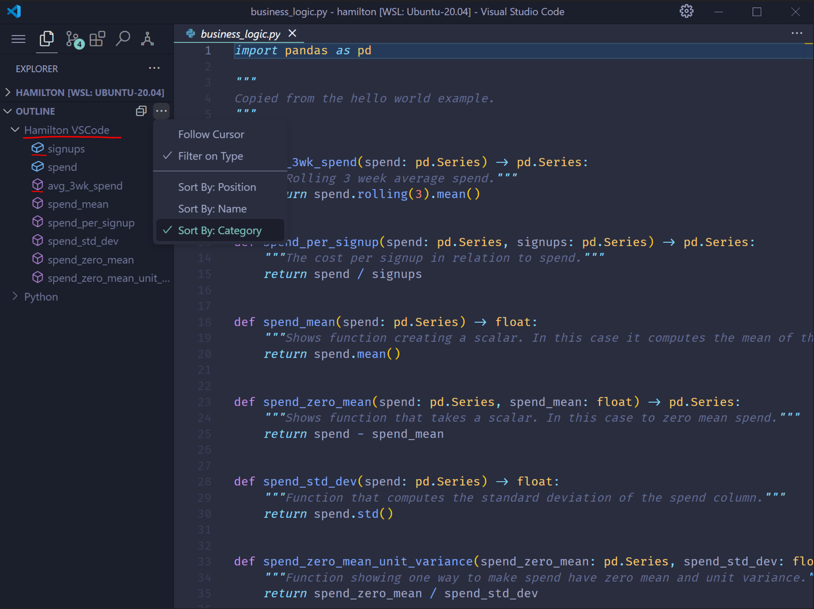
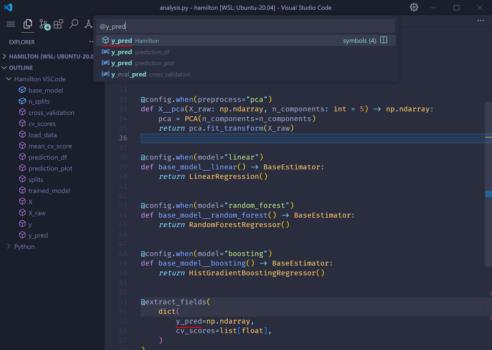
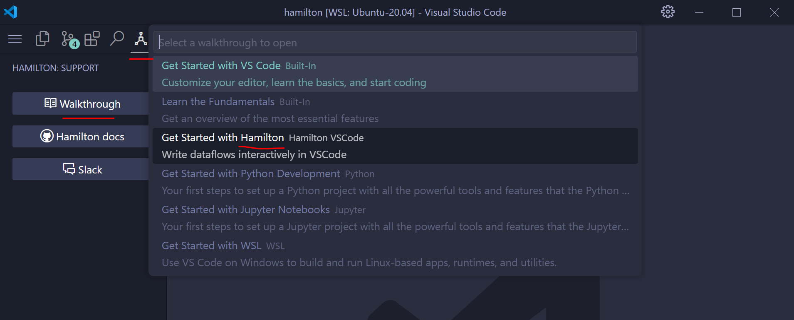

-------------------------
Hamilton VSCode
-------------------------

.. warning::

    The Hamilton VSCode extension is an experimental feature under active development. Edge cases, evolving features, and partial documentation are to be expected. Please  open a GitHub issue or reach out on Slack for troubleshooting!

The Hamilton VSCode extension enables interactive dataflow development in VSCode. This developer productivity tool helps your editor understand how Hamilton works (code completion, symbol navigation, etc.). It is powered by the :doc:`Hamilton Language Server <./language_server>` and can be installed directly from the `VSCode marketplace <https://marketplace.visualstudio.com/items?itemName=DAGWorks.hamilton-vsc>`_.

Features
--------

Dataflow visualization
~~~~~~~~~~~~~~~~~~~~~~

Visualize the dataflow defined in the current Python file. As you type and add functions, the visualization automatically updates. There is a UI button to rotate the visualization 90-degree.

.. note::

    We suggest moving the visualization tab to the VSCode panel (``CTRL+J``) or the secondary sidebar (``CTRL+ALT+B``) by drag-and-dropping the tab.

Completion suggestions
~~~~~~~~~~~~~~~~~~~~~~

Get completion suggestions when defining new nodes. It will even insert the appropriate type when selected! Completion suggestions have the ``Node`` type and can even display their docstring when hovered over.

Outline
~~~~~~~~~~~~~~~

The **OUTLINE** menu now displays a **Hamilton VSCode** entry. Nodes and inputs from the current Python file are listed and denoted by distinct icons.

Symbol navigation
~~~~~~~~~~~~~~~~~

When entering symbol navigation (``CTRL+SHIFT+O``), you can jump directly to any node definition. Notice from the screenshot that it even pickups node defined in a decorator.

Extension walkthrough
~~~~~~~~~~~~~~~~~~~~~

Under the Hamilton menu (the icon at the top), you can find a list of buttons. Selecting ``Walkthrough`` and then ``Get started with Hamilton`` will launch an interactive menu to get you set up along with some tips.

.. note::

    Some of this content may become outdated since the extension is evolving quickly.

Roadmap
-------
There are many features that we'd be interested in implementing. Let us know on `Slack <https://join.slack.com/t/hamilton-opensource/shared_invite/zt-1bjs72asx-wcUTgH7q7QX1igiQ5bbdcg>`_ your favorite ones!

- Go To Definition: jump to where the node defined
- Go To References: jump to where the node is a dependency
- Rename: rename a node across locations (can be tricky when mentioned in a decorator)
- Support dataflows spanning multiple modules
- Configure the visualization (i.e., match the Python features)
- Integrate with the Hamilton UI (e.g., click a node to open it's Hamilton UI page and see execution details)
- Visualize notebook cells using the Hamilton Jupyter extension (seems possible)
