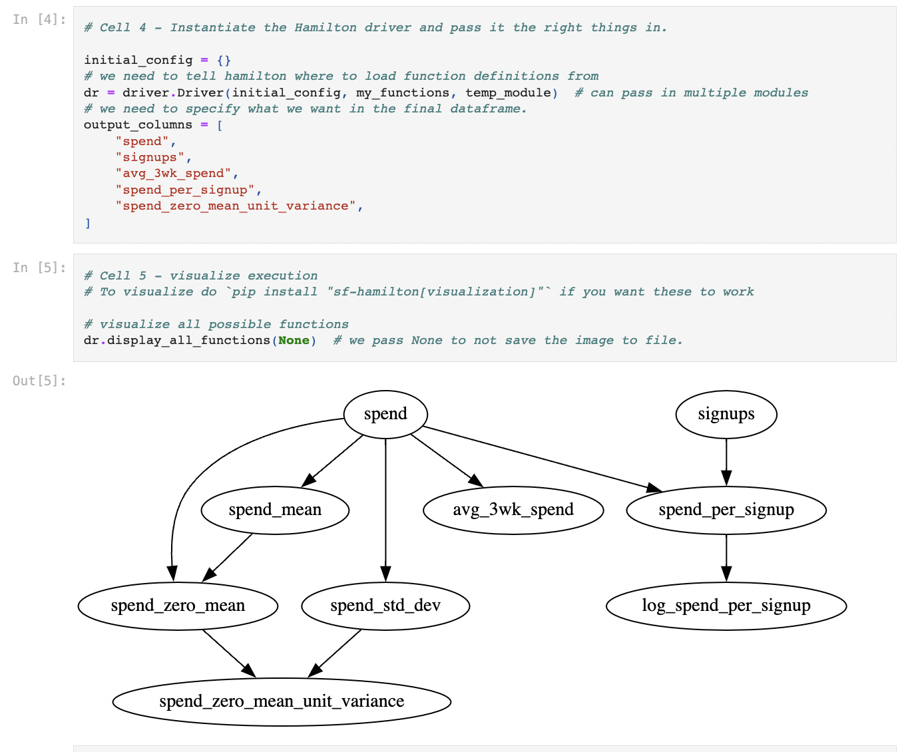

=========================
Run in a Jupyter Notebook
=========================

It's natural to run Hamilton within a jupyter notebook. There are a few ways to go about this:

#. Store all your code in the jupyter notebook, iterating on the functions themselves as well as the driver (see example below)
#. Store your code externally, and import it into the notebook. Utilize the driver to run the code, iteratively adding functions
to the driver as you settle on transform logic
#. Execute/manage your code externally, and use the notebook to visualize the DAG/interact with it

How you do this is entirely up to you! We're likely going to add more first-class jupyter notebook support.

The `Hello World <https://github.com/DAGWorks-Inc/hamilton/blob/main/examples/hello_world/my_notebook.ipynb>`_ example notebook shows you how you would approach (1), and it should be easy to extend to the other approaches.

As a quick teaser...

