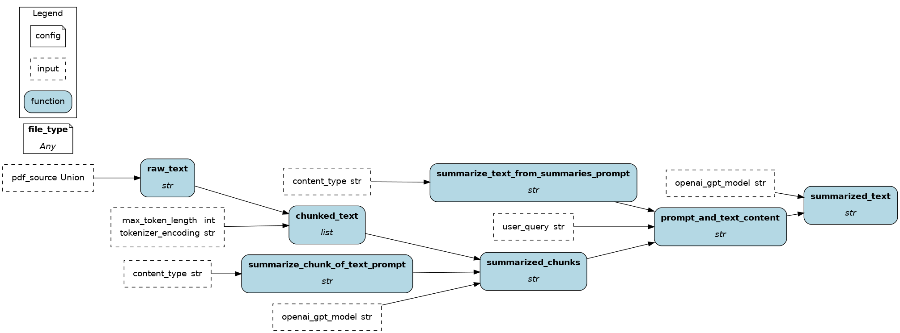

# FastAPI

[FastAPI](https://fastapi.tiangolo.com/) is an open-source Python web framework to create APIs. It is a modern alternative to Flask and a more lightweight option than Django. In FastAPI, endpoints are defined using Python functions. The parameters indicate the request specifications and the return value specifies the response. Decorators are used to specify the [HTTP methods](https://learn.microsoft.com/en-us/azure/architecture/best-practices/api-design) (GET, POST, etc.) and to route the request.

```python
from typing import Union
from fastapi import FastAPI

app = FastAPI()  # Instantiate the FastAPI server

@app.get("/")  # GET method with base route "/"
def read_root():
    return {"Hello": "World"}

@app.get("/items/{item_id}")  # dynamic route with variable `item_id`
def read_item(item_id: int, q: Union[str, None] = None):
    return {"item_id": item_id, "q": q}

if __name__ == "__main__":
    # launch the server with `uvicorn`
    import uvicorn
    uvicorn.run(app, host="0.0.0.0", port=8000)  # specify host and port
```

On this page, you'll learn how Hamilton can help you:
- Test you application
- Reduce friction transition between proof-of-concept and production
- Document your API

## Challenges
### 1. Test your FastAPI application
FastAPI endpoints are simply decorated Python function, allowing a great deal of flexibility as to what is executed (functions, classes, web requests, etc.) On one hand, we want to test that endpoints are defined and behave properly by starting a server and testing the GET, POST, etc. requests. FastAPI provides great [documentation and tooling](https://fastapi.tiangolo.com/tutorial/testing/) to do so. On the other hand, these tests conflate the role of the FastAPI server and the endpoint behavior. To run them, a server-client pair need to be created, which will slow down your test suite, and [endpoints need to be mocked](https://jestjs.io/docs/mock-functions) to avoid connecting to production environment. By conflating the role of the FastAPI server and the endpoint behavior, more efforts and resources are needed to write and run tests. The content of the endpoints and the structure of the codebase might make it extremely difficult to test endpoint dataflows isolated from FastAPI.

### 2. Document your API
FastAPI already does a great job at automating API documentation by integrating with [Swagger UI](https://fastapi.tiangolo.com/how-to/configure-swagger-ui/) and [OpenAPI](https://fastapi.tiangolo.com/how-to/separate-openapi-schemas/). It leverages the endpoints' name, path, docstring, and type annotations, and also allows to add descriptions and example inputs. However, since docstrings, descriptions, and example inputs are not directly tied to the code, they risk of becoming out of sync as changes are made.


## Hamilton + FastAPI
Adding Hamilton to your FastAPI server can provide a better separation between the dataflow and the API endpoints. Each endpoint can use `Driver.execute()` to request variables and wrap results into an HTTP response. Then, data transformations and interactions with resources (e.g., database, web service) are defined into standalone Python modules and decoupled from the server code.

Since Hamilton dataflows will run the same way inside or outside FastAPI, you can write simpler unit tests for Hamilton functions without defining a mock server and client. Additionnally, visualizations for Hamilton dataflows can be generated directly from the code, which ensures they're in sync with the API behavior.

### Example
In this example, we'll build a backend for a PDF summarizer application.

> The full code can be found on [GitHub](https://github.com/DAGWorks-Inc/hamilton/tree/main/examples/LLM_Workflows/pdf_summarizer/backend/server.py)

#### Client
The client defines an HTTP POST request to send a PDF file along a selected OpenAI GPT model, the content type of the PDF file, and a query for the summarization. The `files` parameter allows for [multipart encoding uploads](https://requests.readthedocs.io/en/latest/user/advanced/?highlight=files#post-multiple-multipart-encoded-files) and `data` sets the content of the body of the request.
```python
# client.py
from typing import IO
import requests

def post_summarize(
    uploaded_pdf: IO[bytes],
    openai_gpt_model: str,
    content_type: str,
    user_query: str,
) -> requests.Response:
    """POST request to summarize a PDF via the `/summarize` endpoint"""
    return requests.post(
        url="http://0.0.0.0:8000/summarize",  # http://HOST:PORT/ENDPOINT as specified in server.py
        files=dict(pdf_file=uploaded_pdf),
        data=dict(
            openai_gpt_model=openai_gpt_model,
            content_type=content_type,
            user_query=user_query,
        ),
    )
```
> 💡 For more complex FastAPI applications, you can automatically [generate the client code](https://fastapi.tiangolo.com/advanced/generate-clients/) in Python and other languages (TypeScript, Rust, etc.)

#### Backend dataflow with Hamilton
Hamilton transformations are defined in the module `summarization.py`. This includes loading and chunking the raw text, summarizing chunks with the OpenAI API, and reducing chunks into a final summary.

Visualization of the Hamilton dataflow



#### Server definition with FastAPI
Then, the FastAPI server is defined in `server.py`. Notice a few things:
- the `Driver` is built only once in the global context.
- the endpoint types are set using `Annotated[...]` to [accept multipart encoded forms](https://fastapi.tiangolo.com/tutorial/request-forms-and-files/?h=form#__tabbed_2_1)
- the HTTP POST request is passed as `inputs` to `Driver.execute()`
- the Hamilton results are wrapped into a Pydantic `SummarizeResponse` model

```python
# server.py
from typing import Annotated

from fastapi import FastAPI, Form, UploadFile
from pydantic import BaseModel
from hamilton import driver

import summarization

app = FastAPI()

# build the Hamilton driver with the summarization module
dr = (
    driver.Builder()
    .with_modules(summarization)
    .build()
)

class SummarizeResponse(BaseModel):
    """Response to the /summarize endpoint"""
    summary: str

@app.post("/summarize")  # POST request, `/summarize` endpoint
def summarize_pdf(
    pdf_file: Annotated[UploadFile, Form()],
    openai_gpt_model: Annotated[str, Form()],
    content_type: Annotated[str, Form()],
    user_query: Annotated[str, Form()],
) -> SummarizeResponse:
    """Summarize the text from the PDF file"""
    results = dr.execute(
        ["summarized_text"],
        inputs=dict(
            pdf_source=pdf_file.file,
            openai_gpt_model=openai_gpt_model,
            content_type=content_type,
            user_query=user_query,
        ),
    )
    return SummarizeResponse(summary=results["summarized_text"])

if __name__ == "__main__":
    import uvicorn
    uvicorn.run(app, host="0.0.0.0", port=8000)  # specify host and port
```

#### Visualize endpoints' dataflow
The Hamilton dataflow visualizations can be added to the automatically generated FastAPI Swagger documentation, which can be viewed at http://0.0.0.0:8000/docs
```python
# server.py
# ... after defining all endpoints

# get the visualization
visualization = dr.visualize_execution(["summarized_text"], inputs=dict(pdf_source=bytes(), openai_gpt_model="", user_query=""))
# encode the PNG object into a base64 string
base64_viz = base64.b64encode(visualization.pipe(format="png")).decode("utf-8")
# add the base64 string of a PNG to the API endpoint text description
app.routes[-1].description += f""""""

# ... before `if __name__ == "__main__":`
```


### Benefits
- **Clearer scope**: the decoupling between `server.py` and `summarization.py` makes it easier to extend and test the server separately from the data transformations.
- **Reusable code**: the module `summarization.py` can be reused elsewhere with Hamilton. For instance, if you first started by building a proof-of-concept with [Streamlit + Hamilton](https://hamilton.dagworks.io/en/latest/integrations/streamlit), the logic you produced could be reused to power your FastAPI server.
- **Richer documentation**: Hamilton allows to view and better understand the dataflow of an operation.
