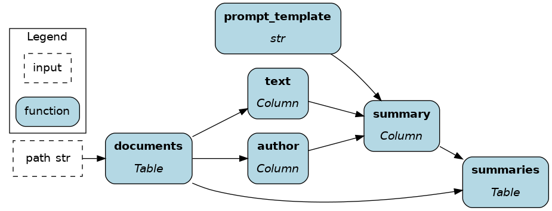

# Ibis

[Ibis](https://ibis-project.org/) is the portable Python dataframe library. It allows you to define data transformations once and execute them in multiple backends (BigQuery, DuckDB, PySpark, SQLite, Snowflake, Postgres, Polars; [see the full list](https://ibis-project.org/support_matrix)). If you never used Ibis before, it should feel similar to SQL with a touch of dataframes (e.g., pandas). You'll be primarily writing expressions (similar to an SQL query), which compute values only after calling for execution via `.to_pandas()` for example.

On this page, you'll learn how Ibis + Hamilton can help:
- Create a modular codebase for better collaboration and maintainability
- Reduce the development-production gap

## Standalone Ibis
Here's an Ibis code snippet to load data from a CSV, compute features, and select columns / filter rows. It illustrates typical feature engineering operations.

 Reading the code, you'll notice that:

- We use "expression chaining", meaning there's a series of `.method()` attached one after another.
- The variable `ibis._` is a special character referring to the current expression e.g., `ibis._.pet` accesseses the column "pet" of the current table.
- The table method `.mutate(col1=, col2=, ...)` assigns new columns or overwrites existing ones.

```python
import ibis

raw_data_path = ...
feature_selection = [
    "id", "has_children", "has_pet", "is_summer_brazil",
    "service_time", "seasons", "disciplinary_failure",
    "absenteeism_time_in_hours",
],

# write the expression
feature_set = (
    ibis.read_csv(sources=raw_data_path, table_name="absenteism")
    .rename("snake_case")
    .mutate(
        has_children=ibis.ifelse(ibis._.son > 0, 1, 0),
        has_pet=ibis.ifelse(ibis._.pet > 0, 1, 0),
        is_summer_brazil=ibis._.month_of_absence.isin([1, 2, 12]).cast(int),
    )
    .select(*feature_selection)
    .filter(ibis.ifelse(ibis._.has_pet == 1, True, False))
)
# execute the expression
feature_df = feature_set.to_pandas()
```

### Challenge 1 - Maintain and test large data transformations codebases
Ibis has an SQL-like syntax and supports chaining operations, allowing for powerful queries in a few lines of code. Conversely, there's a risk of sprawling complexity as expressions as statements are appended, making them harder to test and debug. Preventing this issue requires a lot of upfront discipline and refactoring.

### Challenge 2 - Orchestrate Ibis code in production
Ibis alleviates a major pain point by enabling data transformations to work across backends. However, moving from dev to prod still requires some code changes such as changing backend connectors, swapping unsupported operators, adding some orchestration and logging execution. This is outside the scope of the Ibis project and is expected to be enabled by other means.

## How Hamilton complements Ibis
### Write modular Ibis code
Hamilton was initially developed to [structure pandas code for a large catalog of features](https://blog.dagworks.io/p/tidy-production-pandas-with-hamilton-3b759a2bf562), and has been adopted by multiple organizations since. Its syntax encourages users to chunk code into meaningful and reusable components, which facilitates documentation, unit testing, code reviews, and improves iteration speed. These benefits directly translate to organizing Ibis code.

Below, we'll refactor the above code to use Hamilton. Users have the flexibility to chunk code at the table or the column-level depending on the needed granularity. This modularity is particularly beneficial to Ibis because:

- Well-scoped functions with type annotations and docstring are easier to understand for new Ibis users and facilitate onboarding.
- Unit testing and data validation becomes easier with smaller expressions. These checks become more important when working across backends since the [operation coverage varies](https://ibis-project.org/support_matrix) and bugs may arise.

#### Table-level
Table-level operations might feel most familiar to SQL and Spark users. Also, Ibis + Hamilton is reminiscent of dbt for the Python ecosystem.

Working with tables is very efficient when your number of columns/features is limited, and you don't need full lineage. As you want to reuse components, you can progressively breakdown "table-level code" in to "column-level code".

The initial Ibis code is now 3 functions with type annotations and docstrings. We have a clear sense of the expected external outputs and we could implement schema checks between functions.

```python
import ibis
import ibis.expr.types as ir

def raw_table(raw_data_path: str) -> ir.Table:
    """Load CSV from `raw_data_path` into a Table expression
    and format column names to snakecase
    """
    return (
        ibis.read_csv(sources=raw_data_path, table_name="absenteism")
        .rename("snake_case")
    )

def feature_table(raw_table: ir.Table) -> ir.Table:
    """Add to `raw_table` the feature columns `has_children`
    `has_pet`, and `is_summer_brazil`
    """
    return raw_table.mutate(
        has_children=(ibis.ifelse(ibis._.son > 0, True, False)),
        has_pet=ibis.ifelse(ibis._.pet > 0, True, False),
        is_summer_brazil=ibis._.month_of_absence.isin([1, 2, 12]),
    )

def feature_set(
    feature_table: ir.Table,
    feature_selection: list[str],
    condition: Optional[ibis.common.deferred.Deferred] = None,
) -> ir.Table:
    """Select feature columns and filter rows"""
    return feature_table[feature_selection].filter(condition)
```


#### Column-level
Hamilton was built around column-level operations, which is most common in dataframe libraries (pandas, Dask, polars).

Column-level code leads to fully-reusable feature definitions and a great level of lineage. Notably, this allows to [trace sensitive data and evaluate downstream impacts of code changes](../../how-tos/use-hamilton-for-lineage.md). However, it is more verbose to get started with, but remember that code is more often read than written.

Now, the `raw_table` is loaded and the columns `son`, `pet`, and `month_of_absence` are extracted to engineer new features. After transformations, features are joined with `raw_table` to create `feature_table`.
```python
import ibis
import ibis.expr.types as ir
from hamilton.function_modifiers import extract_columns
from hamilton.plugins import ibis_extensions

# extract specific columns from the table
@extract_columns("son", "pet", "month_of_absence")
def raw_table(raw_data_path: str) -> ir.Table:
    """Load the CSV found at `raw_data_path` into a Table expression
    and format columns to snakecase
    """
    return (
        ibis.read_csv(sources=raw_data_path, table_name="absenteism")
        .rename("snake_case")
    )

# accesses a single column from `raw_table`
def has_children(son: ir.Column) -> ir.BooleanColumn:
    """True if someone has any children"""
    return ibis.ifelse(son > 0, True, False)

# narrows the return type from `ir.Column` to `ir.BooleanColumn`
def has_pet(pet: ir.Column) -> ir.BooleanColumn:
    """True if someone has any pets"""
    return ibis.ifelse(pet > 0, True, False).cast(bool)

# typing and docstring provides business context to features
def is_summer_brazil(month_of_absence: ir.Column) -> ir.BooleanColumn:
    """True if it is summer in Brazil during this month

    People in the northern hemisphere are likely to take vacations
    to warm places when it's cold locally
    """
    return month_of_absence.isin([1, 2, 12])

def feature_table(
    raw_table: ir.Table,
    has_children: ir.BooleanColumn,
    has_pet: ir.BooleanColumn,
    is_summer_brazil: ir.BooleanColumn,
) -> ir.Table:
    """Join computed features to the `raw_data` table"""
    return raw_table.mutate(
        has_children=has_children,
        has_pet=has_pet,
        is_summer_brazil=is_summer_brazil,
    )

def feature_set(
    feature_table: ir.Table,
    feature_selection: list[str],
    condition: Optional[ibis.common.deferred.Deferred] = None,
) -> ir.Table:
    """Select feature columns and filter rows"""
    return feature_table[feature_selection].filter(condition)
```


``` {note}
If your code is already structured with Hamilton, migrating from pandas to Ibis should be easy!
```

### Orchestrate Ibis anywhere
Hamilton is ideal orchestrate for Ibis because it has the lightest footprint and will run anywhere Python does (script, notebook, FastAPI, pyodide, etc.) In fact, the Hamilton library only has 4 dependencies. You don't need "framework code" to get started, just plain Python functions. When moving to production, Hamilton has all the necessary features to complement Ibis such as swapping components, configurations, and lifecycle hooks for logging, alerting, and telemetry.

A simple usage pattern of Hamilton + Ibis is to use the [`@config.when` function modifier](../../concepts/function-modifiers.rst). In the following example, we have alternative implementations for the backend connection, which will be used for computing and storing results. When running your code, specify in your config `backend="duckdb"` or `backend="bigquery"` to swap between the two.

```python
# ibis_dataflow.py
import ibis
import ibis.expr.types as ir
from hamilton.function_modifiers import config

# ... entire dataflow definition

@config.when(backend="duckdb")
def backend_connection__duckdb(
    connection_string: str
) -> ibis.backends.BaseBackend:
    """Connect to DuckDB backend"""
    return ibis.duckdb.connect(connection_string)

@config.when(backend="bigquery")
def backend_connection__bigquery(
    project_id: str,
    dataset_id: str,
) -> ibis.backends.BaseBackend:
    """Connect to BigQuery backend
    Install dependencies via `pip install ibis-framework[bigquery]`
    """
    return ibis.bigquery.connect(
        project_id=project_id,
        dataset_id=dataset_id,
    )

def insert_results(
    backend_connection: ibis.backends.BaseBackend,
    result_table: ir.Table,
    table_name: str
):
    """Execute expression and insert results"""
    backend_connection.insert(
        table_name=table_name,P
        obj=result_table
    )
```
``` {note}
A potential architecture for Ibis + Hamilton would be running CRON jobs on GitHub actions to periodically launch AWS Lambda with the Hamilton code to orchestrate Ibis data transformations directly on the backend. This has the potential to save meaningful cloud egress cost and greatly diminishes orchestration complexity.
```

## How Ibis complements Hamilton
### Performance boost
Leveraging DuckDB as the default backend, Hamilton users migrating to Ibis should immediately find performance improvements both for local dev and production. In addition, the portability of Ibis has the potential to greatly reduce development time.

### Atomic data transformation documentation
Hamilton can directly produce a dataflow visualization from code, helping with project documentation. Ibis pushes this one step further by providing a detailed view of the query plan and schemas. See this Ibis visualization for the column-level Hamilton dataflow defined above. It includes all renaming, type casting, and transformations steps (Please open the image in a new tab and zoom in 🔎).


### Working across rows with user-defined functions (UDFs)
Hamilton and most backends are designed to work primarily on tables and columns, but sometimes you'd like to operate over a row (think of `pd.DataFrame.apply()`). However, pivoting tables is costly and manually iterating over rows to collect values and create a new column is quickly inconvenient. With [using scalar user-defined functions (UDFs)](https://ibis-project.org/reference/scalar-udfs), Ibis makes it to execute arbitrary Python code on rows directly on the backend.

``` {note}
Using `@ibis.udf.scalar.python` creates a non-vectorized function that iterates row-by-row. See [the docs](https://ibis-project.org/reference/scalar-udfs) to use backend-specific UDFs with `@ibis.udf.scalar.builtin` and create vectorized scalar UDFs.
```

For instance, you could [embed rows of a text column using an LLM API](https://ibis-project.org/posts/duckdb-for-rag/) without leaving the datawarehouse.

```python
import ibis
import ibis.expr.types as ir

def documents(path: str) -> ir.Table:
    """load text documents from file"""
    return ibis.read_parquet(sources=path, table_name="documents")

# the function name would need to start
# with `_` to avoid being added as a node
@ibis.udf.scalar.python
def _generate_summary(author: str, text: str, prompt_template: str) -> str:
    """UDF Function to call the OpenAI API line by line"""
    prompt = prompt_template.format(author=author, text=text)
    client = openai.OpenAI(...)
    try:
        response = client.chat.completions.create(...)
        return_value = response.choices[0].message.content
    except Exception:
        return_value = ""
    return return_value


def prompt_template() -> str:
    return """summarize the following text from {author} and add
    contextual notes based on it biography and other written work

    TEXT
    {text}
    """

def summaries(documents: ir.Table, prompt_template: str) -> ir.Table
    """Compute the UDF against the family"""
    return documents.mutate(
        summary=_generated_summary(
            _.author,
            _.text,
            prompt_template=prompt_template
        )
    )
```



##  Ibis + Hamilton - a natural pairing
- **What works in dev works in prod**: Ibis and Hamilton allows you to write and structure code data transformations portable across backends for small and big data alike. The two being lightweight libraries, installing dependencies on remote workers is fast and you're unlikely to ever encounter dependency conflicts.
- **Maintainable and testable code**: Modular functions facilitates writing high quality code and promotes reusability, compounding your engineering efforts. It becomes easier for new users to contribute to a dataflow and pull requests are merged faster.
- **Greater visibility**: With Hamilton and Ibis, you have incredible visualizations directly derived from your code. This is a superpower for documentation, allowing users to make sense of a dataflow, and also reason about changes.
