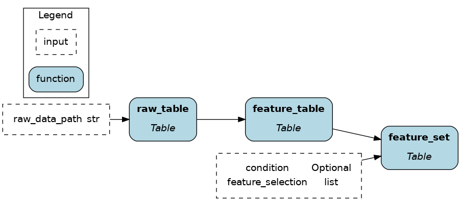

# Ibis

[Ibis](https://ibis-project.org/) is the portable Python dataframe library. It allows you to define data transformations once and execute them in multiple backends (BigQuery, DuckDB, PySpark, SQLite, Snowflake, Postgres, Polars; [see the full list](https://ibis-project.org/support_matrix)). If you never used Ibis before, it should feel similar to SQL with a touch of dataframes (e.g., pandas). You'll be primarily writing expressions (similar to an SQL query), which compute values only after calling for execution via `.to_pandas()` for example.

On this page, you'll learn how Ibis + Hamilton can help:
- Create a modular codebase for better collaboration and maintainability
- Reduce the development-production gap
- Develop cost-effective data pipelines

## Ibis example
The following code loads data from a CSV, computes features, then makes a selection at the end. When reading the code, notice that:

- The variable `ibis._` is a special character referring to the current expression e.g., `ibis._.pet` accesseses the column "pet" of the current table.
- The table method `.mutate(col1=, col2=, ...)` assigns new columns or overwrites existing ones.

```python
import ibis

raw_data_path = ...
feature_selection = [
    "id", "has_children", "has_pet", "is_summer_brazil",
    "service_time", "seasons", "disciplinary_failure",
    "absenteeism_time_in_hours",
],

# write the expression
feature_set = (
    ibis.read_csv(sources=raw_data_path, table_name="absenteism")
    .rename("snake_case")
    .mutate(
        has_children=ibis.ifelse(ibis._.son > 0, 1, 0),
        has_pet=ibis.ifelse(ibis._.pet > 0, 1, 0),
        is_summer_brazil=ibis._.month_of_absence.isin([1, 2, 12]).cast(int),
    )
    .select(*feature_selection)
    .filter(ibis.ifelse(ibis._.has_pet == 1, True, False))
)
# execute the expression
feature_df = feature_set.to_pandas()
```

## Challenges
### 1. Test and maintain your transformations
Ibis has an SQL-like syntax and supports chaining operations, allowing for powerful queries in a few lines of code. Conversely, there's a risk of sprawling complexity as expressions as statements are appended, making them harder to test and debug. Preventing this issue requires a lot of upfront discipline and refactoring.

### 2. Promote development code to production
Ibis alleviates a major pain point by enabling data transformations to work across backends. However, moving from dev to prod still requires some code changes such as changing backend connectors, swapping unsupported operators, adding some orchestration and logging execution. This is outside the scope of the Ibis project and is expected to be enabled by other means.

## Hamilton + Ibis
Hamilton was initially developed to structure pandas code into modular pieces. This helps managing large feature catalogs and has been adopted [by multiple organizations](#who-is-using-hamilton) for feature engineering. This directly translate to organizing Ibis code. In addition to the usual benefits of Hamilton such as facilitating feature reusability, code reviews, and documentation, modular code is especially beneficial for Ibis because:

- Well-scoped functions with type annotations and docstring help migrate to Ibis and onboard new Ibis users.
- Unit testing and data validation becomes more important when working across backends since the [operation coverage varies](https://ibis-project.org/support_matrix) and bugs may arise.

As an example, we'll refactor the above code to use Hamilton. Note that Ibis expression types are subclasses of `ibis.expr.types` which we import as `ir`.

### Table-level
```python
import ibis
import ibis.expr.types as ir

def raw_table(raw_data_path: str) -> ir.Table:
    """Load CSV from `raw_data_path` into a Table expression
    and format column names to snakecase
    """
    return (
        ibis.read_csv(sources=raw_data_path, table_name="absenteism")
        .rename("snake_case")
    )

def feature_table(raw_table: ir.Table) -> ir.Table:
    """Add to `raw_table` the feature columns `has_children`
    `has_pet`, and `is_summer_brazil`
    """
    return raw_table.mutate(
        has_children=(ibis.ifelse(ibis._.son > 0, True, False)),
        has_pet=ibis.ifelse(ibis._.pet > 0, True, False),
        is_summer_brazil=ibis._.month_of_absence.isin([1, 2, 12]),
    )

def feature_set(
    feature_table: ir.Table,
    feature_selection: list[str],
    condition: Optional[ibis.common.deferred.Deferred] = None,
) -> ir.Table:
    """Select feature columns and filter rows"""
    return feature_table[feature_selection].filter(condition)
```



### Column-level
Hamilton is built to support column-level lineage. Simply breakdown your expressions as follow:


```python
import ibis
import ibis.expr.types as ir
from hamilton.function_modifiers import extract_columns
from hamilton.plugins import ibis_extensions

# extract specific columns from the table
@extract_columns("son", "pet", "month_of_absence")
def raw_table(raw_data_path: str) -> ir.Table:
    """Load the CSV found at `raw_data_path` into a Table expression
    and format columns to snakecase
    """
    return (
        ibis.read_csv(sources=raw_data_path, table_name="absenteism")
        .rename("snake_case")
    )

# accesses a single column from `raw_table`
def has_children(son: ir.Column) -> ir.BooleanColumn:
    """True if someone has any children"""
    return ibis.ifelse(son > 0, True, False)

# narrows the return type from `ir.Column` to `ir.BooleanColumn`
def has_pet(pet: ir.Column) -> ir.BooleanColumn:
    """True if someone has any pets"""
    return ibis.ifelse(pet > 0, True, False).cast(bool)

# typing and docstring provides business context to features
def is_summer_brazil(month_of_absence: ir.Column) -> ir.BooleanColumn:
    """True if it is summer in Brazil during this month

    People in the northern hemisphere are likely to take vacations
    to warm places when it's cold locally
    """
    return month_of_absence.isin([1, 2, 12])

def feature_table(
    raw_table: ir.Table,
    has_children: ir.BooleanColumn,
    has_pet: ir.BooleanColumn,
    is_summer_brazil: ir.BooleanColumn,
) -> ir.Table:
    """Join computed features to the `raw_data` table"""
    return raw_table.mutate(
        has_children=has_children,
        has_pet=has_pet,
        is_summer_brazil=is_summer_brazil,
    )

def feature_set(
    feature_table: ir.Table,
    feature_selection: list[str],
    condition: Optional[ibis.common.deferred.Deferred] = None,
) -> ir.Table:
    """Select feature columns and filter rows"""
    return feature_table[feature_selection].filter(condition)
```


> 💡 If your code is already structured with Hamilton, migrating from pandas to Ibis should be easy!

### Orchestration

Hamilton is the ideal orchestration partner for Ibis because it's the lightest "orchestrator" you'll find. In fact, it's a simple Python package with 4 dependencies, and you don't need "framework code" to get started, just plain Python functions. When moving to production, Hamilton has all the necessary production-ready features to complement Ibis, such as swapping components, configurations, and lifecycle hooks for logging, alerting, and telemetry.

A simple usage pattern of Hamilton + Ibis is to use the [`@config.when` function modifier](../../concepts/function-modifiers.rst). In the following example, we have alternative implementations for the backend connection, which will be used for computing and storing results.

```python
# ibis_dataflow.py
import ibis
import ibis.expr.types as ir
from hamilton.function_modifiers import config

# ... entire dataflow definition

@config.when(backend="duckdb")
def backend_connection__duckdb(
    connection_string: str
) -> ibis.backends.BaseBackend:
    """Connect to DuckDB backend"""
    return ibis.duckdb.connect(connection_string)

@config.when(backend="bigquery")
def insert_results__bigquery(
    project_id: str,
    dataset_id: str,
) -> ibis.backends.BaseBackend:
    """Connect to BigQuery backend
    Install dependencies via `pip install ibis-framework[bigquery]`
    """
    return ibis.bigquery.connect(
        project_id=project_id,
        dataset_id=dataset_id,
    )

def insert_results(
    backend_connection: ibis.backends.BaseBackend,
    result_table: ir.Table,
    table_name: str
):
    """Execute expression and insert results"""
    backend_connection.insert(
        table_name=table_name,
        obj=result_table
    )
```

```python
# run.py
from hamilton import driver
import ibis_dataflow

dr = (
    driver.Builder()
    .with_config({"backend": "duckdb"})
    .with_modules(ibis_dataflow)
    .build()
)
inputs = dict(connection_string=...)
# `insert_results` implementation depends on config
dr.execute(["insert_results"], inputs=inputs)
```

## How Ibis improves the Hamilton experience
### Atomic data transformation documentation
Ibis provides Hamilton users with high-performance local engines (DuckDB, Polars) instead of pandas. Also, Ibis complements Hamilton's dataflow visualization with a more detailed view of the query plan and schemas. See this Ibis visualization for the column-level Hamilton dataflow defined above. It includes all renaming, type casting, and transformations steps. Please zoom in!


### Working across rows with user-defined functions (UDFs)
Finally, Hamilton, Ibis, and most backends are designed to work primarily on tables and columns. However, Ibis makes it easy to work across rows and execute arbitrary Python code from the backend [using user-defined functions (UDFs)](https://ibis-project.org/reference/scalar-udfs). For instance, you could [embed rows of a text column using an LLM API](https://ibis-project.org/posts/duckdb-for-rag/). You can think of it as a `DataFrame().apply()` in pandas. Here's how to use it with Hamilton:

```python
import ibis
import ibis.expr.types as ir

def documents(path: str) -> ir.Table:
    """load text documents from file"""
    return ibis.read_parquet(sources=path, table_name="documents")

# the function name would need to start
# with `_` to avoid being added as a node
@ibis.udf.scalar.python
def _generate_summary(author: str, text: str, prompt_template: str) -> str:
    """UDF Function to call the OpenAI API line by line"""
    prompt = prompt_template.format(author=author, text=text)
    client = openai.OpenAI(...)
    try:
        response = client.chat.completions.create(...)
        return_value = response.choices[0].message.content
    except Exception:
        return_value = ""
    return return_value


def prompt_template() -> str:
    return """summarize the following text from {author} and add
    contextual notes based on it biography and other written work

    TEXT
    {text}
    """

def summaries(documents: ir.Table, prompt_template: str) -> ir.Table
    """Compute the UDF against the family"""
    return documents.mutate(
        summary=_generated_summary(
            _.author,
            _.text,
            prompt_template=prompt_template
        )
    )
```
