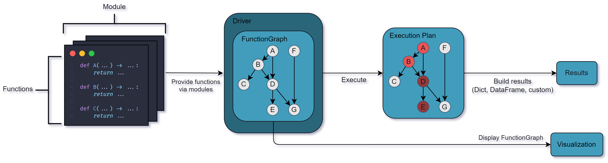

# Welcome to Hamilton
<div align="left">
    <a href="https://join.slack.com/t/hamilton-opensource/shared_invite/zt-1bjs72asx-wcUTgH7q7QX1igiQ5bbdcg" target="_blank"></a>
    <a href="https://twitter.com/hamilton_os" target="_blank"></a>
    <a href="https://pepy.tech/project/sf-hamilton" target="_blank"></a>
</div>

Hamilton is a general-purpose framework to write dataflows using regular Python functions. At the core, each function defines a transformation and its parameters indicates its dependencies. Hamilton automatically connects individual functions into a [Directed Acyclic Graph](https://en.wikipedia.org/wiki/Directed_acyclic_graph) (DAG) that can be executed, visualized, optimized, and reported on.
Hamilton also comes with a [UI](concepts/ui.rst) to visualize, catalog, and monitor your dataflows.

```{figure} ./_static/abc.png
:scale: 50
:align: center

The ABC of Hamilton
```

# Why should you use Hamilton?
**Facilitate collaboration**. By focusing on functions, Hamilton avoids sprawling code hierarchy and generates flat dataflows. Well-scoped functions make it easier to add features, complete code reviews, debug pipeline failures, and hand-off projects. Visualizations can be generated directly from your code to better understand and document it.
Integration with the [Hamilton UI](concepts/ui.rst) allows you to track lineage, catalog code & artifacts, and monitor your dataflows.

**Reduce development time**. Hamilton dataflows are reusable across projects and context (e.g., pipeline vs. web service). The benefits of developing robust and well-tested solutions are multiplied by reusability. Off-the-shelf dataflows are available on the [Hamilton Hub](https://hub.dagworks.io/).

**Own your platform**. Hamilton helps you integrate the frameworks and tools of your stack. Hamilton's features are easy to extend and customize to your needs. This flexibility enables self-serve designs and ultimately reduces the risks of vendor lock-in.

**Scale your dataflow**. Hamilton separates transformation logic from execution, allowing you to seamlessly scale via remote execution (AWS, Modal, etc.) and specialized computation engines (Spark, Ray, duckdb etc.). Hamilton was battle tested under intensive enterprise data workloads.

Here's a quick overview of benefits that Hamilton provides as compared to other tools:

| Feature                                   | Hamilton | Macro orchestration systems (e.g. Airflow) | Feast | dbt | Dask |
|-------------------------------------------|:---:|:---------------------------------------------:|:-----:|:---:|:----:|
| Execute a graph of data transformations   | ✅  |                   ✅                          |   ❌  | ✅  |  ✅   |
| Can visualize lineage easily              | ✅  |                   ❌                          |   ❌  | ✅  |  ✅   |
| Can model GenerativeAI/LLM based workflows| ✅  |                   ❌                          |   ❌  | ❌  |  ❌   |
| Is a feature store                        | ❌  |                   ❌                          |   ✅  | ❌  |  ❌   |
| Helps you structure your code base        | ✅  |                   ❌                          |   ❌  | ✅  |  ❌   |
| Is just a library                         | ✅  |                   ❌                          |   ❌  | ❌  |  ✅   |
| Runs anywhere python runs                 | ✅  |                   ❌                          |   ❌  | ❌  |  ✅   |
| Documentation friendly                    | ✅  |                   ❌                          |   ❌  | ❌  |  ❌   |
| Code is always unit testable              | ✅  |                   ❌                          |   ❌  | ❌  |  ❌   |

# Architecture Overview

The following diagram gives a simplified overview of the main components of Hamilton.



**Functions & Module**. Transformations are regular Python functions organized into modules. Functions must be type-annotated, but hold no dependency with Hamilton and can be reused outside of it.

**Driver & FunctionGraph**. The `Driver` will automatically assemble the `FunctionGraph` from the modules given. The `Driver` can be configured to modify and extend the execution behavior (e.g., remote execution, monitoring, webhooks, caching).

**Visualization**. The `FunctionGraph` can be visualized without executing code. This coupling ensures visualizations always match the code from modules.

**Execution**. When requesting variables, the `Driver` establishes an execution plan to only compute the required functions. Then, results are gathered and returned to the user.

# Who is using Hamilton?


Multiple companies are doing cool stuff with Hamilton! Come chat with members of the community and the development team on [Slack](https://join.slack.com/t/hamilton-opensource/shared_invite/zt-1bjs72asx-wcUTgH7q7QX1igiQ5bbdcg):

* **Stitch Fix** — Time series forecasting
* **British cycling** — Telemetry analysis
* **Joby** - Flight data processing
* **Transfix** - Online featurization and prediction
* **IBM** - Internal search and ML pipelines
* **Ascena** - Feature engineering
* **Adobe** - Prompt engineering research
* **Axiom Cloud** - IoT data processing
* **Oak Ridge & PNNL** - [Naturf project](https://github.com/IMMM-SFA/naturf/tree/feature/nodes)
* **Habitat** - Time-series feature engineering
* **UK Government Digital Service** - National feedback pipeline (processing & analysis)
* **Railoify** - Orchestrate pandas code
* **Lexis Nexis** - Feature processing and lineage
* **Opendoor** - Manage PySpark pipelines
* **KI** - Feature engineering
* **AB-InBev** - Machine learning Platform on PySpark
* **Rippling** - Feature engineering on PySpark
