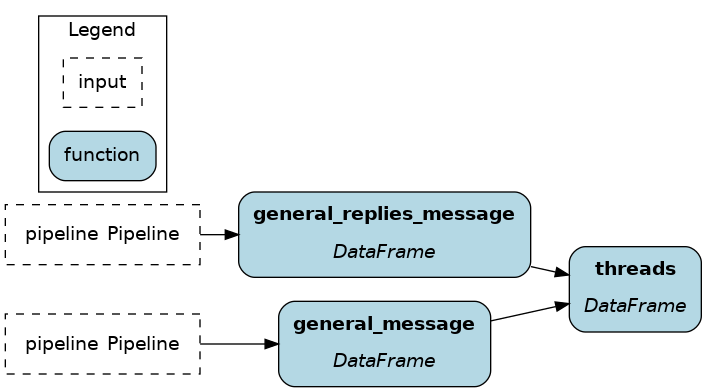
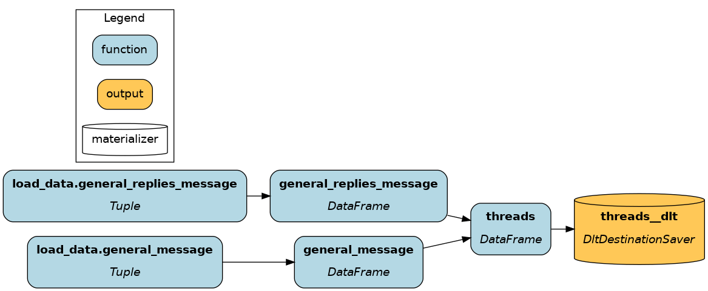

# dlt

[dlt](https://dlthub.com/) stands for "data load tool". It's an open-source Python library providing a ton of data `Sources` (Slack, Stripe, Google Analytics, Zendesk, etc.) and `Destinations` (S3, Snowflake, BigQuery, Postgres, etc.). `Pipelines` make it easy to connect `Sources` and `Destinations` and provide advanced engineering features such as table normalization, incremental loading, and automatic schema evolution.

dlt is an "extract and load" tool and Hamilton is a "transform" tool, allowing various usage patterns.

On this page, you'll learn:

- Extract, Transform, Load (ETL)
- Extract, Load, Transform (ELT)
- dlt materializer plugin for Hamilton

``` {note}
See this [blog post](https://blog.dagworks.io/p/slack-summary-pipeline-with-dlt-ibis) for a more detailed discussion about ETL with dlt + Hamilton
```

## Extract, Transform, Load (ETL)
The key consideration for ETL is that the data has to move twice:

> ingest raw data (dlt) -> transform (Hamilton) -> store transformed data (dlt)

1. **Extract**: dlt moves the raw data to a processing server
2. **Transform**: on the server, Hamilton executes transformations
3. **Load**: dlt moves the final data to its destination (database, dashboard, etc.)

**Pros**
- Reduce storage cost: raw data isn't stored
- Data centralization: transformed data is better separated from raw and low quality data

**Cons**
- Increased latency: data has to move twice
- Reduced flexibility: to try new transformations, data needs to

### Extract

0. Create a dlt pipeline for raw data ingestion (see [dlt guide](https://dlthub.com/docs/walkthroughs/create-a-pipeline)).

1. Write the dlt pipeline execution code in `run.py`

    ```python
    # run.py
    import dlt
    import slack  # NOTE this is dlt code, not an official Slack library

    # define dlt pipeline to a local duckdb instance
    extract_pipeline = dlt.pipeline(
        pipeline_name="slack_raw",
        destination='duckdb',
        dataset_name="slack_community_backup"
    )
    # configure dlt slack source
    source = slack.slack_source(
        selected_channels=["general"], replies=True
    )
    # moves data from source to destination
    raw_load_info = extract_pipeline.run(source)
    ```

### Transform

2. Define the Hamilton dataflow of transformations

    ```python
    # transform.py
    import dlt
    import pandas as pd

    def _table_to_df(client, table_name: str) -> pd.DataFrame:
        """Load data as DataFrame using the dlt SQL client"""
        with client.execute_query("SELECT * FROM %s" % table_name) as t:
            return t.df()

    def general_message(pipeline: dlt.Pipeline) -> pd.DataFrame:
        """Load table `general_message` from dlt data"""
        with pipeline.sql_client() as client:
            return _table_to_df(client, "general_message")

    def general_replies_message(pipeline: dlt.Pipeline) -> pd.DataFrame:
        """Load table `general_replies_message` from dlt data"""
        with pipeline.sql_client() as client:
            return _table_to_df(client, "general_replies_message")

    def threads(
        general_message: pd.DataFrame,
        general_replies_message: pd.DataFrame,
    ) -> pd.DataFrame:
        """Reassemble from the union of parent messages and replies"""
        columns = ["thread_ts", "ts", "user", "text"]
        return pd.concat(
            [general_message[columns], general_replies_message[columns]],
            axis=0
        )
    ```



3. Add the Hamilton dataflow execution code to `run.py`

    ```python
    # run.py
    from hamilton import driver
    import transform  # module containing dataflow definition

    # pass the `transform` module
    dr = driver.Builder().with_modules(transform).build()
    # request the node `threads`; pass the dlt `pipeline` as inputs
    results = dr.execute(["threads"], inputs=dict(pipeline=extract_pipeline))
    # `results` is a dictionary with key `threads`
    ```

### Load
4. Create a 2nd dlt pipeline to load the transformed data. The `pipeline_name` should be different from the **Extract** step.

    ```python
    # run.py
    # define dlt pipeline to bigquery (our prod env)
    load_pipeline = dlt.pipeline(
        pipeline_name="slack_final",
        destination='bigquery',
        dataset_name="slack_community_backup"
    )
    # pass the results from Hamilton to dlt
    data = results["threads"].to_dict(orient="records")
    final_load_info = load_pipeline.run(data, table_name="threads")
    ```

### ETL Summary
You need to set up your dlt pipeline for raw and transformed data, and define your Hamilton transformation dataflow. Then, your execution code consist of executing the ETL step in sequence. It should look like this:

```python
# run.py
import dlt
from hamilton import driver
import slack  # NOTE this is dlt code, not an official Slack library
import transform  # module containing dataflow definition

# EXTRACT
extract_pipeline = dlt.pipeline(
    pipeline_name="slack_raw",
    destination='duckdb',
    dataset_name="slack_community_backup"
)
source = slack.slack_source(
    selected_channels=["general"], replies=True
)
raw_load_info = extract_pipeline.run(source)

# TRANSFORM
dr = driver.Builder().with_modules(transform).build()
results = dr.execute(["threads"], inputs=dict(pipeline=extract_pipeline))

# LOAD
load_pipeline = dlt.pipeline(
    pipeline_name="slack_final",
    destination='bigquery',
    dataset_name="slack_community_backup"
)
data = results["threads"].to_dict(orient="records")
final_load_info = load_pipeline.run(data, table_name="threads")
```

## Extract, Load, Transform (ELT)
Compared to ETL, ELT moves data once.

> ingest and store raw data (dlt) -> transform (Hamilton)

Transformations happen within the data destination, typically a data warehouse. To achieve this, we will leverage the [Ibis](https://ibis-project.org/) library, which allows to execute data transformations directly on the destination backend.

1. **Extract & Load**: dlt moves the raw data to the destination
2. **Transform**: Hamilton + Ibis execute transformations within the destination

**Pros**
- Deduplicate computation: redundant operations can be optimized using raw and intermediary data
- Simpler architecture: no transformation server is needed, unlike ETL

**Cons**
- Increased storage cost: more space is required to store raw and intermediary data
- Decreased data quality: the sprawl of data of various quality levels needs to be governed

### Extract & Load

0. Create a dlt pipeline for raw data ingestion (see [dlt guide](https://dlthub.com/docs/walkthroughs/create-a-pipeline)).

1. Write the dlt pipeline execution code in `run.py`

    ```python
    # run.py
    import dlt
    import slack  # NOTE this is dlt code, not an official Slack library

    # define dlt pipeline to duckdb
    pipeline = dlt.pipeline(
        pipeline_name="slack",
        destination='duckdb',
        dataset_name="slack_community_backup"
    )
    # load dlt slack source
    source = slack.slack_source(
        selected_channels=["general"], replies=True
    )
    # execute dlt pipeline
    load_info = pipeline.run(source)


### Transform

2. Define a dataflow of transformations using Hamilton + Ibis

    ```python
    # transform.py
    import ibis
    import ibis.expr.types as ir

    def db_con(pipeline: dlt.Pipeline) -> ibis.BaseBackend:
        backend = ibis.connect(f"{pipeline.pipeline_name}.duckdb")
        ibis.set_backend(backend)
        return backend

    def general_message(db_con: ibis.BaseBackend, pipeline: dlt.Pipeline) -> ir.Table:
        """Load table `general_message` from dlt data"""
        return db_con.table(
            "general_message",
            schema=pipeline.dataset_name,
            database=pipeline.pipeline_name
        ).mutate(
            thread_ts=ibis._.thread_ts.cast(str),
            ts=ibis._.ts.cast(str),
        )

    def general_replies_message(db_con: ibis.BaseBackend, pipeline: dlt.Pipeline) -> ir.Table:
        """Load table `general_replies_message` from dlt data"""
        return db_con.table(
            "general_replies_message",
            schema=pipeline.dataset_name,
            database=pipeline.pipeline_name
        )

    def threads(
        general_message: ir.Table,
        general_replies_message: ir.Table,
    ) -> ir.Table:
        """Create the union of `general_message` and `general_replies_message`"""
        columns = ["thread_ts", "ts", "user", "text"]
        return ibis.union(
            general_message.select(columns),
            general_replies_message.select(columns),
        )

    def insert_threads(threads: ir.Table) -> bool:
        db_con = ibis.get_backend()  # retrieves the backend set in `db_con()`
        db_con.create_table("threads", threads)
        return True
    ```

3. Execute the Hamilton dataflow to trigger transformations on the backend

    ```python
    # run.py
    # hamilton transform
    from hamilton import driver
    import transform  # module containing dataflow definition

    dr = driver.Builder().with_modules(transform).build()
    dr.execute(
        ["insert_threads"],  # execute node `insert_threads`
        inputs=dict(pipeline=pipeline)  # pass the dlt pipeline
    )
    ```

### ELT Summary
You need to set up your dlt pipeline for raw, and define your Hamilton transformation dataflow. Then, your execution code consist of using dlt to move data to the backend and Hamilton + Ibis to execute transformations.

```python
# run.py
import dlt
from hamilton import driver
import slack  # NOTE this is dlt code, not an official Slack library
import transform  # module containing dataflow definition

# EXTRACT & LOAD
pipeline = dlt.pipeline(
    pipeline_name="slack",
    destination='duckdb',
    dataset_name="slack_community_backup"
)
source = slack.slack_source(
    selected_channels=["general"], replies=True
)
load_info = pipeline.run(source)

# TRANSFORM
dr = driver.Builder().with_modules(transform).build()
results = dr.execute(
    ["insert_threads"],  # query the `threads` node
    inputs=dict(pipeline=pipeline)  # pass the dlt load info
)
```

## dlt materializer plugin
We added custom Data Loader/Saver to plug dlt with Hamilton. Compared to the previous approach, it allows to include the dlt operations as part of the Hamilton dataflow and improve lineage / visibility.


``` {note}
See [this notebook](https://github.com/DAGWorks-Inc/hamilton/blob/main/examples/dlt/dlt_plugin.ipynb) for a demo.
```

### DataLoader
The `DataLoader` allows to read in-memory data from a `dlt.Resource`. When working with `dlt.Source`, you can access individual `dlt.Resource` with `source.resource["source_name"]`. This removes the need to write utility functions to read data from dlt (with pandas or Ibis). Contrary to the previous ETL and ELT examples, this approach is useful when you don't want to store the dlt Source data. It effectively connects dlt to Hamilton to enable "Extract, Transform" (ET).


```python
# run.py
from hamilton import driver
from hamilton.io.materialization import from_
import slack  # NOTE this is dlt code, not an official Slack library
import transform

source = slack.source(selected_channels=["general"], replies=True)

dr = driver.Builder().with_modules(transform).build()

materializers = [
    from_.dlt(
        target="general_message",  # node name assigned to the data
        resource=source.resources["general_message"]
    ),
    from_.dlt(
        target="general_replies_message",
        resource=source.resources["general_replies_message"]
    ),
]
# when using only loaders (i.e., `from_`), you need to specify
# `additional_vars` to compute, like you would in `.execute(final_vars=["threads"])`
dr.materialize(*materializers, additional_vars=["threads"])
```

### DataSaver
The `DataSaver` allows to write node results to any `dlt.Destination`. You'll need to define a `dlt.Pipeline` with the desired `dlt.Destination` and you can specify arguments for the `pipeline.run()` behavior (e.g., incremental loading, primary key, load_file_format). This provides a "Transform, Load" (TL) connector from Hamilton to dlt.

```python
# run.py
import dlt
from hamilton import driver
from hamilton.io.materialization import to
import slack  # NOTE this is dlt code, not an official Slack library
import transform

pipeline = dlt.pipeline(
    pipeline_name="slack",
    destination='duckdb',
    dataset_name="slack_community_backup"
)

dr = driver.Builder().with_modules(transform).build()

materializers = [
    to.dlt(
        id="threads__dlt",  # node name
        dependencies=["threads"],
        table_name="slack_threads",
        pipeline=pipeline,
    )
]

dr.materialize(*materializers)
```

### Combining both
You can also combine both the `DataLoader` and `DataSaver`. You will see below that it's almost identical to the ELT example, but now all operations are part of the Hamilton dataflow!


```python
# run.py
import dlt
from hamilton import driver
from hamilton.io.materialization import from_, to
import slack  # NOTE this is dlt code, not an official Slack library
import transform

pipeline = dlt.pipeline(
    pipeline_name="slack",
    destination='duckdb',
    dataset_name="slack_community_backup"
)
source = slack.source(selected_channels=["general"], replies=True)

dr = driver.Builder().with_modules(transform).build()

materializers = [
    from_.dlt(
        target="general_message",
        resource=source.resources["general_message"]
    ),
    from_.dlt(
        target="general_replies_message",
        resource=source.resources["general_replies_message"]
    ),
    to.dlt(
        id="threads__dlt",
        dependencies=["threads"],
        table_name="slack_threads",
        pipeline=pipeline,
    )
]

dr.materialize(*materializers)
```



## Next steps
- Our full [code example to ingest Slack data and generate thread summaries](https://github.com/DAGWorks-Inc/hamilton/tree/main/examples/dlt) is available on GitHub.
- Another important pattern in data engineering is reverse ETL, which consists of moving data analytics back to your sources (CRM, Hubspot, Zendesk, etc.). See this [dlt blog](https://dlthub.com/docs/blog/reverse-etl-dlt) to get started.
