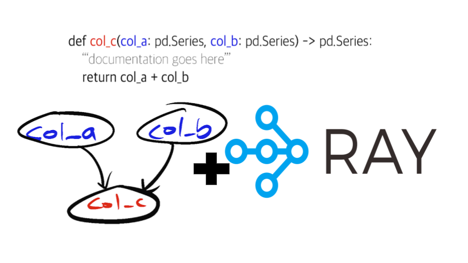

======
⚡ Ray
======

For those eager to just see code, please jump right ahead to a full hello world with Ray
`here <https://github.com/stitchfix/hamilton/tree/main/examples/ray>`_.

For those unfamiliar with `Ray <https://ray.io/>`_, it is an open source framework that can scale python applications
that came out of `UC Berkeley <https://rise.cs.berkeley.edu/projects/ray/>`_. It has a growing ecosystem of tooling
that helps with lots of machine learning related workflows. For example, it sells itself as enabling you to scale from
your laptop to a cluster very easily, without having to change much code. In terms of real world use, we like to use
Ray as a very quick way to implement `multiprocessing in python <https://machinelearningmastery.com/multiprocessing-in-python/>`_
without worry about the details!

Ray Primer
----------

Here is a Ray primer. The good news is, is that you don’t have to know much about Ray to use it with Hamilton. You just
need to know that it will parallelize your workflow over multiple CPU cores easily, and allow you to scale beyond your
laptop if you have a Ray Cluster set up. But just so you understand how Hamilton connects with it, let’s quickly go over
how one would use Ray.

Ray Usage Premise
#################

The basic premise to use Ray, is that you have to annotate your functions that you want to be scheduled for execution
via Ray. For example (from `their documentation <https://docs.ray.io/en/latest/ray-core/tasks.html#ray-remote-functions>`_):

.. code-block:: python

    # This is a regular Python function.
    def normal_function():
        return 1

    # By adding the `@ray.remote` decorator, a regular Python function
    # becomes a Ray remote function.
    @ray.remote
    def my_ray_function():
        return 1

Then to execute the ``my_ray_function`` function, you would do:

.. code-block:: python

    my_ray_function.remote()

Which would then tell Ray to schedule the function for execution. To run locally versus on a cluster, all you have to
do is instantiate “Ray” differently before calling the above code.

.. code-block:: python

    import ray
    ray.init() # local execution over multiple cores
    ray.init({... cluster details ...}) # connect to cluster.

Now, 🤔, you might be wondering this seems like a lot of work to get my existing code to run, e.g. how do I pass in
parameters to my functions? How should I change my application to make better use of Ray? etc. Good news! You don’t
have to think about that with Hamilton at all! You just write your standard Hamilton functions, and only change some
“_driver_” code to make it run on Ray. More on that in the next section.

Hamilton + Ray
--------------

To use Ray with Hamilton, you first need to install it.

.. code-block:: bash

    pip install "sf-hamilton[ray]"

Next, with Hamilton by default, all your logic is written as python functions. So you write your Hamilton functions as
you normally would.

At the Hamilton framework level, Hamilton can easily inject ``@ray.remote`` for every single function in the directed
acyclic graph (DAG) your functions define. That is, `you don’t have to change any of your Hamilton code to make use of
Ray!` All you need to do, to make Hamilton run on Ray, is provide a `“GraphAdapter”` object to the Hamilton `“Driver”`
class you instantiate.

A GraphAdapter, is just a simple class that has a few functions defined that enable you to augment how your DAG is
walked and executed. See :doc:`../reference/api-reference/available-graph-adapters` for more information.

In terms of code to add/change, here’s what’s required to augment standard Hamilton driver code — see **numbered
comments**:

.. code-block:: python

    import ray
    from hamilton import base, driver
    from hamilton.experimental import h_ray
    ...
    ray.init() # (1) instantiate Ray
    config = {...} # instantiate your config
    modules = [...] # provide modules where your Hamilton functions live
    rga = h_ray.RayGraphAdapter( # (2) object to tell Hamilton to run on Ray
          result_builder=base.PandasDataFrameResult())  # (3) says we want a DF as a result
    dr = driver.Driver(config, *modules, adapter=rga) # (4) tell Hamilton
    df = dr.execute([...])
    ray.shutdown() #(5) shut down ray/our connection to it.

Note: no change to Hamilton functions needs to take place.

Let's walk through the numbered code comments:

#. instantiates Ray -- this is where we would provide cluster information, otherwise this just spins up Ray locally.
#. we instantiate a RayGraphAdapter. This object will tell Hamilton to do a few special things to execute the DAG.
#. We have to specify what object we want to return from execution. We want a pandas data frame here, though it could be any type of python object. That is, the other common return type is probably ``base.DictResult()``.
#. We pass the graph adapter as a keyword argument to the Driver constructor.
#. We shut down Ray when finished.

Ray Workflows
#############

The Ray Hamilton integration also supports `Ray Workflows <https://docs.ray.io/en/latest/workflows/concepts.html>`_.
To use that, you just need to replace the graph adapter instantiation with this line:

.. code-block:: python

    rga = h_ray.RayWorkflowGraphAdapter(
            result_builder=base.PandasDataFrameResult(),
            # Ray will resume a run if possible based on workflow id
            workflow_id="hello-world-123",  # so change this to suit your needs
        )

Ray workflows require a ``workflow_id`` argument, so be sure to look into the
`Ray Workflow documentation <https://docs.ray.io/en/latest/workflows/concepts.html>`_ for best practices there.

It’s that simple!
#################

To summarize, the recipe for using Ray with Hamilton doesn’t change much from using Hamilton:

#. Install Hamilton + Ray. ``pip install "sf-hamilton[ray]"``.
#. Write Hamilton functions.
#. Write your driver code — adjust this part if you want it to run on Ray.

Since it’s so easy to switch to using Ray or not, we’d love some benchmarks/anecdotes to see how much switching to Ray
improves the speed or scale at which you can operate your dataflow!

For a full “Ray Hello World” code sample, we direct you to the `examples directory here <https://github.com/stitchfix/hamilton/tree/main/examples/ray/hello\_world>`_.

Caveats
-------

A brief note on caveats with using Hamilton + Ray.

#. We are looking to graduate Ray support from `"experimental"`, but to do that we need your feedback! That API has
been very stable (hasn’t changed since launch), but to feel good about making it permanent, we’d love to know what you
think.
#. We don’t expose all the functionality of Ray, but we could. E.g. memory aware scheduling, or specifying resources for
specific functions. Let us know if you want something exposed — create an issue on github please — 
`https://github.com/stitchfix/hamilton <https://github.com/stitchfix/hamilton>`_.

To conclude
-----------

By using Hamilton, you can organize and scale the human side of writing data transforms (no, I didn’t talk about this
in this post, but see :doc:`../talks-or-podcasts-or-blogs-or-papers` to convince yourself there 😉). With Ray, you can
scale your data workflows to work beyond the limits of your laptop. Together, the skies the limit!
