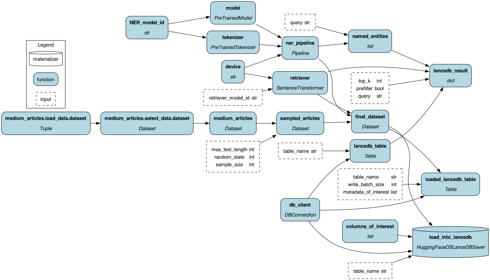

# Document processing with Named Entity Recognition (NER) for RAG
This example demonstrates how to use a Named Entity Recognition (NER) model to extract entities from text along
with embeddings to facilitate querying with more precision. Specifically we'll use the entities here to filter to
the documents that contain the entities of interest.

In general the concept we're showing here, is that if you extract extra metadata, like the entities text mentions,
this can be used when trying to find the most relevant text to pass to an LLM in a retrieval augmented generation (RAG)
context.

The pipeline we create can be seen in the image below.

To run this in a notebook:

1. Install the requirements by running `pip install -r requirements.txt`.
2. Install `jupyter` by running `pip install jupyter`.
3. Run `jupyter notebook` in the current directory and open `notebook.ipynb`.

Alternatively open this notebook in Google Colab by clicking the button below:

To run this example via the commandline :
1. Install the requirements by running `pip install -r requirements.txt`
2. Run the script `python run.py`. Some example commands:

    - python run.py medium_docs load
    - python run.py medium_docs query --query "Why does SpaceX want to build a city on Mars?"
    - python run.py medium_docs query --query "How are autonomous vehicles changing the world?"

3. To see the full list of commands run `python run.py --help`.
