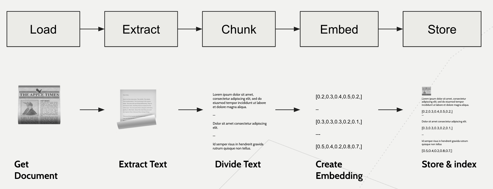

# RAG Document: Extract, Chunk, Embed Example

The notebook here explains how to build a simple pipeline that processes a page from Hamilton's documentation.

Open it in google collab:

# File structure

* simple_pipeline.ipynb - this contains documentation and code. Read this.
* pipeline.py - what the code in simple_pipeline.ipynb creates for easy reference
* requirements.txt - python dependencies required (outside of jupyter lab)

To exercise this example you can run it in Google Colab:

