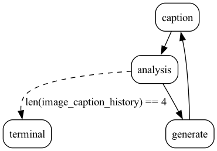

# Image Telephone with Burr

See the [streamlit app](https://image-telephone.streamlit.app) for a demonstration
of previously run images.

This example uses dataflows from the hub to do something fun with image captioning and generation.
Note that hamilton code is used rather than defined here. How the game is orchestrated
is by using Hamilton's companion framework called [Burr](https://github.com/dagworks-inc/burr).

Burr is a simple way to define state machines and run them. It complements Hamilton by providing
a way to save state, define loops and conditional branches. That is, it defines things that Hamilton
cannot.

# Contents

There are a few files:

1. notebook.ipynb
2. application.py
3. streamlit.py

## notebook.ipynb
This is a simple notebook to help you run the telephone game in a notebook.

We recommend you start here - you can even run it in a colab notebook.
<a target="_blank" href="https://colab.research.google.com/github/DAGWorks-Inc/hamilton/blob/main/examples/LLM_Workflows/image_telephone/notebook.ipynb">
  
</a>

## application.py
This is a more sophisticated version of the telephone game because it also
has an analysis step to produce embeddings of the caption.

Run this if you want to replicate what was shown in the blog post.
```bash
# run this to see the command line options
python application.py --help
```
When you run it the flow of the application should look like this:


## streamlit.py
This is a streamlit app that lets you play the telephone game in a web browser.
It assumes you have saved to some S3 bucket the images and captions that were generated
in the game.
