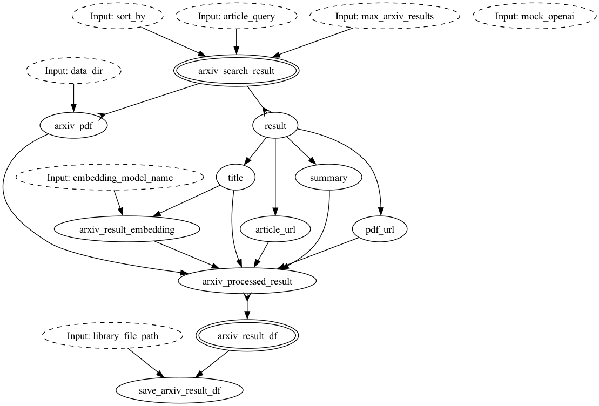

# How to use "OpenAI functions" with a Knowledge Base

This example is based on [this notebook](https://github.com/openai/openai-cookbook/blob/main/examples/How_to_call_functions_for_knowledge_retrieval.ipynb)
 in the [OpenAI cookbook](https://github.com/openai/openai-cookbook/).

The point of the cookbook is to show how you can retrieve some knowledge, e.g. a list of articles, and then use that
as input to OpenAI, using it in the context of conversation, where the OpenAI LLM can determine whether an external function should
be called to get more context.

Hamilton is great for describing dataflows, i.e. DAGs. In this example, we will use Hamilton to define a DAG that
encapsulates two functions that are called by OpenAI as housed in [functions.py](https://github.com/DAGWorks-Inc/hamilton/tree/main/examples/LLM_Workflows/knowledge_retrieval/functions.py).
Specifically the logic for each is housed in two modules:
 - getting articles from Arxiv, housed in [arxiv_articles.py](https://github.com/DAGWorks-Inc/hamilton/tree/main/examples/LLM_Workflows/knowledge_retrieval/arxiv_articles.py)
 - summarizing a PDF article, housed in [summarize_text.py](https://github.com/DAGWorks-Inc/hamilton/tree/main/examples/LLM_Workflows/knowledge_retrieval/summarize_text.py)

## get_articles()
This is the DAG that is defined when you call get_articles() in functions.py:

## summarize_text()
This is the DAG that is defined when you call summarize_text() in functions.py:

Then to orchestrate this, state.py contains code to hold a conversation and functions to call out
to OpenAI and then exercise the two functions as appropriate.

Note: the original cookbook example is not production ready, and so to set expectations, in this example we get 80% of
the way there translating it into Hamilton code. The remaining 20% is left as an exercise for the reader.

# Running the example
You just need to install the dependencies:
> pip install -r requirements.txt

and run state.py:

> python state.py

The bottom of state.py has the conversation that is taking place - so modify that to change the conversation.
