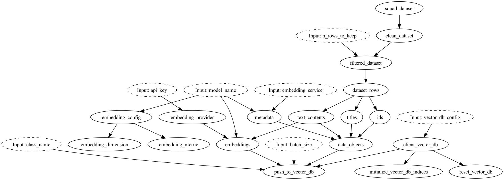
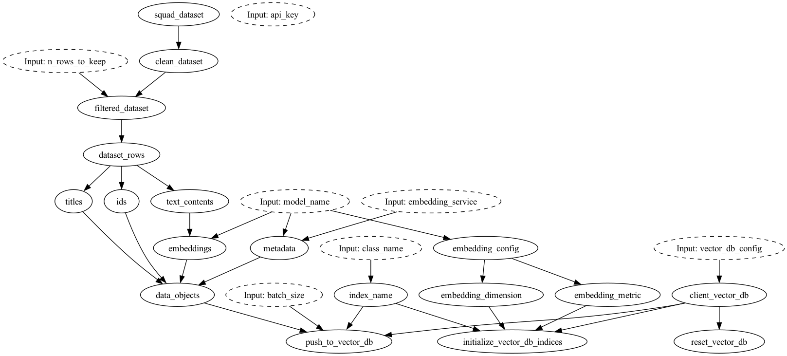
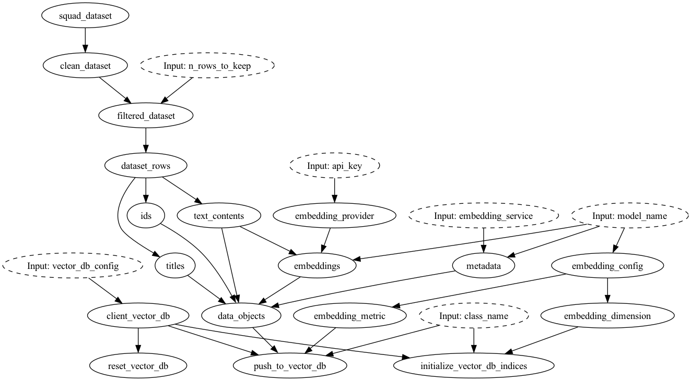
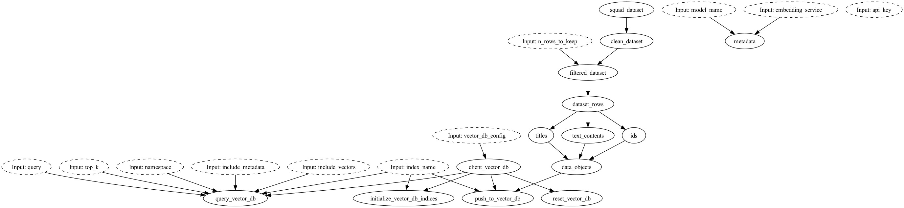

# Flexibly change components of your LLM stack

This example shows how to pull data from the HuggingFace datasets hub, create embeddings for text passage using Cohere / OpenAI / SentenceTransformer, and store them in a vector database using LanceDB / Weaviate / Pinecone.



*DAG for OpenAI embeddings and Weaviate vector database*

In addition, you'll see how Hamilton can help you create replaceable components. This flexibility, makes it easier to assess service providers and refactor code to fit your needs. The above and below DAGs were generated simply by changing a string value and a module import. Try to spot the differences!



*DAG for SentenceTransformers embeddings and Pinecone vector database*



*DAG for Cohere embeddings and Lancedb vector database*



*DAG for Marqo Marqo vector database; note marqo processes embeddings itself.*

# Example structure
- `run.py` contains the code to test the example. It uses `click` to provide a simple command interface.
- `data_module.py` contains the code to pull data from HuggingFace. The code is in a separate Python module since it doesn't depend on the other functionalities and could include more involved preprocessing.
- `embedding_module.py` contains the code to embed text using either Cohere API, OpenAI API or SentenceTransformer library. The use of `@config.when` allows to have all options in the same Python module. This allows to quickly rerun your Hamilton DAG by simply changing your config. You'll see that functions share similar signature to enable interchangeability.
- `lancedb_module.py`, `weaviate_module.py`, `marqo_module.py` and `pinecone_module.py` implement the same functionalities for each vector database. Having the same function names allows Hamilton to abstract away the implementation details and reinforce the notion that both modules shouldn't be loaded simultaneously.
- `docker-compose.yml` allows you to start a local instance of Weaviate ([More information](https://weaviate.io/developers/weaviate/installation/docker-compose)).

# How-to run the example
Prerequisite:
- Create accounts and get the API keys for the service you plan to use.
- Create your python environment, and comment out the vector DB packages in `requirements.txt` you
don't want before doing `pip install -r requirements.txt`.
- For Weaviate start your local instance using `docker compose up -d`.
- For Marqo `docker pull marqoai/marqo:latest` followed by
`docker run --name marqo -it --privileged -p 8882:8882 --add-host host.docker.internal:host-gateway marqoai/marqo:latest`.
Note: this will require 10GB+ of disk space since the image is large...
1. Run `python run.py --help` to learn about the options. You will options to:
    - Select a vector database from: weaviate, pinecone
    - Select an text embedding service from: openai, cohere, sentence_transformer
    - Select the text embedding model. There is a sensible default for each service.
    - Create a png visualization of the code execution.
2. Run `python run.py` to execute the code with `lancedb` and `sentence_transformer`

To change embedding service, you can use the following:
- SentenceTransformer: `--embedding_service=sentence_transformer --model_name=MODEL_NAME`
- OpenAI: `--embedding_service=openai --embedding_api_key=API_KEY`
- Cohere: `--embedding_service=openai --embedding_api_key=API_KEY`
- Marqo: `--embedding_service=marqo`  # note there is no function in embeddings_module.py for marqo.

To change vector database you need to pass a JSON config argument:
- LanceDB: `--vector_db=lancedb --vector_db_config='{"uri": "data/lancedb"}'`
- Weaviate: `--vector_db=weaviate --vector_db_config='{"url": "http://locahost:8080/"}'`
- Pinecone: `--vector_db=pinecone --vector_db_config='{"environment": "ENVIRONMENT", "api_key": "API_KEY"}'`
- Marqo: `--vector_db=marqo --vector_db_config='{"url":"http://localhost:8882"}' --other_input_kwargs '{"index_name":"hamilton"}'`

# Next step / Exercises
- Implement the code to read data from the vector database
- Add the code to send the same generative prompt to multiple providers


# Notes:
If you run into `lzma` not being installed and you're using `pyenv`, then if you're on a mac you can try the following:

1. Install XZ
```bash
brew install xz
```

2. Reinstall the python version you're using to pick up the required changes:
```bash
CFLAGS="-I$(brew --prefix xz)/include" LDFLAGS="-L$(brew --prefix xz)/lib" pyenv install 3.X.XX
```
