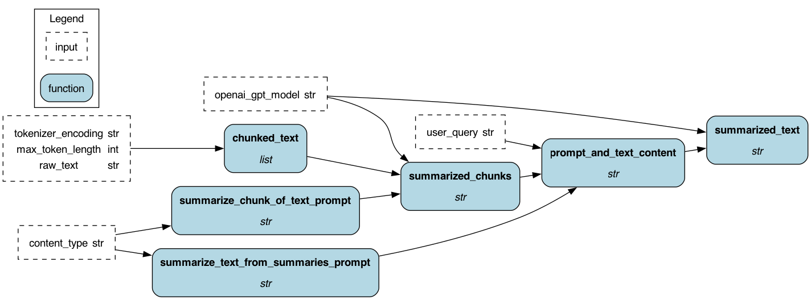

# (Yet another) LLM PDF Summarizer 📝
Here's a extensible and production-ready PDF summarizer that you can run anywhere! The frontend uses streamlit, which communicates with a FastAPI backend powered by Hamilton. You give it a PDF file via the browser app and it returns you a text summary using the OpenAI API. If you want, you skip the browser inteface and directly access the `/summarize` endpoint with your document! Everything is containerized using Docker, so you should be able to run it where you please 🏃

## Why build this project?
This project shows how easy it is to production Hamilton. Its function-centric declarative approach makes the code easy to read and extend. We invite you to clone the repo and customize to your needs! We are happy to help you via [Slack](https://hamilton-opensource.slack.com/join/shared_invite/zt-1bjs72asx-wcUTgH7q7QX1igiQ5bbdcg) and are excited to see what you build 😁

Here are a few ideas:
- Modify the streamlit `file_uploader` to allow sending batches of files through the UI
- Add PDF parsing and preprocessing to reduce number of tokens sent to OpenAI
- Add Hamilton functions to gather metadata (file length, number of tokens, language, etc.) and return it via `SummaryResponse`
- Support other file formats; use the `@config.when()` decorator to add alternatives to the `raw_text()` function for PDFs
- Extract structured data from PDFs using open source models from the HuggingFace Hub.

*The Hamilton execution DAG powering the backend*

# Setup
1. Clone this repository `git clone https://github.com/dagworks-inc/hamilton.git`
2. Move to the directory `cd hamilton/examples/LLM_Workflows/pdf_summarizer`
3. Create a `.env` (next to `README.md` and `docker-compose.yaml`) and add your OpenAI API key in  such that `OPENAI_API_KEY=YOUR_API_KEY`
4. Build docker images `docker compose build`
5. Create docker containers `docker compose up -d`
6. Go to [http://localhost:8080/docs] to see if the FastAPI server is running
7. Go to [http://localhost:8081/] to view the Streamlit app
