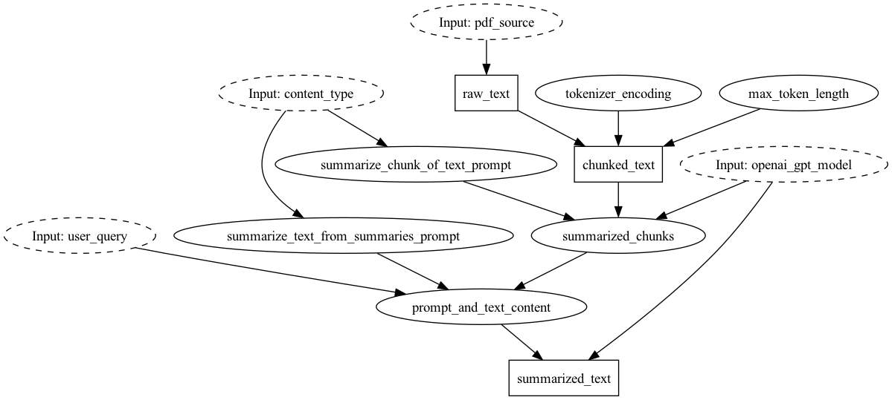

# PDF Summarizer on Spark

Here we show how you can run the same Hamilton dataflow, that we defined in the backend
folder, on Spark. This is useful if you want to run the same dataflow on a larger dataset,
or have to run it on a cluster. Importantly this means you don't have to rewrite your
code, or have to change where/how you develop!



# File organization
 - `summarization.py` this should be a carbon copy of the one in the backend folder.
 - `run.py` this contains the code to create a spark job and run the summarization code.

# How this works
We take the dataflow defined by `summarization.py` and execute it as a bunch
of row based UDFs on spark. The magic to do this happens in the Hamilton PySparkUDFGraphAdapter.

The premise is that there is a central dataframe
that contains a column that maps to the required input. Which in this example
is `pdf_source`. You can request whatever intermediate outputs as columns, which
in this example we do with `["raw_text", "chunked_text", "summarized_text"]`.

## Running the code

1. Make sure you have the right dependencies installed. You can do this by running
`pip install -r requirements.txt`.
2. Download some PDFs, and then update `run.py` with the paths to them.
3. Then you can run the code with `python run.py`. Be sure to have your OPENAI_API_KEY in the
environment.

# Sharing `summarization.py` in real life
Here in this example, we just copied summarization.py to share the code. In real life
you would most likely:

1. create a python package with your dataflows and publish things that way.
2. or, in lieu of publishing a package, you share code via repository and augment the python path/
zip the code up to share it between the fastAPI service and spark.


# Errors you might encounter:
## Fork error on mac
If you are running spark on a mac, you might get the following error:

```
objc[95025]: +[__NSCFConstantString initialize] may have been in progress in another thread when fork() was called.
objc[95025]: +[__NSCFConstantString initialize] may have been in progress in another thread when fork() was called. We cannot safely call it or ignore it in the fork() child process. Crashing instead. Set a breakpoint on objc_initializeAfterForkError to debug.
```
Export the following environment variable to fix it before running the code:

```bash
export OBJC_DISABLE_INITIALIZE_FORK_SAFETY=YES
```

## Pyspark error "got multiple values for argument"
You should not get this error, but you might if you adjust the code.

E.g.
```python
TypeError: prompt_and_text_content() got multiple values for argument 'summarize_text_from_summaries_prompt'
```
Solution -- ensure that what ends up being columns in a dataframe are the leftmost
arguments to each function, and not after any "primitive" arguments. This is because we
bind primitive functions with a kwargs call, but we pass in columns as positional arguments.
