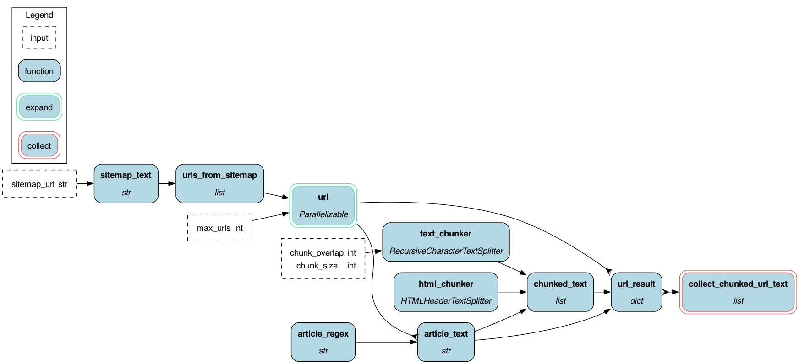

# Scraping and Chunking
Scraping and chunking are an important part of any RAG dataflow. Typically they're
the start of your "backend" operations to populate for example your vector database.

## High Level Explanation
Here we show how to model this process with Hamilton, but also we show how to avoid
dealing with executors and control flow logic that can make your code hard to maintain, test, and reuse.
For the latter case, see the example code below. You would typically see this in a scraping and chunking workflow to
parallelize it. `some_func` below would be some large function, or wrapper around logic to process each
URL. The point to grok, is that you have to deal with this
control flow logic yourself to orchestrate your code -- which invariably tightly couples it and
makes it harder to test and reuse.
```python
def scrape(urls: list) -> list:
    all_data = []
    with concurrent.futures.ThreadPoolExecutor(max_workers=MAX) as executor:
        futures = [
            executor.submit(
                some_func, url, func_args...
            )
            for url in urls
        ]
        with tqdm(total=len(urls)) as pbar:
            for _ in concurrent.futures.as_completed(futures):
                pbar.update(1)
        for future in futures:
            data = future.result()
            all_data += data
    return all_data
```
##
Instead, with Hamilton, you can write the processing logic INDEPENDENT of having to deal
with the for loop and control logic to submit to the executor. This is a big win, because
it means you can easily unit test your code, reuse it, and then scale it to run in parallel without
coupling to a specific execution system.

To start, we can "unravel" `some_func` above into a DAG of operations (a simple linear chain here):
```python

def article_regex() -> str:
    """This assumes you're using the furo theme for sphinx"""
    return r'<article role="main" id="furo-main-content">(.*?)</article>'


def article_text(url: str, article_regex: str) -> str:
    """Pulls URL and takes out relevant HTML.

    :param url: the url to pull.
    :param article_regex: the regext to use to get the contents out of.
    :return: sub-portion of the HTML
    """
    html = requests.get(url)
    article = re.findall(article_regex, html.text, re.DOTALL)
    if not article:
        raise ValueError(f"No article found in {url}")
    text = article[0].strip()
    return text

def processed_article(article_text: str) -> list:
    """Processes the article text.

    :param article_text: the text to process.
    :return: the processed text.
    """
    # do some processing, even saving it, etc.
    return article_text
```
Next we can then "parallelize" & "collect" it over inputs, i.e. "map" over it with various values. To tell Hamilton to
do that we'd add the following functions to "sandwich" the code above:
```python
def url(urls_from_sitemap: list[str], max_urls: int = 1000) -> Parallelizable[str]:
    """
    Takes in a list of URLs for parallel processing.

    Note: this could be in a separate module, but it's here for simplicity.
    """
    for url in urls_from_sitemap[0:max_urls]:
        yield url

# The previous Hamilton code could live here, or if in another module, Hamilton
# would stitch the graph together correctly.

def collect_processed_articles(processed_article: Collect[list]) -> list:
    """Function to collect the results from parallel processing.
    Note: all `processed_article` results are pulled into memory. So, if you have a lot of results,
    you may want to write them to a datastore and pass pointers instead.
    """
    return list(url_result)
```
The magic is in the `Parallelizable` & `Collect` types. This tells Hamilton to run what is between them
in parallel as a single task. For more information see the
[parallel documentation](https://hamilton.dagworks.io/en/latest/concepts/parallel-task/) and
[examples](https://github.com/DAGWorks-Inc/hamilton/tree/main/examples/parallelism).

## Let's explain the example

Here is an image of the pipeline when run locally, or via ray or dask:


The pipeline is a simple one that:
1. takes in a sitemap.xml file and creates a list of all the URLs in the file. Defaults to Hamilton's.
2. For each URL the process is then parallelized (green border).
3. each url is pulled and stripped to the relevant body of HTML.
4. the HTML is then chunked into smaller pieces -- returning langchain documents
5. what this doesn't do is create embeddings -- but that would be easy to extend.
6. then all the results are collected (red border) and returned.

What this leaves us with is a general way to then plug in various executors to run the code in parallel.
This is what the `run.py`, `run_dask.py`, `run_ray.py`, and `spark/spark_pipeline.py` files do. They run the same code, but on different
execution systems.

Or you can open the notebook in google collab:<a target="_blank" href="https://colab.research.google.com/github/DAGWorks-Inc/hamilton/blob/main/examples/LLM_Workflows/scraping_and_chunking/notebook.ipynb">
  
</a> That will exercise the different execution systems.

### File Structure
Here we explain the file structure of the example:

 - `doc_pipeline.py` - the main file that contains the Hamilton code that defines the document chunking pipeline.
 - `run.py` - code that you would invoke to run `doc_pipeline` locally, or in a single python process.
 - `run_dask.py` - code that you would invoke to run `doc_pipeline` on a Dask cluster / or dask locally.
 - `run_ray.py` - code that you would invoke to run `doc_pipeline` on a Ray cluster / or ray locally.
 - `spark/doc_pipeline.py` - the main file that contains the Hamilton code that defines the document chunking pipeline,
but adjusted for PySpark.
 - `spark/spark_pipeline.py` - code that you would invoke to run `spark/doc_pipeline` on a Spark cluster / or spark locally.
 - `spark/README.md` - more details on running the Spark example and why the code differs slightly.

### Running the example
Make sure you have the right python dependencies installed for the execution system you want to use.
See `requirements.txt` (or `spark/requirements.txt`) for the dependencies you need to install.

Then you can run the example with the following commands:
```bash
python run.py
python run_dask.py
python run_ray.py
python spark/spark_pipeline.py
```
See `spark/README.md` for more details on running the Spark example and why the code differs slightly.

## Extensions / what to do next
This example is a simple one, but it's easy to extend. For example, you could:

* add a step to create embeddings from the chunked documents.
* you could also add a step to save the results to a database, or to a file system.
* you'd also likely tune the parallelism to ensure you don't DoS the resource you're hitting.

## Hamilton over Langchain
Hamilton is a general purpose tool, and what we've described here applies broadly
to any code that you might write: data, machine learning, LLMs, web processing, etc. You can
even use it with parts of LangChain!
