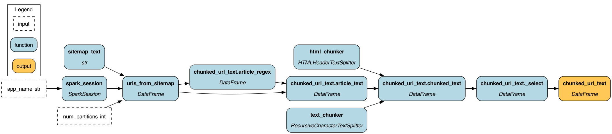

# PySpark version of the scraping and chunking example

Here we show how you can integrate the Hamilton dataflow, that we defined previously
easily into a PySpark job. This is useful if you want to run the same dataflow on a larger dataset,
or have to run it on a cluster.

# Why use PySpark?
PySpark is a great way to scale your data processing. In the case of scraping and chunking it allows
you to parallelize operations. This is useful if you have a large number of documents to process.


# File organization
 - `spark_pipeline.py` is the main dataflow for the spark job
 - `doc_pipline.py` contains the code to parse and chunk the documents. It has a few adjustments to make
it work with the `@with_columns` integration Hamilton has.

# How to run
If you're on MacOS:
```bash
OBJC_DISABLE_INITIALIZE_FORK_SAFETY=YES python spark_pipeline.py
```
Otherwise:
```bash
python spark_pipeline.py
```

This is what it'll run:

As you can see it'll linearize the process of adding UDFs in the right order to the dataframe based
on the DAG we defined in `doc_pipeline.py`.

# Changes to run on PySpark
Here's why we need to make some minor adjustments to the code.

1. You can only make dataframe columns from spark compatible types. Thus if a function is returning an object,
e.g. the LangChain chunker in this example, it cannot be used as a column. We have to convert it to a string
or a struct, or not include it in the "sub-DAG" that with_columns is creating.
2. The `@with_columns` decorator assumes that intermediate functions can be saved as columns to the dataframe.
That's how it strings together computation. If this is not possible, you have to tell Hamilton to not include
the function in the "sub-DAG" that with_columns is creating.

## Handling langchain's Document type
So instead of returning a LangChain Document object, we return a JSON string for simplicity. We could
create a PySpark Struct type, but that's a bit more involved.

## Handling `@with_columns` restrictions
In `doc_pipline.py` you'll see we define a variable that is a list of the functions we want to include in the
"sub-DAG" that with_columns is creating. This is a quick way to label or specify what transforms,
can be made into columns. `@with_columns` will then reference this list of functions to know what to include.
That way `html_chunker` and `text_chunker` are not included in the "sub-DAG" that `@with_columns` is creating, and
are then run once and bound to the UDFs the Hamilton is creating underneath.

# Caveats to think about in real life
## Partitions & number of executors
PySpark's parallelism is basically controlled by the number of partitions and the number of executors. That is,
the parallelism you get is `min(number of partitions, number of executors)`. The number of partitions relates
to how many independent chunks of data you have. When you load data you can repartition it. The number
of executors relates to how many independent processes you have to do work. It is not exposed here in this example,
but you'd set the number of executors when you submit the job.

So you'll likely need to tune these for your use case so that you don't DoS a resource you're hitting. E.g. especially
important if you extend this workflow to create embeddings.
