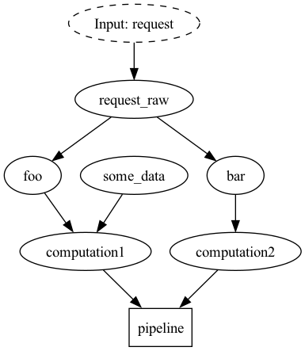

# Hamilton + Async

This is currently an experimental feature, allowing one to run a hamilton DAG composed (entirely or partially) of async functions.

## How to use

See the [example](fastapi.py) for the example. The difference from a normal driver is two-fold:

1. You call it using the `AsyncDriver` rather than the standard driver
2. `raw_execute`, and `execute` are both coroutines, meaning they should be called with `await`.
3. It allows for tasks as inputs -- they'll get properly awaited

To run the example, make sure to install `requirements.txt`.

Then run `uvicorn fastapi_example:app` in one terminal.

Then curl with:

```bash
curl -X 'POST' \
  'http://localhost:8000/execute' \
  -H 'accept: application/json' \
  -d '{}'
```

You should get the following result:

```json
{"pipeline":{"computation1":false,"computation2":true}}
```

## Tracking

This has an additional endpoint that will use the async tracker if the [ui](https://hamilton.dagworks.io/en/latest/concepts/ui/)
is running on port 8241 -- see [fastapi_example.py](fastapi_example.py) for the code.
If it is not running it will proceed anyway without tracking.

You can run it with:

```bash
curl -X 'POST' \
  'http://localhost:8000/execute' \
  -H 'accept: application/json' \
  -d '{}'
```

Recall, to get the server running, you'll have to run the following:

```bash
pip install sf-hamilton[ui]
hamilton ui
```

This assumes a project (1) exists -- if you want a different one you can go the the UI and create one and/or set it in the code.


## How it works

Behind the scenes, we create a [GraphAdapter](../../hamilton/experimental/h_async.py)
that turns every function into a coroutine. The function graph then executes, creating tasks for each node,
that are awaited at the end. Thus no computation is complete until a final node
is awaited.

Any node inputs are awaited on prior to node computation if they are awaitable, so you can pass
in external tasks as inputs if you want.

Here is the execution visualized:



## Caveats

1. This will break in certain cases when decorating an async function (E.G. with `extract_outputs`).
This is because the output of that function is never awaited during delegation. We are looking into ways to fix this,
but for now be careful. We will at least be adding validation so the errors are clearer.
2. Performance *should* be close to optimal but we have not benchmarked. We welcome contributions.

We want feedback! We can determine how to make this part of the core API once we get userse who are happy,
so have some fun!

Fixing the caveats will be the first order of business, and adding validations when things won't work.
