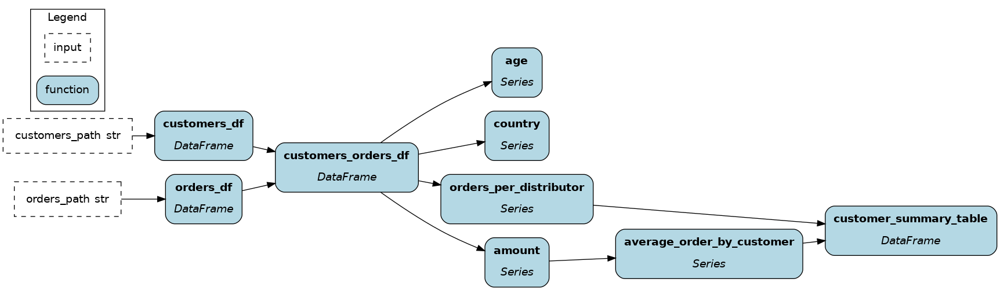
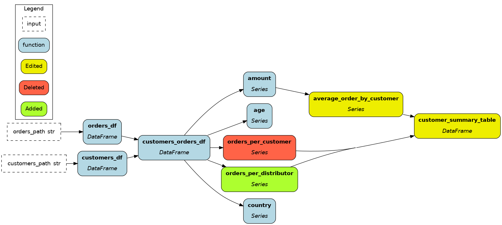

# Hamilton CLI

The Hamilton CLI allows to build `Driver` objects from the command line.

# Installation
Install dependencies with (it only needs `typer`)

```pip install sf-hamilton[cli]```

Test the installation with

```hamilton --help```

# Features

Currently 4 commands:

- `build`: creates a Hamilton `Driver` from specified modules. It"s useful to validate the dataflow definition
- `view`: calls `dr.display_all_functions()` on the built `Driver`
- `version`: generates node hashes based on their source code, and a dataflow hash from the collection of node hashes.
- `diff`: get a diff of added/deleted/edited nodes between the current version of Python modules and another git reference (`default=HEAD`, i.e., the last commited version). You can get a visualization of the diffs

See [DOCS.md](./DOCS.md) for the full references

# Usage

- Useful to quickly check a dataflow definition is valid without creating a script or an interactive environment
- `./example_script.py` shows you how to pipe out CLI responses as JSON objects. Can be useful in a CI pipeline
- For programmatic use in Python, see `hamilton.cli.commands` Note that this API is experimental and unstable.

# Examples
To illustrate, let"s take the file `module_v1.py` which contains a few functions (details aren"t important).

```python
import pandas as pd
from hamilton.function_modifiers import extract_columns

def customers_df(customers_path: str = "customers.csv") -> pd.DataFrame:
    """Load the customer dataset."""
    return pd.read_csv(customers_path)

def orders_df(orders_path: str = "orders.csv") -> pd.DataFrame:
    """Load the orders dataset."""
    return pd.read_csv(orders_path)

@extract_columns("amount", "age", "country")
def customers_orders_df(customers_df: pd.DataFrame, orders_df: pd.DataFrame) -> pd.DataFrame:
    """Combine the customers and orders datasets.
    Setting index to (order_id, customer_id)."""
    _df = pd.merge(customers_df, orders_df, on="customer_id")
    _df = _df.set_index(["order_id", "customer_id"])
    return _df

def orders_per_customer(customers_orders_df: pd.DataFrame) -> pd.Series:
    """Compute the number of orders per customer.
    Outputs series indexed by customer_id."""
    return customers_orders_df.groupby("customer_id").size().rename("orders_per_customer")

def average_order_by_customer(amount: pd.Series) -> pd.Series:
    """Compute the average order amount per customer.
    Outputs series indexed by customer_id."""
    return amount.groupby("customer_id").mean().rename("average_order_by_customer")

def customer_summary_table(
    orders_per_customer: pd.Series, average_order_by_customer: pd.Series
) -> pd.DataFrame:
    """Our customer summary table definition."""
    return pd.concat([orders_per_customer, average_order_by_customer], axis=1)
```

## `build`
### Command
Call `build` with a single Python module path.

```
hamilton build module_v1.py
```
### Response
Returns the modules included in the dataflow
```json
{"modules": ["module_v1"]}
```

## `view`
### Command
Call `view` with a single Python module path, and specify the output visualization path.

```
hamilton view --output ./dag.png module_v1.py
```
### Response
Returns the modules included in the dataflow
```json
{"path": "/home/tjean/projects/dagworks/hamilton/examples/cli/dag.png"}
```


## `version`
### Command
Call `version` with a single Python module path.

```
hamilton version module_v1.py
```
### Response
Returns the hashes for the nodes" function and the dataflow hash (hashes trimmed for readability).
```json
{
  "dataflow_hash": "13b05...",
  "nodes_hash": {
    "age": "18eb2...",
    "amount": "18eb2...",
    "average_order_by_customer": "671e3...",
    "country": "18eb2...",
    "customer_summary_table": "19905...",
    "customers_df": "34f04...",
    "customers_orders_df": "18eb2...",
    "customers_path": "34f04...",
    "orders_df": "452f4...",
    "orders_path": "452f4...",
    "orders_per_distributor": "278b2..."
  }
}
```

## `diff`
After making the following changes to the last functions
```python
# renamed this function
def orders_per_distributor(customers_orders_df: pd.DataFrame) -> pd.Series:
    """Compute the number of orders per customer.
    Outputs series indexed by customer_id."""
    return customers_orders_df.groupby("customer_id").size().rename("orders_per_distributor")

# added 1 to the return value
def average_order_by_customer(amount: pd.Series) -> pd.Series:
    """Compute the average order amount per customer.
    Outputs series indexed by customer_id."""
    return 1 + (amount.groupby("customer_id").mean().rename("average_order_by_customer"))

# renamed according to `orders_per_distributor`
def customer_summary_table(
    orders_per_distributor: pd.Series, average_order_by_customer: pd.Series
) -> pd.DataFrame:
    """Our customer summary table definition."""
    return pd.concat([orders_per_distributor, average_order_by_customer], axis=1)
```

### Command
```
hamilton diff --view --output ./diff.png module_v1.py
```

### Response
```json
{
  "edit": [
    "average_order_by_customer",
    "customer_summary_table"
  ],
  "v1_only": ["orders_per_customer"],
  "v2_only": ["orders_per_distributor"]
}
```


