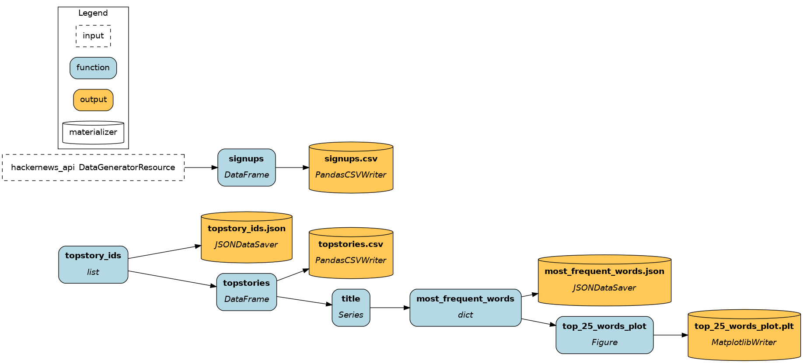

# Hamilton


> Hamilton dataflow materialization plan

## File structure

The Hamilton refactor achieves the same data transformations. The project fits in essentially 2 files:
- `dataflow.py` contains regular Python functions to define the dataflow (equivalent to Dagster `tutorial/assets.py`).
- `run.py` contains the "driver code" to load and execute the dataflow (equivalent to Dagster `tutorial/__init__.py`).
- `notebook.ipynb` contains code to execute the dataflow (similar code to `run.py`), but allows for an interactive exploration of results.

The directory also include `mock_api.py` which simulates a `ressource` in the Dagster tutorial, and `dataflow.png` which is an artifact generated by the Hamilton `Driver`.

## Instructions
1. Run the code
    ```console
    python run.py
    ```

Or run it in Google Colab:
[
](https://colab.research.google.com/github/dagworks-inc/hamilton/blob/main/examples/dagster/hamilton_code/notebook.ipynb)


## Going further
- Learn the basics of Hamilton via the `Concepts/` [documentation section](https://hamilton.dagworks.io/en/latest/concepts/node/)
- Visit [tryhamilton.dev](tryhamilton.dev) for an interactive tutorial in your browser
- Visit the [DAGWorks blog](https://blog.dagworks.io/) for more detailed guides
