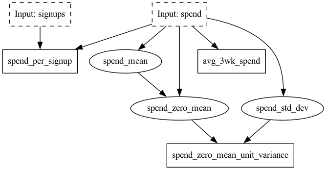

# Dask Community day demo example

This example was demo'ed at the Dask community day for July 2023.

In this example we showcase using the [Hamilton DaskGraphAdapter](https://hamilton.dagworks.io/en/latest/reference/graph-adapters/DaskGraphAdapter/#h-dask-daskgraphadapter)
to inject dask.delayed() as it's walking the DAG that is defined with Hamilton.

File organization:

* `my_functions.py` houses the logic that we want to compute. Note how the functions are named, and what input
parameters they require. That is how we create a DAG modeling the dataflow we want to happen.
* `demo_day_notebook.ipynb` is the notebook that was shown in the demo. At the top it shows using Hamilton, and running
the code without delegating to Dask, and then at the bottom it shows how to use the DaskGraphAdapter that augments
how the DAG is walked, because it calls dask.delayed on every function.

To run things, open up the notebook and run it, after installing the requisite dependencies:
```bash
pip install -r requirements.txt
jupyter notebook
```

If you have questions, or need help with this example,
join us on [slack](https://join.slack.com/t/hamilton-opensource/shared_invite/zt-1bjs72asx-wcUTgH7q7QX1igiQ5bbdcg), and we'll try to help!

# What is executed
This is a simple DAG that we construct here. But for reference it looks like this:


# References:
* [Dask](https://dask.org/)
* [Hamilton Docs](https://hamilton.dagworks.io/en/latest/)
* [Try Hamilton in your browser](https://www.tryhamilton.dev/)
