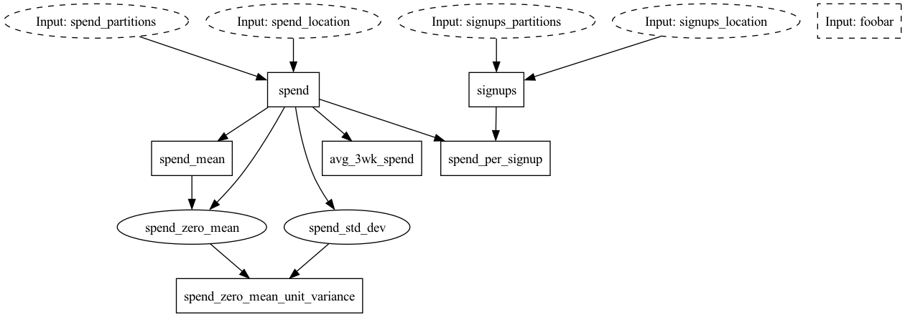

# Hamilton on Dask

Here we have a hello world example showing how you can
take some Hamilton functions and then easily run them
in a distributed setting via dask.

Note: please read this [dask best practices post](https://docs.dask.org/en/stable/dataframe-best-practices.html);
don't scale if you don't need to.

`pip install sf-hamilton[dask-complete]`  or `pip install sf-hamilton dask[complete]` to for the right dependencies to run this example.

File organization:

* `business_logic.py` houses logic that should be invariant to how hamilton is executed.
* `data_loaders.py` houses logic to load data for the business_logic.py module. The
idea is that you'd swap this module out for other ways of loading data or use @config.when to determine what to load.
*  `run.py` is the script that shows how you can swap in loading data from a dask dataframe and reuse pandas.
*  `run_with_delayed.py` shows how you can farm out computation of each function to dask via `dask.delayed`.
*  `run_with_delayed_and_dask_objects.py` shows the combination of the above. It is slightly non-sensical, since we're
entirely operating on what are dask objects effectively. But otherwise shows the code pattern to use both.

# Visualization of execution
Here is the graph of execution:

