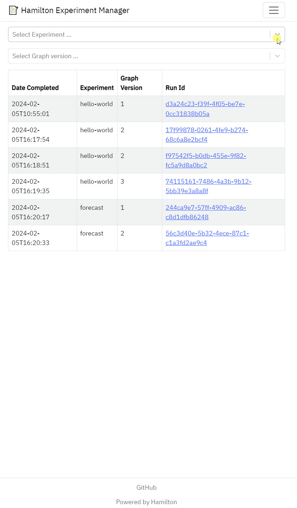

# Hamilton Experiment Manager

Add a hook to your Hamilton Driver to log runs and visualize artifacts and metadata! The server is built using FastAPI + FastUI allowing to easily integrate the server within your app or extend the UI.

<p align="center">
    
</p>

## Features
- 📝 Track run metadata (config, inputs, code version, etc.)
- 📦 Generate directories to store your run artifacts
- 📡 Launch a local server to view and explore your experiments

## Installation
Use `pip install sf-hamilton[experiments]` to install both the hook and the server with their dependencies

## How to use the ExperimentTracker hook
The `ExperimentTracker` hook can be added to your Hamilton Driver definition to automatically log metadata about the run and materialized results.

1. Create the `ExperimentTracker` hook object:
    - `experiment_name`: name to organize related runs. Is used to create directories and displayed in the UI
    - `base_directory`: path where the metadata cache and subdirectories to store artifacts will be created. Default is `./experiments`.
2. Create the Hamilton Driver and pass the `ExperimentTracker` to `with_adapters()` method
3. Define materializers for each artifacts you care about. The UI provides rich support for `parquet`, `csv`, and `json`.
    - ⚠ Make sure to use relative paths (ones that don't start with `/`) for artifacts to be stored in run directories.
4. Call `dr.materialize()` to launch run for which metadata and artifacts will be tracked.
5. (Optional) Use `dr.visualize_materialization()` to visualize the dataflow and set `output_file_path` with the run directory `tracker_hook.run_directory`

### Example
```python
from hamilton import driver
from hamilton.plugins import h_experiments

import my_functions  # <- your Hamilton module


# 1. create the hook
tracker_hook = h_experiments.ExperimentTracker(
    experiment_name="hello-world",
    base_directory="/path/to/experiments",
)

# 2. create driver with modules and hook
dr = (
    driver.Builder()
    .with_modules(my_functions)
    .with_adapters(tracker_hook)
    .build()
)

# 3. define materializers (absolute or relative path)
materializers = [
    # notice the relative paths (don't start with "/")
    to.json(
        id="model_performance__json",
        dependencies=["model_performance"],
        path="./model_performance.json",
    ),
    to.parquet(
        id="training_data__parquet",
        dependencies=["training_data"],
        path="./training_data.parquet",
    ),
]

# 4. launch run using `.materialize()`
dr.materialize(*materializers)

# 5. (optional) visualize materialization and store the figure
#               under the `tracker_hook.run_directory` path
dr.visualize_materialization(
    *materializers,
    output_file_path=f"{tracker_hook.run_directory}/dag",
)
```

## How to use the experiment server
The experiment server is a local FastAPI server that reads the run metadata cache and mounts the `base_directory` to view and explore results. The frontend uses FastUI to create a React interface from Python.

### Start the FastAPI server
```
h_experiments
```

You should see in the terminal:
```
INFO:     Started server process [24113]
INFO:     Waiting for application startup.
INFO:     Application startup complete.
INFO:     Uvicorn running on http://127.0.0.1:8123 (Press CTRL+C to quit)
```
### Set the experiments directory
```
h_experiments $/path/to/base_directory
```

You can use an absolute or relative path. Default is `./experiments`

### Set host and port
```
h_experiments --host $HOST --port $PORT
```
Defaults are `127.0.0.1` and `8123`

## What's next?
Let us know how you find the experiment manager and features you'd like to see! This project is still early/experimental and there are several interesting avenues:
- Materialize artifacts to cloud storage
- User interface to view node-level code diffs
- Performance profiling of runs
- User interface to launch runs

Given this is a FastAPI server, you can easily extend it yourself and mount it as a subroute for your own application!
