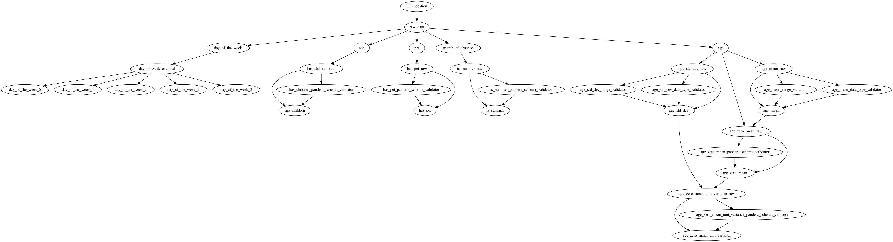
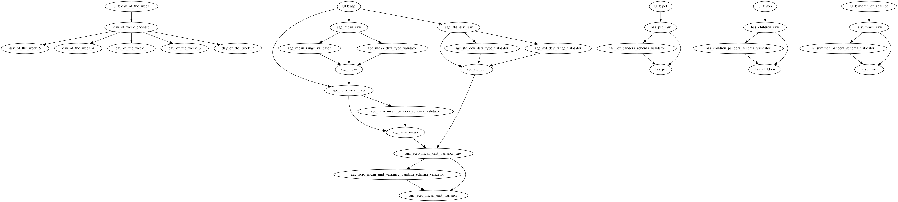

# Scenario 1: the simple case - ETL + Online API

Context required to understand this scenario:
1. you have read the main README in the directory above.
2. you understand what it means to have an extract, transform, load (ETL) process to create features. It ingests raw data,
runs transformations, and then creates a training set for you to train a model on.
3. you understand the need to have an online API from where you want to serve the predictions. The assumption here is
that you can provide the same raw data to it that you would have access to in your ETL process.
4. you understand why aggregation features, like `mean()` or `std_dev()`, make sense only in an
offline setting where you have all the data. In an online setting, computing them likely does not make sense.

# How it works

1. You run `etl.py`, and in addition to storing the features/training a model, you store the aggregate global values
for `age_mean` and `age_std_dev`. `etl.py` uses `offline_loader.py`, `features.py`, and `named_model_feature_sets.py`.
2. You then run `fastapi_server.py`, which is the online webservice with the trained model (not shown here). `fastapi_server.py`
uses `features.py`, and `named_model_feature_sets.py`.
Note, in real-life you would need to figure out a process to inject the aggregate global values for `age_mean` and `age_std_dev`
into the feature computation process. E.g. If you're getting started, these could be hardcoded values, or stored to a file that
is loaded much like the model, or queried from a database, etc. Though you'll want
to ensure these values match whatever values the model was trained with. If you need help here, join our slack and we're happy to help you figure this out!

Here's a mental image of how things work and how they relate to the files/modules & Hamilton:

Otherwise, here is a description of all the files and what they do:

## offline_loader.py
Contains logic to load raw data. Here it's a flat file, but it could be going
to a database, etc.

## features.py
The feature transform logic that takes raw data and transforms it into features. It contains some runtime
dataquality checks using Pandera.

Important not, there are two aggregations features defined: `age_mean` and `age_std_dev`, that are computed on the
`age` column. These make sense to compute in an offline setting as you have all the data, but in an online setting where
you'd be performing inference, that doesn't makse sense. So for the online case, these computations be "overridden" in
`fastapi_server.py` with the values that were computed in the offline setting that you have stored (as mentioned above
and below it's up to you how to store them/sync them). The nice thing in Hamilton is that we can also "tag" these two
feature transforms with information to indicate to someone reading the code, that they should be overriden in the
online feature computation context.

## etl.py
This script mimics what one might do to fit a model: extract data, transform into features,
and then load features somewhere or fit a model. It's pretty basic and is meant
to be illustrative. It is not complete, i.e. doesn't save, or fit a model, it just extracts and transforms data
into features to create a dataframe.

As seen in this image of what is executed - we see the that data is pulled from a data source, and transformed into features.

Note, you need to store `age_mean` and
`age_std_dev` and then somehow get those values to plug into the code in `fastapi_server.py` - we "hand-waive" this here.

## named_model_feature_sets.py
Rather than hardcoding what features the model should have in two places, we define
it in a single place and import it where needed; this is simple if you can share the code eaisly.
However, this is something you'll have to determine how to best do in your set up. There are many ways to do this,
come ask in the slack channel if you need help.

## fastapi_server.py
The FastAPI server that serves the predictions. It's pretty basic and is meant to
illustrate the steps of what's required to serve a prediction from a model, where
you want to use the same feature computation logic as in your ETL process.

Note: the aggregation feature values are provided at run time and are the same
for all predictions -- how you "link" or "sync" these values to the webservice & model
is up to you; in this example we just hardcode them.

Here is the DAG that is executed when a request is made. As you can see, no data is loaded, as we're assuming
that data comes from the API request. Note: `age_mean` and `age_std_dev` are overridden with values and would
not be executed (our visualization doesn't take into account overrides just yet).

