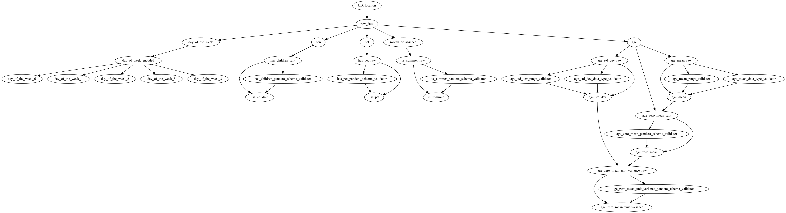

# Scenario 2: the more complex case - request doesn't have the raw data - ETL + Online API

Context required to understand this scenario:
1. you have read the main README in the directory above.
2. you understand what it means to have an extract, transform, load (ETL) process to create features. It ingests raw data,
runs transformations, and then creates a training set for you to train a model on.
3. you understand the need to have an online API from where you want to serve the predictions. The assumption here is
that you need to go to a feature store to get the raw features you need to make a prediction.
4. you understand why aggregation features, like `mean()` or `std_dev()`, make sense only in an
offline setting where you have all the data. In an online setting, computing them likely does not make sense, and in
this example they're a separate call to the feature store to get them.

# How it works

1. You run `etl.py`, which creates a featurized data set for training a model. You have a separate process that pushes
data to your feature store outside of `etl.py`, other than for `age_mean` and `age_std_dev`. `etl.py` uses
`offline_loader.py`, `features.py`, and `named_model_feature_sets.py`.
2. You then run `fastapi_server.py`, which is the online webservice with the trained model (not shown here).
`fastapi_server.py` uses `online_loader.py`, `features.py`, and `named_model_feature_sets.py`.

Otherwise, here is a description of all the files and what they do:

## offline_loader.py
Contains logic to load raw data. Here it's a flat file, but it could be going
to a database, etc.

## features.py
The feature transform logic that takes raw data and transforms it into features. It contains some runtime
dataquality checks using Pandera.

Important not, there are two aggregations features defined: `age_mean` and `age_std_dev`, that are computed on the
`age` column. These make sense to compute in an offline setting as you have all the data, but in an online setting where
you'd be performing inference, that doesn't makse sense. So for the online case, in this example, they are "omitted" from
being nodes in the online context via `@config.when_not_in`. Instead, they are populated via the `online_loader.py` which
goes to the feature store for them. `fastapi_server.py` then is a little simpler than in Scenario (1), as it just
delegates all work to Hamilton for getting features.

## online_loader.py
Contains logic to load raw data in an online context from a feature store. It also contains functions to pull
the stored aggregate feature values.

## etl.py
This script mimics what one might do to fit a model: extract data, transform into features,
and then load the featurized data set somewhere or fit a model. It's pretty basic and is meant
to be illustrative. It is not complete, i.e. doesn't save, or fit a model, it just extracts and transforms data
into features to create a dataframe.

As seen in this image of what is executed - we see the that data is pulled from a data source, and transformed into features.

Note, `age_mean` and `age_std_dev` are pushed to the feature store in this example.

## named_model_feature_sets.py
Rather than hardcoding what features the model should have in two places, we define
it in a single place and import it where needed; this is simple if you can share the code eaisly.
However, this is something you'll have to determine how to best do in your set up. There are many ways to do this,
come ask in the [slack channel](https://join.slack.com/t/hamilton-opensource/shared_invite/zt-1bjs72asx-wcUTgH7q7QX1igiQ5bbdcg)
if you need help.

## fastapi_server.py
The FastAPI server that serves the predictions. It's pretty basic and is meant to
illustrate the steps of what's required to serve a prediction from a model, where
you want to use the same feature computation logic as in your ETL process.

Here is the DAG that is executed when a request is made. As you can see, we need the feature client to go
and grab data from the feature store to fulfill getting data to compute features.

