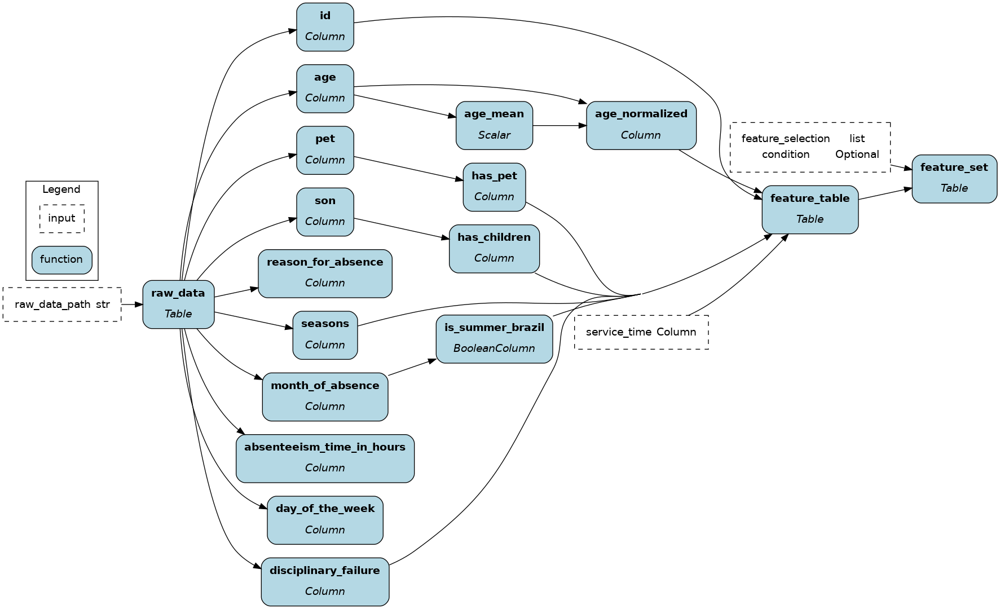

# Ibis + Hamilton

[Ibis](https://ibis-project.org/) is a portable dataframe library to write procedural data transformations in Python and be able to execute them directly on various SQL backends (DuckDB, Snowflake, Postgres, Flink, see [full list](https://ibis-project.org/support_matrix)). Hamilton provides a declarative way to define testable, modular, self-documenting dataflows, that encode lineage and metadata.

In this example, we'll show how to get started with creating feature transformations and training a machine learning model. You'll learn about the basics of Ibis and IbisML and how they integrate with Hamilton.





# Running the example
Follow these steps to get the example working:
1. create and activate virtual environment

    ```script
    python -m venv venv & . venv/bin/activate
    ```
2. install requirements

    ```script
    pip install -r requirements.txt
    ```

3. execute the Hamilton feature engineering dataflow at the table or column level

    ```script
    python run.py --level [table, column]
    ```

# Files
- `table_dataflow.py` and `column_dataflow.py` include the same Ibis feature engineering dataflow, but with different level of granularity
- `tables.png` and `columns.png` were generated by Hamilton directly from the code.
- `ibis_feature_set.png` was generated by Ibis. It describes the atomic data transformations executed by the expression.


# Resources
- [Learn more about Hamilton + Ibis](https://hamilton.dagworks.io/en/latest/integrations/ibis/)
- [Ibis documentation](https://ibis-project.org/)
