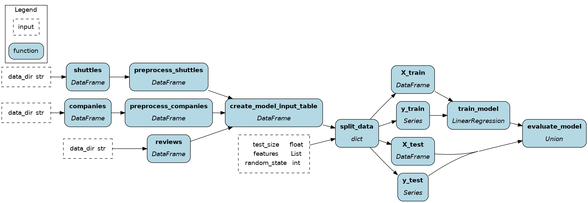

# Hamilton code


> Hamilton dataflow

## File structure
The Hamilton refactor is composed of a few files:
- `data_processing.py` and `data_science.py` contains regular Python functions to define the Hamilton dataflow. This is equivalent to Kedro's `pipeline.py` **and** `nodes.py` files.
- `run.py` contains the "driver code" to load and execute the dataflow. There's no direct equivalent in the Kedro tutorial since it prefers using the CLI for execution.
- `tests/test_dataflow.py` includes tests equivalent to `tests/pipelines/data_science/test_pipeline.py` in the Kedro code.

## Instructions
1. Create a virtual environment and activate it
    ```console
    python -m venv venv && . venv/bin/active
    ```

2. Install requirements for the Hamilton code
    ```console
    pip install -r requirements.txt
    ```

3. Install the current `hamilton-code` project
    ```console
    pip install -e .
    ```

4. Run the dataflow
    ```console
    python run.py
    ```

5. Run the tests
    ```console
    pytest tests/
    ```

## Going further
- Learn the basics of Hamilton via the `Concepts/` [documentation section](https://hamilton.dagworks.io/en/latest/concepts/node/)
- Visit [tryhamilton.dev](tryhamilton.dev) for an interactive tutorial in your browser
- Visit the [DAGWorks blog](https://blog.dagworks.io/) for more detailed guides
