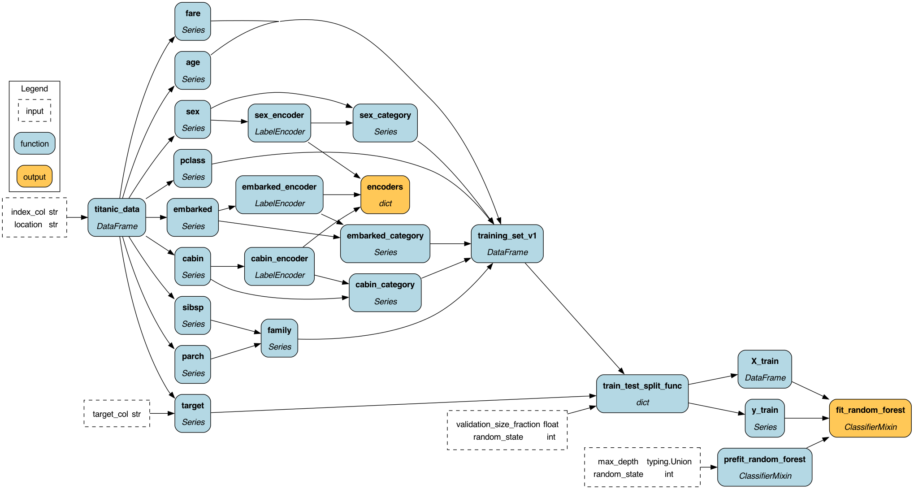

# Lineage + Hamilton


<div style="text-align: center;">Example lineage graph generated by Hamilton when you write Hamilton code.</div>

Here we showcase Hamilton's lineage abilities. We will use the Titanic
data set to model a hypothetical company set up where there is data engineering and data science team collaborating together.

If you want to see code and what it does we invite you to jump straight into browsing the [lineage_snippets](https://github.com/DAGWorks-Inc/hamilton/blob/main/examples/lineage/lineage_snippets.ipynb) notebook.
For those coming from the lineage blog post, you can find the code shown in [lineage_script.py](https://github.com/DAGWorks-Inc/hamilton/blob/main/examples/lineage/lineage_script.py).

For those who want to continue, let's first talk about some common problems people encounter, then more formally frame what we mean by
lineage, and then explain how Hamilton's lineage capabilities help you solve common problems encountered with Data and Machine Learning.

Note: a quick word on terminology, we use `function` and `node` interchangeably because you write functions, that get turned
into nodes that are modeled in a DAG. So if you see `function` or `node` they mean the same thing effectively.

## Common Problems (and therefore questions)
As your data and ML work progresses, invariably time passes and someone runs into a problem such as:
 - why is my model suddenly behaving badly? What columns does it use and what are its data sources?
 - we used to be getting a value for this column/feature, but now we're not. What has changed?
 - we ingested some bad data, and we need to know who and what is impacted.
 - a person on my team wants to make a change to X, but I'm afraid we're going to break something.
 - I have inherited some code running in production, and now something broke, where do I start?
 - Governance is asking me for information about data sources to a model, and the work required seems arduous, how can I quickly get this information?
 - I'm terrified of inheriting this code base, I don't know what's going on.
 - I need to audit that we're in compliance with GDPR, but that's going to take forever.

These are all questions that can be answered with lineage information. Let's talk about what we mean by lineage more concretely.

## What is "Lineage"?
In the context of machine learning and data work, "lineage" refers to the historical record or traceability of data,
models, and processes. It encompasses the entire life cycle of data, from its origin to its final usage. Lineage helps
establish the provenance, quality, and reliability of data and aids in understanding how the data has been transformed.

In the context of machine learning models, lineage provides information about the training data, preprocessing steps,
hyperparameters, and algorithms used to train the model. It helps researchers, data scientists, and stakeholders
understand how a model was developed and evaluate its reliability and potential biases.

For data pipelines and workflows, lineage tracks the flow of data through different processing steps, transformations,
and analyses. It helps identify dependencies, troubleshoot issues, and reproduce results by capturing the sequence of
operations performed on the data.

Lineage information is valuable for various reasons, including:

 - Reproducibility: Lineage enables the replication of experiments and analyses by recording the exact steps taken,
ensuring that results can be reproduced reliably.
 - Auditing and Compliance: Lineage provides transparency and accountability, which is crucial for regulatory
compliance and ensuring data privacy.
 - Troubleshooting and Debugging: Lineage helps identify errors, inconsistencies, or unexpected results by tracing
data transformations and model training processes.
 - Collaboration: Lineage allows different stakeholders to understand the data's history, facilitating collaboration
between teams working on different parts of a project.

## Hamilton's Lineage Capabilities
*Good news*: Hamilton provides a lot of the functionality needed for storing lineage and asking questions of it. Here
we'll walk through a few features of Hamilton that will help answer and empower teams targeting the four points above:
 - reproducibility
 - auditing and compliance
 - troubleshooting and debugging
 - collaboration

### Lineage as Code
To start, Hamilton by design, encodes lineage information as code. This means, as you write each Hamilton function,
you are encoding lineage information required to compute it, i.e. by specifying a dataflow you have in effect,
specified lineage! This means, as you write your code and commit to, for example a version control system,
you have a record of how computation should happen. A huge benefit of this, is when the code changes, so does this
information -- all without you having to manage a separate system!

TL;DR:
> No need for a separate system to store lineage information, it's already in your code!

**The one thing you need to manage** is that Hamilton does not store information on artifacts it produces. If you're
producing a dataframe, a model, or some other object that your Hamilton code computes, you need to store that. The good
news is, you're likely already doing this! **But**, you're probably not storing the lineage information that produced
that artifact, and that's where Hamilton comes in.

For each artifact you produce, you just need to associate the Hamilton DAG that produced it. This is as simple as
storing the git SHA of the code and snapshot of configuration that created your Hamilton DAG, so you can retrieve the
code and ask questions of it. Adding this extra information is easy since most destinations to store artifacts allow for
extra metadata to be stored, e.g. from MLFlow for models, Snowflake as table metadata for tables/dataframes, to flat
files on S3.

Let's explain how using Hamilton helps get at the four points above.

### Reproducibility
By writing Hamilton code and connecting it with a version control system (e.g. git) you have by definition written
code that can reproduce results. This is because Hamilton DAGs are deterministic. The version control system is a
straightforward way to store evolutions of your code and configuration, and therefore your DAGs.

By versioning code, you are therefore versioning lineage information. This means you can go back in time and ask
questions about the past. For example, you can ask what the lineage information was for a model that was trained at
a specific point in time. This is as simple as checking out the git SHA of the code that produced the model, and
asking Hamilton to visualize (e.g. see [`visualize_execution()`](https://hamilton.dagworks.io/en/latest/reference/drivers/Driver/#hamilton.driver.Driver.visualize_execution)),  the DAG and ask questions of it.

### Auditing and Compliance
The [`@tag`](https://hamilton.dagworks.io/en/latest/reference/decorators/tag) and (`@tag_outputs`) feature allows
you to annotate your functions with metadata. No extra YAML file to manage, just directly together with your Hamilton code.
This means you can tag functions with information such as "PII", "GDPR", "HIPAA", etc. and then ask Hamilton to return
nodes with certain tags, e.g. get me all my "sources", or "what is PII, and what consumes it?", etc.

The [Hamilton Driver](https://hamilton.dagworks.io/en/latest/reference/drivers/Driver/#hamilton.driver.Driver)
has a lot of functions that allow you to ask questions of your DAGs to make (1) easier. The driver code can be run in
a CI/CD system, or as part of a reporting/auditing pipeline. For example, you can ask:

* What are all the functions and their tags via [`list_available_variables()`](https://hamilton.dagworks.io/en/latest/reference/drivers/Driver/#hamilton.driver.Driver.list_available_variables)
* What are the possible places that consume the output of this function via [`what_is_downstream_of()`](https://hamilton.dagworks.io/en/latest/reference/drivers/Driver/#hamilton.driver.Driver.what_is_downstream_of)
* What are the possible sources that feed into this function via [`what_is_upstream_of()`](https://hamilton.dagworks.io/en/latest/reference/drivers/Driver/#hamilton.driver.Driver.what_is_upstream_of)

With these three functions you can the find functions with specific tags and then ask questions in relation to them.

### Troubleshooting and Debugging
The good news is that what is great for reproducibility, auditing and reproducibility, is also great for
troubleshooting and debugging.

Debugging is methodical and procedural with Hamilton. The way functions are written
and executed mean that one can easily walk through just the part of the DAG of interest to debug an issue.
To help with this, Hamilton has various methods to visualize lineage so you can more easily see what you're walking through connects to:

* [`display_all_functions()`](https://hamilton.dagworks.io/en/latest/reference/drivers/Driver/#hamilton.driver.Driver.display_all_functions)
* [`display_downstream_of()`](https://hamilton.dagworks.io/en/latest/reference/drivers/Driver/#hamilton.driver.Driver.display_downstream_of)
* [`display_upstream_of()`](https://hamilton.dagworks.io/en/latest/reference/drivers/Driver/#hamilton.driver.Driver.display_upstream_of)
* [`visualize_execution()`](https://hamilton.dagworks.io/en/latest/reference/drivers/Driver/#hamilton.driver.Driver.visualize_execution)
* [`visualize_path_between()`](https://hamilton.dagworks.io/en/latest/reference/drivers/Driver/#hamilton.driver.Driver.visualize_path_between)

### Collaboration
When any organization scales, or has personnel changes, it's important to have a system that helps people get up to
in a self-service manner. Hamilton's lineage as code approach means that new team members can easily get up to speed
because functions are written in a standard way, and the lineage information is encoded in the code itself. The Hamilton
Driver code enables one to ask questions of the DAGs, and therefore the code, to get up to speed quickly.

## Recipe for using Hamilton's Lineage Capabilities

At a high level, the recipe for utilizing Hamilton's lineage capabilities is as follows:

1. Write Hamilton code.
2. Use [`@tag`](https://hamilton.dagworks.io/en/latest/reference/decorators/tag) and
[`@tag_outputs`](https://hamilton.dagworks.io/en/latest/reference/decorators/tag) to
annotate functions.
3. Instantiate a Hamilton Driver, it'll then have a representation of how data and compute flow as defined by your
Hamilton code. The Driver object can then emit/provide information on lineage!
4. If you store Hamilton code with your version control system, you can then go back in time to understand how lineage
changes over time, since it's encoded in code!

In code this should look something like the following:

(1) and (2) write Hamilton code and annotate with `@tag` (and/or `@tag_outputs`).
```python
@tag(owner="data-science", importance="production", artifact="model")
def fit_random_forest(
    prefit_random_forest: base.ClassifierMixin,
    X_train: pd.DataFrame,
    y_train: pd.Series,
) -> base.ClassifierMixin:
  """Returns a fit RF model."""
  # ... contents of function not important ... code skipped for brevity
```
(3) Instantiate a Hamilton Driver and ask questions of it.
```python
from hamilton import base
from hamilton import driver
import data_loading, features, model_pipeline, sets # import modules
config = {}  # This example has no configuration.
# instantiate the driver
adapter = base.DefaultAdapter()
dr = driver.Driver(config, data_loading, features, sets, model_pipeline, adapter=adapter)
# ask questions of the driver
# E.g. How do the feature encoders get computed and what flows into them?
inputs = {
    "location": "data/train.csv",
    "index_col": "passengerid",
    "target_col": "survived",
    "random_state": 42,
    "max_depth": None,
    "validation_size_fraction": 0.33,
}
dr.visualize_execution(
    [features.encoders], "encoder_lineage", {"format": "png"}, inputs=inputs
)
# what is upstream of the fit_random_forest node?
upstream_nodes = dr.what_is_upstream_of("fit_random_forest")
# can now filter the nodes by tags, and pull that information out...

# what is downstream of the titanic_data node?
downstream_nodes = dr.what_is_downstream_of("titanic_data")
# can now filter the nodes by tags, and pull that information out...

# what nodes are PII?
pii_nodes = [n for n in dr.list_available_variables()
             if n.tags.get("PII") == "true"]

# what nodes are called between "age" and "fit_random_forest"?
nodes_in_path = dr.what_is_the_path_between("age", "fit_random_forest")

# etc
```
To see more code, we invite you to:

1. Browse the modules to see what the functions are and what they're annotated with.
2. Browse either the [lineage_snippets](https://github.com/DAGWorks-Inc/hamilton/blob/main/examples/lineage/lineage_snippets.ipynb) notebook
or the [lineage_script](https://github.com/DAGWorks-Inc/hamilton/blob/main/examples/lineage/lineage_script.py)
to see how to use the Hamilton Driver to ask questions of your DAGs.
3. We invite you to then go back in time, by checking out this repository and checking out an older commit and
re-running the script or notebook and seeing how things change. The command to "go back in time" would be:
    ```bash
    # see current lineage
    python lineage_script.py
    # go back in time
    git checkout 7e2e92a79644b904856c0a81b8faa7f1ae00c64e
    # see past lineage
    python lineage_script.py
    # to reset to current lineage
    git checkout main
    ```

## A script you could write to ask questions of your DAGs
To help you get programmatic access to your DAGs, we have an example script you could write
to quickly get lineage answers. The script is [lineage_commands.py](https://github.com/DAGWorks-Inc/hamilton/blob/main/examples/lineage/lineage_commands.py).
The main point of the script, is to show you that it could encode a runbook for your team,
or be used within your CI/CD system to query, visualize, and otherwise emit lineage information.
