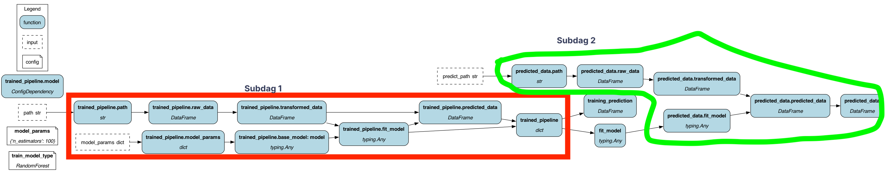

# Modular pipeline example

In this example we show how you can compose a pipeline from multiple modules.
This is a common pattern in Hamilton, where you can define a module that encapsulates
a set of "assets" and then use that module in a parameterized manner.

The use case here is that:

1. we have common data/feature engineering code.
2. we have a training set that creates a model
3. we have an inference step that given a model and a dataset, predicts the outcome on that dataset.

With these 3 things we want to create a single pipeline that:

1. trains a model and predicts on the training set.
2. uses that trained model to then predict on a separate dataset.

We do this by creating our base components:

1. Creating a module that contains the common data/feature engineering code.
2. Creating a module that trains a model.
3. Creating a module that predicts on a dataset.

We can then create two pipelines that use these modules in different ways:

1. For training and predicting on the training set we use all 3 modules.
2. For predicting on a separate dataset we use only the feature engineering module and the prediction module.
3. We wire the two together so that the trained model then gets used in the prediction step for the separate dataset.

By using `@subdag` we namespace the reuse of the modules and that's how we can
reuse the same functions in different pipelines.

See:

