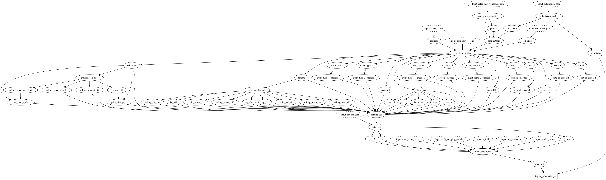

# Kaggle M5 Forecasting
Source - https://www.kaggle.com/c/m5-forecasting-accuracy.

This is an example of how one might use Hamilton using the M5 Forecasting Kaggle
challenge as an example. The code here is based on Ratan Rohith's notebook
that can be [found here](https://www.kaggle.com/code/ratan123/m5-forecasting-lightgbm-with-timeseries-splits).
The notebook is a beginner level notebook that does some feature engineering, and uses LightGBM to fit
a model over folds that then predicts the future. The notebook is a good starting point for anyone want to know
the basics of an approach to time series forecasting.

# Set up
1. Set up the python virtual environment and activate it, then install the required python dependencies.
`pip install -r requirements.txt`.
2. [Download the data](https://www.kaggle.com/competitions/m5-forecasting-accuracy/data) --
you will need to log in to Kaggle to download the data.
3. Decompress the data into the same folder as the code.
4. Run `run.py`. `python run.py`.

# Notes
Here's what this code executes:

