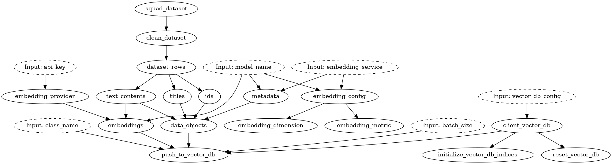
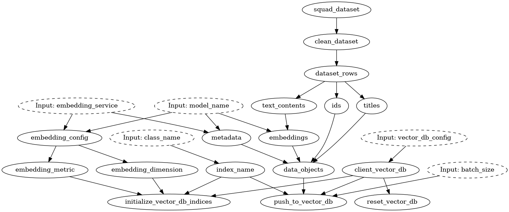

# Flexibly change components of your LLM stack

This example shows how to pull data from the HuggingFace datasets hub, create embeddings for text passage using Cohere / OpenAI / SentenceTransformer, and store them in a vector database using Pinecone / Weaviate.

*DAG for OpenAI embeddings and Weaviate vector database*

In addition, you'll see how Hamilton can help you create replaceable components. This flexibility, makes it easier to assess service providers and refactor code to fit your needs. The above and below DAGs were generated simply by changing a string value and a module import. Try to spot the differences! 

*DAG for SentenceTransformers embeddings and Pinecone vector database*

# Example structure
- `run.py` contains the code to test the example. It uses `click` to provide a simple command interface. 
- `data_module.py` contains the code to pull data from HuggingFace. The code is in a separate Python module since it doesn't depend on the other functionalities and could include more involved preprocessing.
- `embedding_module.py` contains the code to embed text using either Cohere API, OpenAI API or SentenceTransformer library. The use of `@config.when` allows to have all options in the same Python module. This allows to quickly rerun your Hamilton DAG by simply changing your config. You'll see that functions share similar signature to enable interchangeability.
- `weaviate_module.py` and `pinecone_module.py` implement the same functionalities for each vector database. Having the same function names allows Hamilton to abstract away the implementation details and reinforce the notion that both modules shouldn't be loaded simultaneously.
- `docker-compose.yml` allows you to start a local instance of Weaviate ([More information](https://weaviate.io/developers/weaviate/installation/docker-compose)).

# How-to run the example
0. Create accounts and get the API keys for the service you plan to use.
1. Run `python run.py --help` to learn about the options.
2. You can specify the vector database and the embedding service with `--vector_db=VALUE` and `--embedding_service=VALUE` respectively. The defaults are `weaviate` and `sentence_transformer`.
3. You can configure the vector database with a JSON string via the CLI (see `--help`)
4. You will be prompted for your embedding service API key

# Next step / Exercises
- Implement the code to read data from the vector database
- Add the code to send the same generative prompt to multiple providers 
