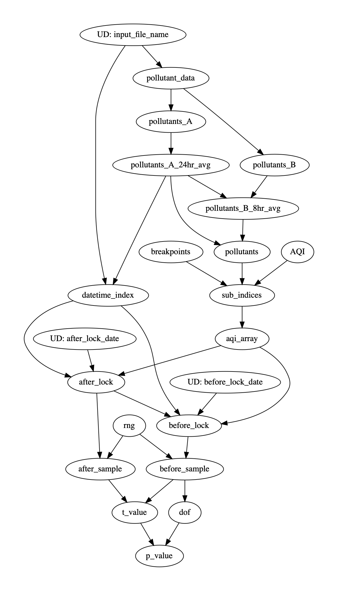

# Air Quality Analysis

This is taken from the numpy tutorial https://github.com/numpy/numpy-tutorials/blob/main/content/tutorial-air-quality-analysis.md.

# analysis_flow.py
Is where the analysis steps are defined as Hamilton functions.

Versus doing this analysis in a notebook, the strength of Hamilton here is in
forcing concise definitions and language around steps in the analysis -- and
then magically the analysis is pretty reusable / very easy to augment. E.g. add some
@config.when or split things into python modules to be swapped out, to extend the
analysis to new data sets, or new types of analyses.

Here is a simple visualization of the functions and thus the analysis:

# run_analysis.py
Is where the driver code lives to create the DAG and exercise it.

To exercise it:
> python run_analysis.py

# Caveat
The code found here was copied and pasted, and then tweaked to run with Hamilton. If something from the modeling
perspective isn't clear, please read https://github.com/numpy/numpy-tutorials/blob/main/content/tutorial-air-quality-analysis.md
