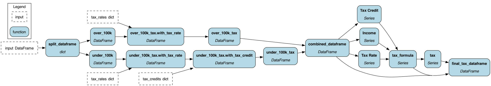

# Split / Apply / Combine

This example demonstrates how to perform
a [split-apply-combine](https://pandas.pydata.org/pandas-docs/stable/user_guide/groupby.html) transformation using
Hamilton.

Many data analysis or processing involve one or more of the following steps:

- **Split**: splitting a data set into groups,
- **Apply**: applying some functions to each of the groups,
- **Combine**: combining the results.

For this example, we want to **split** a DataFrame in 2 DataFrames, then for each DataFrames
*apply** a different transformation pipeline then **combine** the result in a DataFrame.

Note: we also add an adapter that strictly type checks the inputs and outputs as the code runs.
This isn't required but is here to show how to exercise it.

## Example

The example consists of calculating the tax of individuals or families based on their income and the number of children
they have.

The following rules applies to **Income**:

- < 50k: Tax rate is 15 %
- 50k to 70k: Tax rate is 18 %
- 70k to 100k: Tax rate is 20 %
- 100k to 120k: Tax rate is 22 %
- 120k to 150k: Tax rate is 25 %
- over 150k: Tax rate is 28 %

The following rules applies to the **number of children** when the **income is under 100k**:

- 0 child: Tax credit 0 %
- 1 child: Tax credit 2 %
- 2 children: Tax credit 4 %
- 3 children: Tax credit 6 %
- 4 children: Tax credit 8 %
- over 4 children: Tax credit 10 %

The following data needs to be processed:

| Name     | Income | Children |
|----------|--------|----------|
| John     | 75600  | 2        |
| Bob      | 34000  | 1        |
| Chloe    | 111500 | 3        |
| Thomas   | 234546 | 1        |
| Ellis    | 144865 | 2        |
| Deane    | 138500 | 4        |
| Mariella | 69412  | 5        |
| Carlos   | 65535  | 0        |
| Toney    | 43642  | 3        |
| Ramiro   | 117850 | 2        |

## Running the example

You can run the example doing:

```bash
# cd examples/pandas/split-apply-combine/
python my_script.py
```

or running the notebook:

```bash
# cd examples/pandas/split-apply-combine/
jupyter notebook   # pip install jupyter if you don't have it
```
Or you can open up the notebook in Colab:

[](https://colab.research.google.com/github/dagworks-inc/hamilton/blob/main/examples/pandas/split-apply-combine/notebook.ipynb)

The expected result is :

| Name     | Income | Children | Tax Rate | Tax Credit | Tax   | Tax Formula                            |
|----------|--------|----------|----------|------------|-------|----------------------------------------|
| John     | 75600  | 2        | 20 %     | 4 %        | 14515 | (75600 * 0.2) - (75600 * 0.2) * 0.04   |
| Bob      | 34000  | 1        | 15 %     | 2 %        | 4998  | (34000 * 0.15) - (34000 * 0.15) * 0.02 |
| Chloe    | 111500 | 3        | 22 %     |            | 24530 | (111500 * 0.22)                        |
| Thomas   | 234546 | 1        | 28 %     |            | 65673 | (234546 * 0.28)                        |
| Ellis    | 144865 | 2        | 25 %     |            | 36216 | (144865 * 0.25)                        |
| Deane    | 138500 | 4        | 25 %     |            | 34625 | (138500 * 0.25)                        |
| Mariella | 69412  | 5        | 18 %     | 10 %       | 11245 | (69412 * 0.18) - (69412 * 0.18) * 0.1  |
| Carlos   | 65535  | 0        | 18 %     | 0 %        | 11796 | (65535 * 0.18) - (65535 * 0.18) * 0.0  |
| Toney    | 43642  | 3        | 15 %     | 6 %        | 6154  | (43642 * 0.15) - (43642 * 0.15) * 0.06 |
| Ramiro   | 117850 | 2        | 22 %     |            | 25927 | (117850 * 0.22)                        |

The DAG generate should look like:


