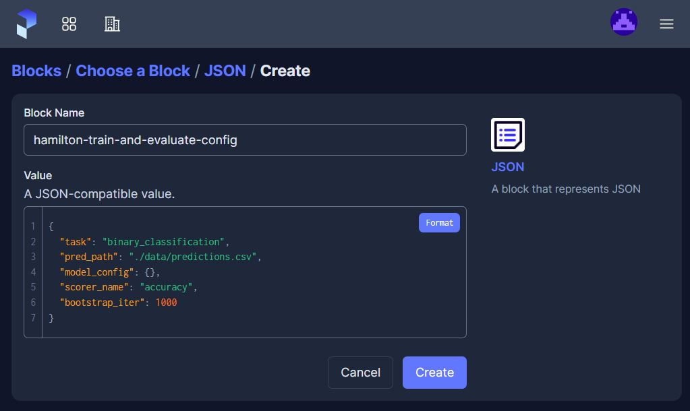
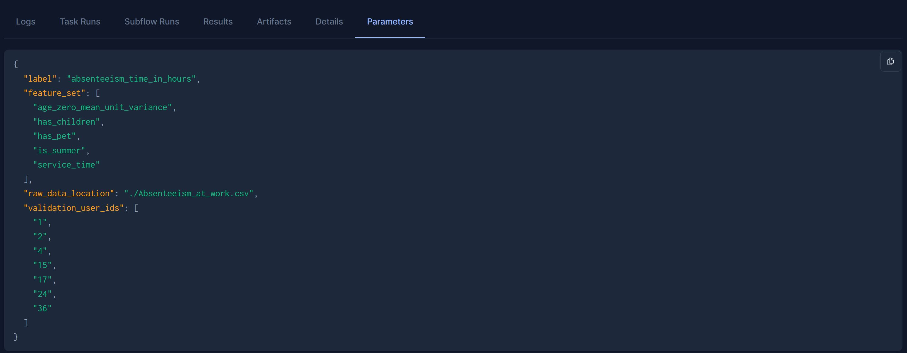
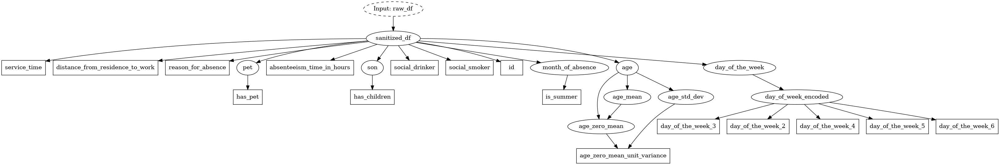

# Hamilton + Prefect

In this example, were going to show how to run a simple `data preprocessing -> model training -> model evaluation` workflow using Hamilton within Prefect tasks.
- [**Prefect**](https://prefect.io) is an open source orchestrator written in Python. Its purpose is to launch and execute your workflows over your infrastructure.  It is a macro-orchestration system.
- [**Hamilton**](https://github.com/dagworks-inc/hamilton) is a micro-framework to describe dataflows in Python. Its strength is expressing the flow of data & computation in a way that is straightforward to create, maintain, and reuse (much like DBT has done for SQL). It is lightweight and can be run anywhere that python runs.  It is a micro-orchestration system.

## Why both?
Prefect is a heavy weight system that includes useful features for production system such as job queues, caching, retries, logging, and more. However, each additional "task" you create comes with execution overhead and needs to be manually added to the DAG structure. Opting for less granular tasks ultimately reduces visibility and maintainability, while opting for more creates more overhead.

In contrast, Hamilton automatically builds its DAG from the function definition itself, encouraging clean, small and single-purposed functions. By using Hamilton in a Prefect task, you gain this greater insight into lineage, reduced Prefect execution overhead and a simpler DAG to manage, and you get portable Python code you can run outside Prefect too.

## What does the code do?
This example illustrates a typical data science / machine learning workflow where we:
1. Pull raw data from a source
2. Process data into properly formatted training data
3. Store training data as an artifact
4. Train a model
5. Evaluate the model to decide if it meets performance requirements

The code to support these steps is written as modular functions in `prepare_data.py` (steps 1, 2, 3), `train_model.py` (step 4), and `evaluate_model.py` (step 5). The modules can be loaded with the Hamilton `Driver` to automatically generate the execution DAG from the functions. In our scenario, we use Prefect because we want to be able to schedule and run our workflow daily. The file `run.py` contains the Prefect workflow definition, where each task has its own Hamilton `Driver`. ([Learn more about Prefect scheduling](https://docs.prefect.io/2.10.21/concepts/schedules/)).

You'll notice that the Prefect workflow has 2 tasks: `prepare_data_task` and `train_and_evaluate_model_task` even though there are 3 function modules. While each function module best describes a logical grouping of functions, the Prefect tasks can help define how/where they should be executed. For example, the data processing task might require CPU resources while the model training and evaluation would benefit from having access to a GPU. This split allows us to benefit from Prefect's monitoring and tracking features, which make it easier to debug errors than having a single large Prefect task.

For another workflow, a large Hamilton DAG in a single Prefect task, or smaller Prefect tasks and Hamilton modules might have been preferred. This shows how the Hamilton `Driver` brings flexibility to where and how you run your code.

## Prefect setup
The easiest way to get this example running is to sign up for Prefect's free tier and follow the [Prefect Cloud Quickstart](https://docs.prefect.io/latest/cloud/cloud-quickstart/) section. Don't want to sign up? Don't worry, as Prefect is open source, can instead opt to host and run everything yourself as described [here](https://docs.prefect.io/latest/host/). The steps to get started are:
1. Signup for Prefect
2. Create a workspace
3. In this directory, create a virtual environment with the needed requirements. You can copy the commands below to do so.
    ```
    python -m venv ./venv &&
    . ./venv/bin/activate &&&
    pip install -r requirements.txt
    ```
4. Login to Prefect with your local machine using `prefect cloud login`
5. Execute the workflow by running `python run.py`. You should see a new run appear on your dashboard at https://app.prefect.cloud/

## Tips
1. Use Prefect [Blocks](https://docs.prefect.io/latest/concepts/blocks/) to store your Hamilton configuration. This way, you can edit it directly from your Prefect dashboard to launch different runs without altering your source code.

2. Prefect keeps track of your flow and tasks config, which is useful to reproduce runs.

3. Store Hamilton [DAG visualization](https://hamilton.dagworks.io/en/latest/how-tos/use-hamilton-for-lineage/) with your runs using Prefect [artifacts](https://docs.prefect.io/latest/concepts/artifacts/).
    
    The general idea is:
    1. produce a local visualization file
        ```
        dr = hamilton.driver.Driver(...)

        visualization_path = "hamilton_dag"
        # visualize_execution shares a similar signature to Driver.execute()
        dr.visualize_execution(
            final_vars=...,
            inputs=...,
            output_file_path=visualization_path,
            render_kwargs={"format": "png"},
        )
        ```
    2. encode file as bytes
        ```
        import b64

        with open(f"{visualization_path}.png", "rb") as f:
            encoded_string = b64.b64encode(f.read())
        ```

    3. push the byte string to a Prefect remote storage
        ```
        from prefect.filesystems import RemoteFileSystem

        remote_basepath =...
        fs = RemoteFileSystem(basepath=remote_basepath)
        remote_dag_file = ...
        with fs.open(remote_dag_file, "wb") as f:
            f.write(encoded_string)
        ```

    4. link the byte string artifact to the Prefect run using `create_link_artifact`
        ```
        from prefect.artifacts import create_link_artifact

        create_link_artifact(
            key=...,
            link=f"{remote_basepath}/{remote_dag_file},
            description="Hamilton execution DAG"
        )
        ```
