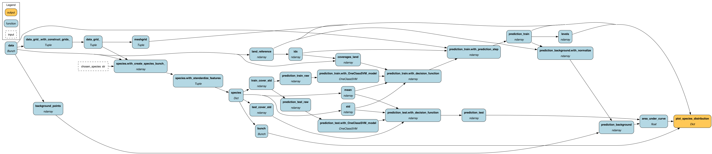

# Species distribution modeling

We translate the Species distribution modeling from scikit-learn into Hamilton to showcase `pipe` and`pipe_output`.

# Highlights
 Example of a simple ETL pipeline broken into modules with external couplings.

1) To see how to couple external modules / source code and integrate it into a Hamilton DAG check out `grids.py` or `preprocessing.py`, where we use `@pipe` to wrap and inject external functions as Hamilton nodes.
2) To see how to re-use functions check out `train_and_predict.py`, where we use `@pipe_output` to evaluate our model on the individual test and train datasets.



# Description
We have two complimentary decorators that can help with transforming input / output of a node in the DAG: `pipe_input` and `pipe_output`.

## @pipe_input
We can directly transform input of a node using `pipe_input` with
```python

@pipe_input(
    step(baz,...),
    step(qux,...)
)
def foo(bar:Any)->Any:
    ...
```
In the above case two nodes `baz` and `qux` get created and are inserted between `bar` and `foo`; thus we get
```python
foo(qux(baz(bar)))
```

This can be particularly useful in the following cases:
1.  You want the transformations to display as nodes in the DAG, with the possibility of storing or visualizing
    the result
2. You want to pull in functions from an external repository, and build the DAG a little more procedurally
3. You want to use the same function multiple times, but with different parameters -- while `@does`/`@parameterize` can
do this, this presents an easier way to do this, especially in a chain.


## @pipe_output
On the other hand we can also perform transformations on the output of the node with `pipe_output` with
```python
@pipe_output(
    step(baz,...)
    step(qux,...)
)
def foo(bar:Any)->Any:
    ...
```
In the above case a node gets created from `baz()` and is appended after `foo`; thus we get
```python
qux(baz(foo(bar)))
```

This can be particularly useful when:
1. Ensuring consi
2. Re-using the same function on multiple nodes. For example, needing to do different pre-processing, but than passing data to the same `model`, aka feature engineering hyper-tuning.
3. We can also use `step(...).when(...)` and can choose at execution time which transformation will be applied to the output of a particular node. For example, each `step` represents a different `model` and we switch between them with a config dictionary in the Hamilton driver.

## original_script.py
The original script has been left intact. The only change we made is to add
```python
if __name__ == "__main__":
    plot_species_distribution()
    plt.show()

```
so that it does not run when imported into other scripts.

This script can be run as is for comparison. Actually the external functions `construct_grids()` and `create_species_bunch()` we will directly import and use as external functions to showcase how you can use our `pipe` and `pipe_output` functionality to "Hamiltonise" external modules.

## hamilton_notebook.ipynb
Is a nodebook that contains all the modules and has the execution cells to run the complete code. It also gives you the ability to visualize the DAG.

## run.py
If you prefer to run code through a shell the same code is also available as a python script.


```bash
python -m run.py
```


# Disclaimer
The original code and analysis is taken from [scikit-learn](https://scikit-learn.org/stable/auto_examples/applications/plot_species_distribution_modeling.html).
We don't know them and they don't know us - but they wrote a neat analysis and we wanted to show you how their procedural code would look like if it was written with the help of Hamilton.

Thanks to the authors for creating it:
- Peter Prettenhofer <peter.prettenhofer@gmail.com>,
- Jake Vanderplas <vanderplas@astro.washington.edu>

License: BSD 3 clause
